# C++

## 基础知识

* **函数调用的过程**

参数入栈、保护现场、函数跳转、恢复现场

1. **函数调用的触发：**
   - 当程序执行到一个函数调用的语句时，会将控制权转移到被调用函数的代码块。
2. **保存上下文：**
   - 调用函数前，当前函数的执行现场（上下文）需要保存，以便在函数调用结束后能够恢复。包括函数返回地址、当前函数的局部变量、寄存器的状态等。
   - 这些信息通常被保存在调用栈（call stack）上。
3. **传递参数：**
   - 将调用函数的参数传递给被调用函数。参数的传递方式有值传递、引用传递、指针传递等。
4. **分配栈空间：**
   - 为被调用函数分配栈空间。通常在栈上分配局部变量和函数的执行过程中需要的其他临时数据。
5. **跳转到被调用函数：**
   - 使用跳转指令（例如`call`指令）将程序控制权转移到被调用函数的入口点。
6. **执行被调用函数：**
   - 被调用函数开始执行，执行函数体中的代码。在函数内部，局部变量和参数通常被存储在栈上。
7. **返回值：**
   - 被调用函数执行完毕后，将返回值存储在指定的寄存器中或通过栈传递给调用函数。
8. **清理栈空间：**
   - 被调用函数执行完毕后，需要清理栈上分配的局部变量等信息。
9. **恢复上下文：**
   - 恢复调用函数的上下文，包括返回地址等信息。
10. **返回到调用点：**
    - 使用返回指令（例如`ret`指令）将程序控制权返回到调用函数的下一条指令，继续执行。

**栈帧**也叫过程活动记录，是编译器用来实现过程/函数调用的一种数据结构。简言之，**栈帧**就是利用`EBP`（栈帧指针，**请注意不是ESP**）寄存器访问局部变量、参数、函数返回地址等的手段。


* **C++内存分区**

 1. 堆区

    用于存储动态分配内存的区域，通常需要手动分配和释放，调用new/delete

 2. 栈区

    用于存储局部变量和函数调用信息的区域，栈上的变量的生命周期和所在函数执行周期对应，函数调用结束时，栈上的变量会自动销毁。

3. 全局区

​		用于存储全局变量和静态变量的区域，全局变量在整个程序的执行期间都存在，生命周期从程序启动到中止，动态变量在其作用域内存在，生命周期也是如此。

4. 常量区

   常量区是用来存储常量的区域，如字符串类常量，全局常量

5. 代码区

​		代码区是用于存储程序的机器指令的内存区域。这是程序的可执行部分，通常在程序启动时加载到内存中。代码区的数据是只读的，不应进行写操作。


* **C和C++的区别是什么？**

1. C是面向过程的编程语言，C++是面向对象的编程语言，因此C++语言中有继承、多态，此外C++支持模板、异常处理机制以及C++ STL库。
2. 动态内存管理。C语言使用malloc/free,C++使用new/delete
3. 强制类型转换不一样。C语言直接()强转，C++提供了四种类型的强制转换方式(static_cast、const_cast、reinterpret_cast、dynamic_cast)。
4. 异常捕获机制。C语言不提供异常处理机制，错误通常以返回值或者全局变量的形式进行处理，C++支持异常处理，允许程序员自己编写更健壮的代码处理异常。
5. C++还有引用、智能指针、auto关键字等等。


* **C++四种类型转换**

1. 静态转换static_cast

   这是最常见的类型转换操作，用于显式将一个数据类型转换为另一个数据类型，通常用于基本类型的转换、父子类之间的转换，静态转换是在编译期间执行的，不提供运行检查，因此使用的时候要慎用。

2. 动态类型转换dynamic_cast

   通常用于处理多态继承结构中的类型转换，例如基类指针或者引用上进行类型检查和转换，动态转换在运行期间执行，同时会检查是否可以安全的转换，如果不能安全转换，则会返回空指针(用于指针的情况)或者抛出异常(用于引用的情况)。

   ```cpp
   Base* basePtr = new Derived;
   Derived* derivedPtr = dynamic_cast<Derived*>(basePtr);
   if (derivedPtr) {
       // 安全的类型转换
   } else {
       // 转换失败
   }
   ```

3. 常量转换const_cast

   常量转换用于移除和添加const限定符，允许对象在const和非const版本之间进行切换。

4. 重新解释转换reinterpret_Cast

​		重新解释转换是一种非常底层的转换，通常用于将一个指针或引用从一种类型转换为另一种类型。


* **dynamic_cast 什么情况下不能转换**

**无虚函数**：如果类层次结构中的基类没有虚函数，`dynamic_cast` 无法工作。因为 `dynamic_cast` 依赖于运行时类型信息（RTTI），而虚函数表（vtable）通常用于存储这些信息。如果基类没有虚函数，那么对象的类型信息就不会被存储，`dynamic_cast` 将无法获知对象的实际类型。

**没有派生关系**：如果两个类之间没有继承关系，`dynamic_cast` 无法进行转型。它只用于基类和派生类之间的类型转换。

**对象为空指针**：如果传递给 `dynamic_cast` 的对象指针是空指针，则转换也会失败。


* **dynamic_cast怎么实现的**
  在C++中，向下转型（Downcasting）通常是通过 `dynamic_cast` 操作符来实现的。向下转型是从基类指针或引用到派生类指针或引用的转换。

`dynamic_cast` 运算符在执行向下转型时，会检查是否可以安全地将基类指针或引用转换为派生类指针或引用。它依赖于类型信息（RTTI - Runtime Type Information）来判断对象的实际类型。以下是 `dynamic_cast` 的一般步骤：

1. **检查是否是合法的向下转型：** `dynamic_cast` 会检查指针或引用指向的对象的实际类型。如果对象是通过 `new` 运算符创建的，并且基类中包含虚函数，那么运行时类型信息（RTTI）将包含关于对象实际类型的信息。
2. **如果是合法的向下转型：** 如果对象的实际类型是派生类，那么 `dynamic_cast` 将返回指向派生类的指针或引用。
3. **如果不是合法的向下转型：** 如果对象的实际类型不是派生类，那么对于指针，`dynamic_cast` 返回 `nullptr`；对于引用，`dynamic_cast` 引发 `std::bad_cast` 异常。


* **C++异常处理机制**

​	C++异常处理机制适用于一些程序中异常情况的机制。

1. 异常类别

   C++标准库定义了一组异常类别，如runtime_error、logic_error等，用于表示不同类型异常情况，我们也可以自定义异常类别，派生自std::exception类别

2. try

   `try` 块用于包裹可能引发异常的代码块。

3. catch

​		`catch` 块用于捕获和处理异常。你可以有多个 `catch` 块，每个块可以捕获不同类型的异常。`catch` 块中的代码会在异常抛出时执行。

4. throw

  	`throw` 用于抛出异常，将控制流转移到匹配的 `catch` 块。你可以抛出异常对象，这些对象可以是内置数据类型、自定义类对象或标准库异常类的对象。


* **struct和class区别**

1. struct一般用于数据结构的集合，class是对一个对象数据的封装
2. struct默认的访问权限是public，class默认访问权限是private
3. 继承关系中，struct默认是公有继承，class默认是私有继承】

补充了一下C/C++中struct的不同

|          |           C            | C++                      |
| :------: | :--------------------: | ------------------------ |
| 成员函数 |         不能有         | 可以                     |
| 静态成员 |         不能有         | 可以                     |
| 访问控制 |  默认public，不能修改  | public/private/protected |
| 继承关系 |       不可以继承       | 可从类或者其他结构体继承 |
|  初始化  | 不能直接初始化数据成员 | 可以                     |


* 导入C函数的关键字，C++编译时和C有什么不同？

1. **关键字：**在C++中，导入C函数的关键字是**extern**，表达形式为**extern “C”**， extern "C"的主要作用就是为了能够正确实现C++代码调用其他C语言代码。加上extern "C"后，会指示编译器这部分代码按**C语言**的进行编译，而不是C++的。
2. **编译区别：**由于C++支持函数重载，因此编译器编译函数的过程中会将函数的**参数类型**也加到编译后的代码中，而不仅仅是**函数名**；而C语言并不支持函数重载，因此编译C语言代码的函数时不会带上函数的参数类型，一般只包括**函数名**。


* **函数指针相关**

  概念：函数指针就是**指向函数**的指针变量。每一个函数都有一个入口地址，该入口地址就是函数指针所指向的地址。

  定义：

  ```cpp
  return_type (*pointer_name)(parameter_type1, parameter_type2, ...);
  ```

  应用场景：

  1. 回调函数

     允许将一个函数传递给另一个函数实现回调。


* **构造函数为受保护的（protected）是为什么**

**防止直接实例化：**将构造函数设置为受保护的可以防止外部代码直接实例化该类。只有该类的派生类（子类）能够调用受保护的构造函数。


* **C++什么情况下会发生拷贝？**

1. 传递参数给函数

2. 从函数返回对象(现代编译器一般有所优化，从而减少或者避免不必要的对象拷贝)

3. 使用赋值操作符号

   

* **sizeof 与 strlen**

`sizeof` 是一个运算符，而不是函数，它返回一个类型或对象的大小（以字节为单位），包括对象的所有内存部分(包括null)。

`strlen` 是一个函数，返回一个以 null 结尾的字符串的长度，即字符串中的字符数，不包括 null 终止符在内。


* **大小端存储问题**

小端：低位-》高位存储

大端：高位-》低位存储

Windows上是小端存储

```cpp
#include <iostream>
int main() {
	uint32_t num = 1;  // 使用32位整数进行判断
	// 获取num的地址
	uint8_t* bytePtr = reinterpret_cast<uint8_t*>(&num);
	// 判断存储方式
	if (*bytePtr == 1) {
		std::cout << "Little-endian" << std::endl;
	}
	else {
		std::cout << "Big-endian" << std::endl;
	}
	return 0;
}
```


* **C++类中默认函数**

在C++中，如果你没有自己定义，编译器会为类生成一些默认的函数。这些函数包括：

1. 默认构造函数（Default Constructor）：如果你没有定义任何构造函数，则编译器会生成一个默认构造函数。默认构造函数没有参数，并执行默认的对象初始化操作。

2. 复制构造函数（Copy Constructor）：如果你没有定义复制构造函数，编译器会生成一个默认的复制构造函数。复制构造函数用于在创建新对象时，根据已有对象创建一个副本。

3. 复制赋值运算符（Copy Assignment Operator）：如果你没有定义复制赋值运算符，编译器会生成一个默认的复制赋值运算符。复制赋值运算符用于将一个对象的值赋给另一个已经存在的对象。

4. 移动构造函数（Move Constructor）：从C++11标准开始，如果你没有定义移动构造函数，编译器会生成一个默认的移动构造函数。移动构造函数用于在创建新对象时，根据已有对象创建一个副本，并且“窃取”已有对象的资源而不是复制。

5. 移动赋值运算符（Move Assignment Operator）：从C++11标准开始，如果你没有定义移动赋值运算符，编译器会生成一个默认的移动赋值运算符。移动赋值运算符用于将一个对象的值赋给另一个已经存在的对象，并且“窃取”已有对象的资源而不是复制。

6. 析构函数（Destructor）：如果你没有定义析构函数，编译器会生成一个默认的析构函数。析构函数用于在对象销毁时执行清理操作，并释放对象所占用的资源。

需要注意的是，如果你显式地定义了一个构造函数、复制构造函数、复制赋值运算符、移动构造函数、移动赋值运算符或析构函数，编译器将不会生成默认的版本，并且你需要自己实现这些函数。

* **脚本语言慢在哪里了？静态编译语言快在哪里了？**
  脚本语言和静态编译语言之间的性能差异主要来源于它们的执行模型、类型系统、以及编译和运行时的优化等方面。以下是一些常见的性能差异点：

脚本语言：

1. **解释执行：** 大多数脚本语言是解释执行的，代码在运行时由解释器逐行解释并执行。这导致了一些运行时开销。
2. **动态类型：** 脚本语言通常是动态类型的，变量的类型在运行时确定。这增加了运行时的类型检查和类型转换的开销。
3. **垃圾回收：** 许多脚本语言使用垃圾回收来管理内存，这可能导致不可预测的暂停和性能开销。
4. **优化限制：** 由于解释器的存在，一些高级的编译时优化无法进行，因此在运行时进行的优化较为有限。

静态编译语言：

1. **编译时类型检查：** 静态编译语言在编译时进行类型检查，这有助于提前发现潜在的类型错误，同时也减少了运行时类型检查的开销。
2. **本地代码生成：** 静态编译语言通常将源代码编译成本地机器码，而不是在运行时逐行解释。这减少了解释器的开销。
3. **更丰富的编译时优化：** 静态编译语言可以进行更多的编译时优化，例如内联函数、循环展开等，以提高执行效率。
4. **手动内存管理：** 一些静态编译语言允许程序员手动管理内存，这可以更精确地控制内存的分配和释放，避免垃圾回收的性能开销。


## 多态

* **编译期多态和运行期多态**

  * 编译期多态

  1. 重载：编译器根据函数的名称、参数类型和参数个数来生成不同的函数签名。在调用函数时，编译器通过匹配函数签名来确定调用哪个函数。
  2. 模板：模板的多态性在编译时通过模板参数的类型进行实现，而不是通过函数签名。在模板中，函数或类可以被定义为适用于多种类型，由编译器在编译时生成相应的代码。

  * 运行期多态

  **虚函数(重点)**

* **什么是多态？C++如何实现多态？**

多态就是同一个函数名的多种状态或者是一个接口具有不同的行为，C++多态分为编译期多态和运行时多态，编译期多态成为静态联编，通过重载和模板实现，运行时多态成为动态联编，通过继承和虚函数实现。

* **什么是虚函数？什么是纯虚函数**

C++虚函数是一种用于实现多态性的机制，它允许在派生类中重写基类的函数，并且在运行的时候执行正确的函数版本，虚函数用于创建一个虚函数表，其中包含了正确的函数的指针。

1. 虚函数的定义

   在基类中，你可以将一个成员函数标记为虚函数，在函数声明前面加上关键字virtual。派生类可以重写虚函数，即在派生类中提供自己的实现。

2. 虚函数表

   每个带虚函数的类都会包含一个虚函数表，其中存储了指向虚函数的指针，这个表在程序运行的时候确定要调用的函数。派生类的虚函数包含的是指向派生类函数的指针，从而实现了多态性。

3. 纯虚函数

​		纯虚函数是一种特许类型的虚函数，他没有具体的实现，只有声明，要求派生类必须提供自己的实现。

* **虚函数机制**

​		虚函数是通过虚函数表来实现的，虚函数表包含了一个类(所有)的虚函数的地址，在有虚函数的类对象中，它内存空间的头部会有一个虚函数表指针(虚表指针)，用来管理虚函数表。当子类对象对父类虚函数进行重写的时候，虚函数表的相应虚函数地址会发生改变，改写成这个虚函数的地址，当我们用一个父类的指针来操作子类对象的时候，它可以指明实际所调用的函数。

​		如果子类中不存在虚函数，那么子类的虚指针将直接指向父类的虚函数表，如果子类中有虚函数，则会产生自己的虚函数表；如果没有将父类中的虚函数全部重载，那么没有被重载的虚函数指针将会指向父类虚函数的地址。


* **虚表是什么时候生成的？存储在哪一块区域？**

编译期间，存储在只读字段(**全局区吗？**)。


* **析构函数**

子类实现析构函数，使得在析构函数中释放子类所占用的资源，如果父类不声明为虚函数，那么会造成子类的资源未释放而导致内存泄漏。

* **钻石(菱形)继承存在什么问题，如何解决**？

存在二义性问题，两个父类对公共基类的数据和方法产生一份拷贝，因此对于子类来说的，读写一个公共基类的数据或者调用一个方法的时候，不知道是哪一个父类的数据和方法，就会导致编译出错。可以采用虚继承的方法解决这个问题，这样就只会创造一份公共基类的实例，不会造成二义性。

* **C++ RTTI 机制**

一般情况下，在编译期间就能确定一个表达式的类型，但是当存在多态时，有些表达式的类型在编译期间就无法确定了，必须等到程序运行后根据实际的环境来确定。

C++内存模型主要包含以下内容：

1. 如果没有虚函数也没有虚继承，那么对象内存模型只有成员变量。
2. 如果包含了虚函数，那么会额外添加一个虚函数表，并在对象内存中插入一个指针，只想虚函数表。
3. 如果包含了虚继承，那么额外添加一个虚基类表，并且在对象内存中插入一个指针，指向这个虚基类表。

编译器会在虚函数表 vftable 的开头插入一个指针，指向当前类对应的 type_info 对象。当程序在运行阶段获取类型信息时，可以通过对象指针 p 找到虚函数表指针 vfptr，再通过 vfptr 找到 type_info 对象的指针，进而取得类型信息。


* **C++ RAII（**R**esource **A**cquisition **I**s **I**nitialization）**

资源的使用一般经历三个步骤a.获取资源 b.使用资源 c.销毁资源，但是资源的销毁往往是程序员经常忘记的一个环节，所以程序界就想如何在程序员中让资源自动销毁呢？c++之父给出了解决问题的方案：RAII，它充分的利用了C++语言局部对象自动销毁的特性来控制资源的生命周期。给一个简单的例子来看下局部对象的自动销毁的特性：

```cpp
#include <iostream>
using namespace std;
class person {
  public:
      person(const std::string name = "", int age = 0) : 
      name_(name), age_(age) {
            std::cout << "Init a person!" << std::endl;
      }
      ~person() {
            std::cout << "Destory a person!" << std::endl;
      }
      const std::string& getname() const {
            return this->name_;
      }    
      int getage() const {
            return this->age_;
      }      
  private:
      const std::string name_;
      int age_;  
};
int main() {
    person p;
    return 0;
}
编译并运行：
g++ person.cpp -o person
./person 
运行结果：
Init a person!
Destory a person!
```

从person class可以看出，当我们在main函数中声明一个局部对象的时候，会自动调用构造函数进行对象的初始化，当整个main函数执行完成后，自动调用析构函数来销毁对象，整个过程无需人工介入，由操作系统自动完成；于是，很自然联想到，当我们在使用资源的时候，在构造函数中进行初始化，在析构函数中进行销毁。整个RAII过程我总结四个步骤：

a.设计一个类封装资源

b.在构造函数中初始化

c.在析构函数中执行销毁操作

d.使用时声明一个该对象的类

**shared_ptr与weak_ptr是典型的应用案例。**


* **什么函数不能声明为虚函数呢？**

1. 静态成员函数不能是虚函数。但是静态成员函数是编译时确定的，无法动态绑定，不支持多态，因此不能被重写，也就不能被声明为虚函数。

2. 内联函数不能是虚函数。内联函数就是为了在代码中直接展开，减少函数调用花费的代价。也就是说内联函数是在编译时展开的。而虚函数是为了实现多态，是在运行时绑定的。因此显然内联函数和多态的特性相违背。
3. 构造函数不能是虚函数。首先说下什么是构造函数，构造函数是用来初始化对象的。假如子类可以继承基类构造函数，那么子类对象的构造将使用基类的构造函数，而基类构造函数并不知道子类的有什么成员，显然是不符合语义的。从另外一个角度来讲，多态是通过基类指针指向子类对象来实现多态的，在对象构造之前并没有对象产生，因此无法使用多态特性，这是矛盾的。因此构造函数不允许继承。
4. 友元函数。虽然友元函数可以访问类的私有成员，但它们不是类的成员函数，因此不能被声明为虚函数。


* **析构函数调用虚函数**

假设一个派生类的对象进行析构，首先调用了派生类的析构，然后在调用基类的析构时，遇到了一个虚函数，这个时候有两种选择：Plan A是编译器调用这个虚函数的基类版本，那么虚函数则失去了运行时调用正确版本的意义；Plan B是编译器调用这个虚函数的派生类版本，但是此时对象的派生类部分已经完成析构，“数据成员就被视为未定义的值”，这个函数调用会导致未知行为。

实际情况中编译器使用的是Plan A，如果虚函数的基类版本不是纯虚实现，不会有严重错误发生，但你依然会困惑虚函数机制失效，说不准又是“一张通往彻夜调试的直达车票”，所以Effective C++建议不要这么干。


## 内存管理

* **C++有哪些内存区域**

​	（1）堆，使用malloc、free动态分配和释放空间，能分配较大的内存；

​	（2）栈，为函数的局部变量分配内存，能分配较小的内存；

​	（3）全局/静态存储区，用于存储全局变量和静态变量；

​	（4）常量存储区，专门用来存放常量；

​	（5）代码区；

* **堆区和栈区有哪些区别**
  * 堆中的内存需要手动申请和手动释放，栈中的内存是由OS自动申请和自动释放的。
  * 堆能分配的内存的内存比较大（GB级别），栈能分配的内存比较小（MB级别）。
  * 在堆中分配和释放内存会产生内存碎片，栈不会产生内存碎片。
  * 堆的分配效率比较低下，栈的分配效率比较高。
  * 堆地址从低到高，栈地址从高到底。


* **什么是内存对齐，为什么要做内存对齐，怎么实现的？**

  [C/C++内存对齐详解 - 知乎 (zhihu.com)](https://zhuanlan.zhihu.com/p/30007037)

  

  * （1）内存对齐的原因：关键在于CPU存取数据的效率问题。为了提高效率，计算机从内存中取数据是按照一个固定长度的。比如在32位机上，CPU每次都是取32bit数据的，也就是4字节；若不进行对齐，要取出两块地址中的数据，进行掩码和移位等操作，写入目标寄存器内存，效率很低。内存对齐一方面可以节省内存，一方面可以提升数据读取的速度；

  * （2）内容：内存对齐指的是C++结构体中的数据成员，其内存地址是否为其对齐字节大小的倍数。

  * （3）**对齐原则：**

    每个特定平台上的编译器都有自己的默认“对齐系数”（也叫对齐模数）。gcc中默认#pragma pack(4)，可以通过预编译命令#pragma pack(n)，n = 1,2,4,8,16来改变这一系数。

    * 1）结构体变量的首地址能够被其最宽基本类型成员的对齐值所整除；

    - 2）结构体内每一个成员的相对于起始地址的偏移量能够被该变量的大小整除；
    - 3）结构体总体大小能够被最宽成员大小整除；如果不满足这些条件，编译器就会进行一个填充(padding)。
    - 4）如何对齐：声明数据结构时，字节对齐的数据依次声明，然后小成员组合在一起，能省去一些浪费的空间，不要把小成员参杂声明在字节对齐的数据之间。


* **placement new**

[placement new机制 - 知乎 (zhihu.com)](https://zhuanlan.zhihu.com/p/228001107)


* **栈内存的增长方式**

**从高地址向低地址增长（Top-Down）：**

- 在这种方式下，栈的顶部位于内存地址的较高端，而栈底位于内存地址的较低端。每次函数调用，栈指针减小（向低地址方向移动）。


* **堆上可分配的最大内存是多大**

1. **操作系统限制：** 操作系统通常会限制单个进程可以分配的最大内存。这个限制可以通过操作系统的配置参数来调整。例如，在32位系统上，通常限制单个进程的地址空间为4GB。在64位系统上，这个限制更大。
2. **编译器限制：** 编译器也可以对堆内存的分配施加限制。例如，某些编译器可能限制单个对象的大小，从而影响堆上分配的最大内存。
3. **硬件架构：** 硬件架构的限制也可能影响堆内存的分配。不同的硬件架构可能有不同的寻址空间大小和内存管理策略。
4. **应用程序本身：** 应用程序可能会对堆内存的使用施加限制。例如，某些应用程序可能会设置特定的内存分配策略或对分配的内存进行管理，从而影响堆内存的最大分配量。


* **一个32位操作系统new 8G空间会发生什么？**

在一个32位的系统中，地址空间的最大限制是4GB（2^32字节）。这包括了程序的代码、数据、堆、栈等各个部分。因此，如果你尝试在一个32位系统上使用 `new` 分配8GB的内存空间，会导致分配失败。

在32位系统上，操作系统将整个4GB的地址空间划分为不同的区域，例如内核空间和用户空间。用户空间通常被限制在2GB或3GB，具体取决于操作系统的配置。因此，在这样的环境下，即使你的应用程序是唯一在运行的程序，它仍然无法分配超过这个限制的内存。

尝试分配超过可用地址空间的内存通常会导致 `new` 操作返回 `NULL` 或抛出 `std::bad_alloc` 异常，具体取决于编程语言和标准库的实现。

如果需要处理大量内存，考虑使用64位系统，因为64位系统具有更大的地址空间，可以更轻松地处理大内存需求。


* **32位系统下，如果有两个程序，每个程序new一个2g的空间可以吗？**


在理论上，32位系统的总地址空间大小是4GB。这4GB被划分为用户空间和内核空间，而用户空间通常是2GB或3GB，具体取决于操作系统的配置。

如果有两个程序，每个程序尝试分别使用 `new` 操作符分配2GB的内存，可能会遇到问题，具体取决于操作系统的内存布局和分配策略。

在某些32位系统上，会采用"3GB用户空间/1GB内核空间"的模式，这样每个用户空间程序最多只能分配3GB的地址空间。因此，如果两个程序都尝试分配2GB的内存，它们的地址空间可能会重叠，导致其中一个或两者都分配失败。

在其他一些32位系统上，可能采用"2GB用户空间/2GB内核空间"的模式，这样每个用户空间程序最多只能分配2GB的地址空间。在这种情况下，两个程序分别分配2GB的内存通常不会有重叠的问题。


* **new和new[]会发生什么？**

1. "new"关键字：用于分配单个对象的内存空间，并返回指向该对象的指针。当使用"new"创建对象时，会调用对象的构造函数来初始化对象。

示例：

2. "new[]"关键字：用于分配一片连续的内存空间以存储数组，返回指向数组首元素的指针。当使用"new[]"创建数组时，会调用数组元素的默认构造函数来初始化数组。


* **侯捷C++内存管理笔记**

[侯捷C++ 内存管理 第一讲 笔记 - 知乎 (zhihu.com)](https://zhuanlan.zhihu.com/p/476637169#:~:text=C%2B%2B内存管理 1 一、四种内存分配和释放方法 在编程时可以通过上图的几种方法直接或间接地操作内存。 下面将介绍四种C%2B%2B内存操作方法： ... 2 二、基本构件之,array内存分配的大致情况。 ... 7 四、placement new 8 五、重载 更多项目)


## 指针

* **malloc/free和new/delete的区别**

1. malloc/free是C语言的函数，而new/delete是C++语言的运算符。
2. 类型信息上，malloc返回一个void*指针，需要显示的类型转换，new返回指定类型的指针。
3. 构造函数和析构函数上，malloc和free知识分配和释放内存，不会调用对象的构造函数和析构函数，需要手动调用，new/delete会调用对象的构造函数来初始化对象，并且在释放内存的时候调用析构函数清理资源。
4. 异常处理，new在分配失败的时候直接会抛出std::bad_malloc异常，malloc分配失败直接返回NULL指针，需要手动检查。


* **调用new/delete具体发生了什么？**

​		1.调用new

​		①分配足够的内存以容纳对象的大小

​		②调用构造函数来初始化对象的状态

​		③返回指向分配内存的指针

​		2. 调用delete

​		①调用析构函数来清理对象的状态

​		②释放对象占用的内存

* **new 出来的指针可以用free释放吗？**

new原本要与delete对应，delete比free会多了调用析构函数这一步操作，如果直接用free，那就可能造成内存泄露。


* **什么是野指针，怎么产生的，如何避免**

概念：野指针指的是指针指向的位置是不可知的（不正确的、随机的）

产生原因：释放内存后指针没有置空，依然指向了该内存，那么就可能出现非法访问的错误

避免：

	1. 初始化置为nullptr
	1. 申请内存后判断空
	1. 释放内存后置为nullptr
	1. 使用智能指针

* **C++中的智能指针有哪些，各自有什么作用？**

智能指针主要是用来解决内存泄漏的问题，以及避免多个裸指针指向同一资源时，多次释放资源时，对悬空指针进行释放导致不可预知的错误，它可以主动释放内存，因为它本身是一个类，在函数结束的时候调用析构函数释放内存，智能指针分为不带引用计数的unique_ptr，带引用计数的shared_ptr和weak_ptr

1. unique_ptr删除了拷贝构造函数和赋值函数，因此不支持普通的拷贝或赋值操作。但引入了移动构造函数和移动赋值运算符。所以它们保证了有唯一的智能指针持有此资源。unique_ptr还提供了reset重置资源，swap交换资源等函数，也经常会使用到。

2. shared_ptr称为强智能指针，**它的资源引用计数器在内存的heap堆上**这保证了，每个智能指针的引用计数变量会动态的变化）。**通常用于管理对象的生命周期**。只要有一个指向对象的shared_ptr存在，该对象就不会被析构。

3. weak_ptr被称为弱智能指针，其对资源的引用**不会引起资源的引用计数的变化**，通常作为观察者，用于判断资源是否存在，并根据不同情况做出相应的操作。比如使用weak_ptr对资源进行弱引用，当调用weak_ptr的lock()方法时，若返回nullptr，则说明资源已经不存在，放弃对资源继续操作。否则，将返回一个shared_ptr对象，可以继续操作资源。另外，一旦最后一个指向对象的shared_ptr被销毁，对象就会被释放。即使有weak_ptr指向对象，对象也还是会被释放

* **shared_ptr之间的相互引用问题**


* **shared_ptr的实现原理是什么？构造函数、拷贝构造函数和赋值运算符怎么写？shared_ptr是不是线程安全的？**

1. shared_ptr是通过引用计数机制实现的，引用计数存储着有几个shared_ptr指向相同的对象，当引用计数下降至0时就会自动销毁这个对象；
2. 具体实现：
   1. 构造函数：将指针指向该对象，引用计数置为1
   2. 拷贝构造函数：将指针指向该对象，引用计数++
   3. 赋值运算符号：=号左边的shared_ptr的引用计数-1，右边的shared_ptr引用计数+1，如果左边的引用计数降为了0，要销毁对象并释放内存空间。
3. shared_ptr的引用计数本身是安全且无锁的，但是它指向的对象的读写则不是，因此可以说shared_ptr不是线程安全的。


* **指针和引用的区别**

1. 指针本质上是一个地址，有自己的内存空间，引用只是一个别名。
2. 指针可以指向其他的对象，但是引用不能指向其他的对象，初始化之后就不能变了。
3. 指针可以初始化为nullptr，而引用必须被初始化为一个已有对象的引用。
4. 指针可以是多级指针，引用只能是一级。
5. 引用实质上是一个指针常量。


* **C++引用是怎么实现的？为什么这么设计？**

在内部，引用被实现为指针的一种抽象。当你声明一个引用时，编译器会在底层使用指针来实现引用。

引用的设计主要基于以下几个原因：

1. **语法糖：** 引用提供了一种更直观的语法，使代码更易读、易懂。引用的语法更接近传统的变量使用，而不需要显式地进行指针操作。
2. **避免空指针：** 引用在声明时必须初始化，并且不允许在其生命周期中重新指向其他变量。这有助于避免空指针的问题，提高了代码的安全性。
3. **用于函数参数：** 引用作为函数参数传递时，可以避免复制对象的开销，同时还能够修改调用者传递的变量的值。


* **Delete和Delete[]的区别，delete[]如何知道要delete多少次，在类的成员函数中能否Delete This？**

（1）若是基本类型，delete和delete[]效果是一样的，因为系统会自动记录分配的空间，然后释放；对于自定义数据类型而言（比如类）就不行了，delete仅仅释放数组第一个元素的内存空间，且仅调用了第一个对象的析构函数，但delete[]会调用数组所有元素的析构函数，并释放所有内存空间；

（2）这个问题直接导致我们需要在new []一个对象数组时，需要保存数组的维度，C++的做法是在分配数组空间时多分配了4个字节的大小，专门保存数组的大小，这个数据应该就存在这个分配返回的指针周围，在 delete[]时就可以取出这个保存的数，就知道了需要调用析构函数多少次了；

（3）在类的成员函数可以调用delete this，并且delete this之后还可以调用该对象的其他成员，但是有个前提：被调用的方法不涉及这个对象的数据成员和虚函数。当一个类对象声明时，系统会为其分配内存空间。在类对象的内存空间中，只有数据成员和虚函数表指针，并不包含代码内容，类的成员函数单独放在代码段中。

* **C++ unique_ptr和裸指针的性能开销上有什么不同？**

  * **内存管理开销：** `std::unique_ptr` 通常包含一个指向堆上对象的指针和一个额外的控制块，用于管理资源的所有权。这可能导致 `std::unique_ptr` 对象相较于裸指针占用更多的内存。然而，现代编译器通常会进行优化，使得这种开销相对较小。

  * **构造和销毁开销：** 创建和销毁 `std::unique_ptr` 对象可能涉及更多的工作，因为它需要在构造和析构时管理资源。相较之下，裸指针的构造和销毁开销较小。但这种差异通常在实际应用中不是性能瓶颈。

  * **函数调用开销：** 将 `std::unique_ptr` 传递给函数可能会涉及更多的指针复制，因为 `std::unique_ptr` 是非拷贝可传递（move-only）的。这意味着在函数调用中可能会执行资源所有权的转移。对比之下，裸指针的传递只涉及指针值的复制。

  * **异常处理开销：** `std::unique_ptr` 提供了异常安全性，当异常发生时，会自动释放其管理的资源。这可能导致与裸指针相比更多的开销。但这种开销通常是可以接受的，尤其是考虑到异常安全性的好处。

`std::unique_ptr` 在实现上通常包含一个控制块（control block），它用于管理所拥有对象的生命周期和资源释放。这个控制块包含了以下信息：

1. **指向动态分配的对象的指针：** 这是 `std::unique_ptr` 实际拥有的指针，指向通过 `new` 运算符分配的内存。
2. **指向删除器（deleter）的指针或函数：** 删除器是一个用于释放对象的函数或函数对象。当 `std::unique_ptr` 被销毁或通过 `reset` 释放对象时，控制块会使用删除器来正确释放资源。如果未提供删除器，则默认使用 `delete`。
3. **其他管理信息：** 可能包括引用计数、定制内存分配器等。

这个控制块的存在允许 `std::unique_ptr` 进行资源管理，确保在适当的时候释放动态分配的内存。这是与裸指针最大的区别之一，因为裸指针本身没有内建的资源管理机制。


* **指针数组与数组指针**

数组指针是指向数组的指针。

指针数组是全都是指针的数组。


* **常量指针和指针常量**

常量指针是指向常量的指针。

指针常量是指针本是常量。


## 模板元编程

* **模板元编程了解多少，怎么用模板实现无符号十进制数值转换为等价二进制（数值计算，特化）**

```cpp
#include <iostream>

template <unsigned long long N, int Bits = 8 * sizeof(N)>
struct DecimalToBinary {
	static void printBinary() {
		DecimalToBinary<N / 2, Bits - 1>::printBinary();
		std::cout << (N % 2);
	}
};

template <unsigned long long N>
struct DecimalToBinary<N, 0> {
	static void printBinary() {}
};

int main() {
	constexpr unsigned long long decimal = 123;
	DecimalToBinary<decimal>::printBinary();
	std::cout << std::endl;

	return 0;
}
```


## 现代C++

### 语言可用性强化

* 引入了nullptr、constexpr、auto、using等
* 在面向对象上，引入了继承构造、委托构造。

### 模板

* **引入了变长参数模板、**


* **模板实例化的好吃是什么？(外部模板)**

防止代码冗余。原本的话每一个模板在调用的时候都会实例化一份，实例化以后就只有一份生成。

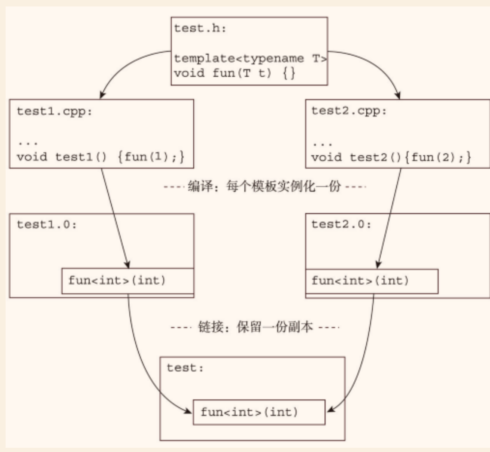


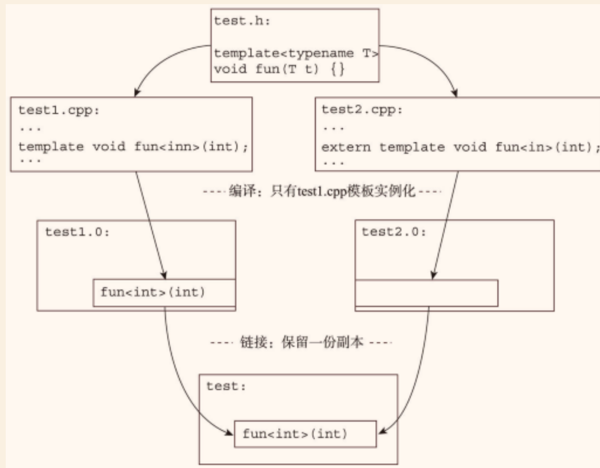


* **模板为什么声明和定义不能分离**

C++是分离式编译，编译是对每一个cpp文件而言的，将cpp编译成独立的obj，再将obj进行链接生成exe可执行程序，对于模板而言，模板只有被调用的时候才会被实例化，如果将声明和定义分开放，那么模板函数不会被实例化，就会发生链接错误。

* **类模板和模板类有什么区别**
  * 类模板是一个通用的模板，定义了一个类的框架，其中某些数据成员和方法可以在实例化的时候指定或推断，类模板是一种通用的定义。
  * 模板类是通过实例化而来的具体的类，即在使用时将模板参数替换为实际的类型。

* **函数模板(泛化和特化的问题)，什么是全特化，什么是偏特化**

  * 所谓模板全特化限定死模板实现的具体类型；
  * 偏特化是指提供另一份template定义式，而其本身仍为`templatized`，这是针对于`template`参数更进一步的条件限制所设计出来的一个特化版本。也就是如果这个模板有多个类型，那么**只限定其中的一部分**;

  ```cpp
  //模板全特化
  template<>
  class Test<int,int>
  {
  public:
   Test(int a, int b) :_a(a), _b(b)
   {
    cout << "模板全特化" << endl;
   }
  private:
   int _a;
   int _b;
  };
  
  //模板偏特化
  template<class T>
  class Test<int,T>
  {
  public:
   Test(int a, T b) :_a(a), _b(b)
   {
    cout << "模板偏特化" << endl;
   }
  private:
   int _a;
   T _b;
  };
  ```

  

### 语言运行期强化

#### Lambda表达式

* **Lambda表达式**

实际上就是提供了一个类似匿名函数的特性， 而匿名函数则是在需要一个函数，但是又不想费力去命名一个函数的情况下去使用的。这样的场景其实有很多很多， 所以匿名函数几乎是现代编程语言的标配。

#### 左值右值

* **左值右值，右值引用，为什么引入右值引用**

  * 左值是具有可寻址的存储单元，并且能由用户改变其值的量，比如，一个int、float、class对象等。左值具有持久的状态，离开作用于后才会销毁。
  * 右值表示即将销毁的临时对象，具有短暂的状态如字面值常量“hello”，返回非引用类型的表达式int func()等，都会生成右值；表达式结束后就不再存在的临时对象。
  * 右值引用必须绑定到右值的引用，通过&&两个取地址符号获得右值引用，只能绑定到即将销毁的对象，可以自由移动其资源。
  * 右值引用是为了支持移动操作而引出的一个概念，它只能绑定到一个将要毁灭的对象，使用右值引用可以避免无谓的拷贝，提高性能。使用std::move可以将左值转换为右值引用。

  

* **为什么要自己定义构造函数？深拷贝与浅拷贝**

  * 拷贝构造函数的作用就是定义了当我们用同类型的另一个对象初始化本对象的时候发生的行为，在某些情况下，使用默认的会出错。比如一个类里面有指针，使用默认的是只拷贝指针的值，即两个对象指向同一块内存，那么其中一个对象析构以后，这一块内存可能不复存在，另一个指针就变为了悬浮指针。
  * 这就是深拷贝和浅拷贝的区别，浅拷贝只是简单地复制某个对象的指针，新旧对象共享同一块内存；深拷贝会另外创造一片新的内存，新对象与老对象不会共享内存，修改新对象不会改到原对象。

  

* **什么是移动构造函数，和拷贝构造函数有什么区别**

  ​		移动构造函数需要传递一个右值引用，不会分配新的内存，而是接管传递而来对象的内存，并在移动之后把源对象销毁；拷贝构造传的是一个左值引用，可能会造成新的内存分配，效率比较低。

  

  

* **std::move怎么是实现的？**

是通过remove_refrence::type模板移除T&&，T&的引用，获取具体类型T（模板偏特化）;然后再把接收的参数的原引用抹除强转成右值引用。


* **移动语义与完美转发**

传统 C++ 通过拷贝构造函数和赋值操作符为类对象设计了拷贝/复制的概念，但为了实现对资源的移动操作， 调用者必须使用先复制、再析构的方式，浪费时间。

直接通过右值引用，接管将亡值的资源管理，延长生命周期。

完美转发:

```cpp
#include <iostream>
#include <utility>
void reference(int& v) {
    std::cout << "左值引用" << std::endl;
}
void reference(int&& v) {
    std::cout << "右值引用" << std::endl;
}
template <typename T>
void pass(T&& v) {
    std::cout << "              普通传参: ";
    reference(v);
    std::cout << "       std::move 传参: ";
    reference(std::move(v));
    std::cout << "    std::forward 传参: ";
    reference(std::forward<T>(v));
    std::cout << "static_cast<T&&> 传参: ";
    reference(static_cast<T&&>(v));
}
int main() {
    std::cout << "传递右值:" << std::endl;
    pass(1);

    std::cout << "传递左值:" << std::endl;
    int v = 1;
    pass(v);

    return 0;
}
```

### 智能指针与内存管理

智能指针都遵循RAII原理，RAII是对资源申请、释放的操作的一种封装。

#### auto_ptr

有问题的使用场景，

* **场景一：数组保存std::auto_ptr实例**

```cpp
std::vector<std::auto_ptr<People>> peoples;
// 这里实例化多个people并保存到数组中
...
std::auto_ptr<People> one = peoples[5];
...
std::cout << peoples[5]->get_name() << std::endl; 
```

上面程序如果将std::auto_tr类型替换为原始指针，就不会有问题。但是这里却会导致程序报段错误崩溃！问题就出在：

```cpp
std::auto_ptr<People> one = peoples[5];
```

这行代码会将peoples[5]中的指针所有权转移了！即该变量中的指针已经为null了。后续对解引用是不正确的。

**原因在于std::auto_ptr支持operator=，为了确保指针所有者唯一，这里转移了所有权！**


* **场景二：函数传参**

```cpp
void do_somthing(std::auto_ptr<People> people){
    // 该函数内不对people变量执行各种隐式/显示的所有权转移和释放
    ...
}

std::auto_ptr<People> people(new People("jony"));
do_something(people);
...

std::cout << people->get_name() << std::endl; 
```

这里对auto_ptr的使用与原始指针的使用完全相同。但是该代码还是会崩溃！问题就在于执行do_something()函数时，传递参数导致原变量的指针所有权转移了，即people变量实际已经变为null了！

**原因在于std::auto_ptr支持拷贝构造，为了确保指针所有者唯一，这里转移了所有权！**


#### shared_ptr

* 是一种强引用智能指针，能够记录多少个`shadred_ptr`共同指向一个对象，当引用计数为0的时候对象会自动删除。

```cpp
template<typename T>
class smart
{
private:
	T* _ptr;
	int* _count; //reference couting

public:
	//构造函数
	smart(T* ptr = nullptr) :_ptr(ptr)
	{
		if (_ptr)
		{
			_count = new int(1);
		}
		else
		{
			_count = new int(0);
		}
	}

	//拷贝构造
	smart(const smart& ptr)
	{
		if (this != &ptr)
		{
			this->_ptr = ptr._ptr;
			this->_count = ptr._count;

			(*this->_count)++;
		}
	}

	//重载operator=
	smart& operator=(const smart & ptr)
	{
		if (this->_ptr == ptr._ptr)
		{
			return *this;
		}
		if (this->_ptr)
		{
			(*this->_count)--;
			if (*this->_count == 0)
			{
				delete this->_ptr;
				delete this->_count;
			}
		}
		this->_ptr = ptr._ptr;
		this->_count = ptr._count;
		(*this->_count)++;
		return *this;
	}

	//operator*重载
	T& operator*()
	{
		if (this->_ptr)
		{
			return *(this->_ptr);
		}
	}

	//operator->重载
	T* operator->()
	{
		if (this->_ptr)
		{
			return this->_ptr;
		}
	}

	//析构函数
	~smart()
	{
		(*this->_count)--;
		if (*this->_count == 0)
		{
			delete this->_ptr;
			delete this->_count;
		}
	}
	//return reference couting
	int use_count()
	{
		return *this->_count;
	}
};
```

#### unique_ptr

* 这是一种独占的智能指针，禁止与其他智能指针共享同一个对象。

```cpp
template<typename T>
class UniquePtr
{
public:
	UniquePtr(T *pResource = NULL)
		: m_pResource(pResource)
	{

	}

	~UniquePtr()
	{
		del();
	}

public:
	void reset(T* pResource) // 先释放资源(如果持有), 再持有资源
	{
		del();
		m_pResource = pResource;
	}

	T* release() // 返回资源，资源的释放由调用方处理
	{
		T* pTemp = m_pResource;
		m_pResource = nullptr;
		return pTemp;
	}

	T* get() // 获取资源，调用方应该只使用不释放，否则会两次delete资源
	{
		return m_pResource;
	}

public:
	operator bool() const // 是否持有资源
	{
		return m_pResource != nullptr;
	}

	T& operator * ()
	{
		return *m_pResource;
	}

	T* operator -> ()
	{
		return m_pResource;
	}

private:
	void del()
	{
		if (nullptr == m_pResource) return;
		delete m_pResource;
		m_pResource = nullptr;
	}

private:
	UniquePtr(const UniquePtr &) = delete; // 禁用拷贝构造
	UniquePtr& operator = (const UniquePtr &) = delete; // 禁用拷贝赋值

private:
	T *m_pResource;
};
```

#### weak_ptr

* 是一种弱引用智能指针，不会引起计数的增加，进而解决循环引用问题。

### 多线程

* **thread**


## 关键字

### const

* const用来修饰定义常量，具有不可变性。在类中，被const修饰的成员函数，不能修改类中的数据成员，加mutable关键字后可以修改。
* 指针常量指的是指针是一个常量，不能被修改，但是指针指向的对象可以被修改，常量指针指的是这个指针指向的对象是一个常量，指针本身可以被修改。
* const修饰的函数可以重载。const成员函数既不能改变类内的数据成员，也不能调用非const的成员函数；const对象只能调用const函数，非const对象无论是否为const成员函数都可以调用，但是如果有重载的非const函数，会优先调用非const函数。
* 顶层const：本身是const；底层const：指向的对象是一个const


### static

* static作用：控制变量的存储方式和可见性。

* 作用
  * 修饰局部变量，会将数据放到静态数据区(原本在栈区)，生命周期会延续到程序结束，作用域并不改变。
  * 修饰全局变量，修改了可见性，只有本文件可见
  * 修饰函数，也是改变了作用域。
  
  以上情况是链接属性被设置为内部链接，对其他单元是隐藏的。
  
  * 修饰类中的函数与变量，表示由所有对象所有，存储空间只存在一个副本，静态非常量数据成员，只能在类外定义和初始化，在类中只是声明。


### extern

- `extern`关键字用于声明一个变量，但不进行定义。它告诉编译器该变量在其他地方定义，不要为它分配存储空间。
- `extern`通常用于在一个文件中引用另一个文件中定义的全局变量。

**extern 和 static互斥，不可以一起使用，static限制了作用域**

"extern C" 是一个用于 C++ 中的声明标记。它用于表示某个代码块或函数应当按照 C 语言的方式进行编译和链接，而不是按照 C++ 的方式。

当 C++ 编译器处理 C++ 代码时，会对函数名进行名字修饰（Name Mangling）以支持函数重载和命名空间的特性。而 C 语言没有这些特性，函数名不进行修饰。因此，当 C++ 代码需要调用 C 语言编写的函数时，需要使用 "extern C" 标记来告诉编译器按照 C 语言的方式处理这些函数。

### explicit

表明类的构造函数是显式的，不能隐式转换。


### constexpr

告诉编译期，应该是一个常量，方便编译器优化


### volatile

禁止编译器优化


### mutable

可变的意思，使类中被声明为const的函数可以修改类中的非静态成员。


## 内联函数和宏

* **内联函数的作用与缺点**
  * 作用：在编译的时候，将调用内联的地方直接将内联函数的代码块替换，节省了函数调用带来的开销。
  * 缺点：可能会造成代码的膨胀，编译时间比较缓慢，造成比较大内存开销，exe比较大，占用CPU资源

* **内联和宏的区别**
  * define是在预处理阶段对命令进行替换，inline是在编译的时候，将调用内联的地方直接将内联函数的代码块替换，节省了函数调用带来的开销。
  
  * define不会对参数的类型进行检查，会出现类型安全的问题；但是内联函数在编译阶段会进行类型检查；
  
  * 宏定义时要注意书写（参数要括起来）否则容易出现歧义，内联函数不会产生歧义；
  


## STL

* **STL六大组件和关系**

  容器、迭代器、算法、适配器、空间分配器、仿函式

  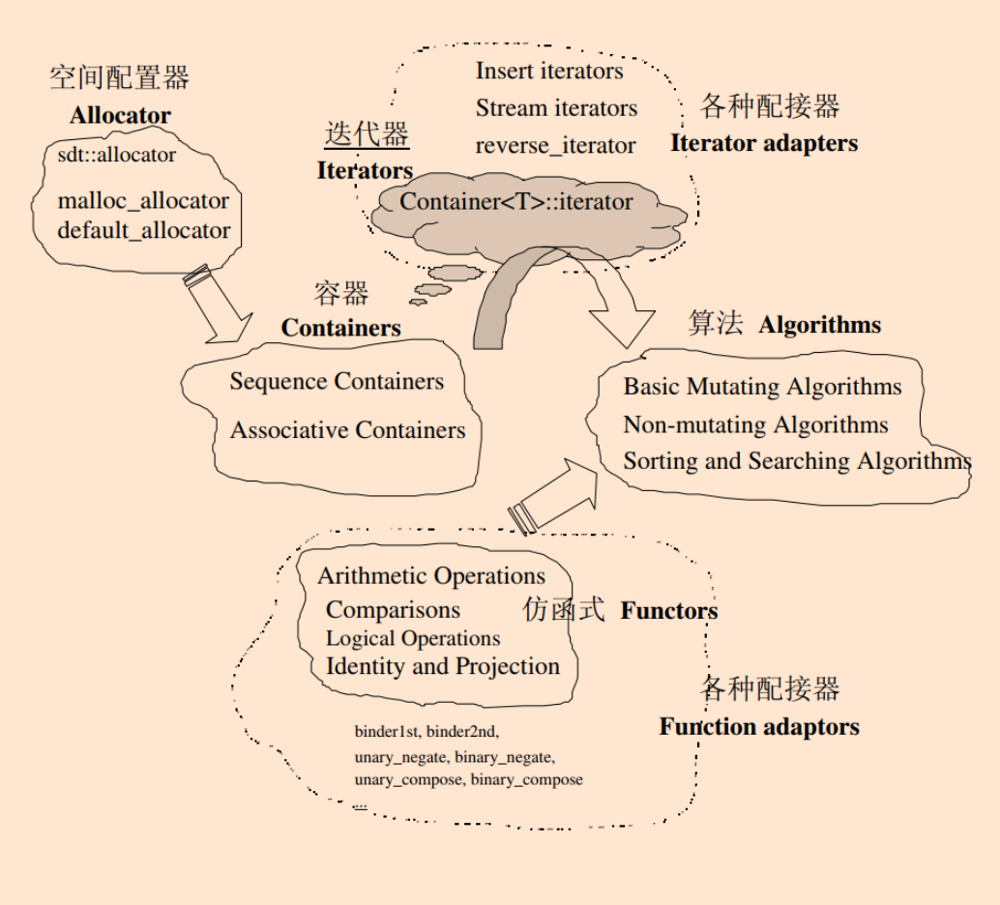

  * 容器：各种数据结构，vector、list、deque、set、map
  * 算法：各种常用算法，包含了初始化、排序、搜索、转换等等
  * 迭代器：用于遍历对象集合的元素，扮演着容器和算法之间的胶合剂，可以视为“泛型指针”。
  * 仿函数：也成为函数对象，行为类似函数，可以作为算法的某种策略。
  * 适配器：一种用来修饰容器或者仿函数活迭代器接口的东西。例如STL提供的queue、stack，就是一种空间配接器。
  * 分配器：空间支配器，负责空间的管理与配置。

* **数组和链表的区别？什么情况下用哪个？**

**数组：**

1. **内存分配：**
   - 连续的内存块存储元素。
2. **大小固定：**
   - 数组的大小通常是固定的，即在创建时就需要确定大小。
3. **随机访问效率高：**
   - 通过索引可以直接访问数组中的任意元素，时间复杂度为 O(1)。
4. **插入和删除开销大：**
   - 插入和删除元素时，需要移动元素，时间复杂度为 O(n)。
5. **适用于静态数据集：**
   - 适用于元素数量固定、对元素的随机访问频繁的情况。

**链表：**

1. **内存分配：**
   - 非连续的内存块，通过指针链接各个节点。
2. **大小动态：**
   - 链表的大小可以动态增长或缩小，不需要预先指定大小。
3. **随机访问效率低：**
   - 需要从头节点开始顺序访问，时间复杂度为 O(n)。
4. **插入和删除效率高：**
   - 在链表中插入或删除元素时，只需调整相邻节点的指针，时间复杂度为 O(1)。
5. **适用于动态数据集：**
   - 适用于需要频繁插入和删除操作、不确定元素数量的情况。

**选择标准：**

- **静态 vs. 动态：**
  - 如果数据集大小是固定的，且需要频繁进行随机访问，使用数组更为合适。
  - 如果数据集大小不确定，需要频繁进行插入和删除操作，使用链表更为合适。
- **内存连续性：**
  - 数组需要连续的内存块，如果内存碎片较多或需要频繁分配释放内存，链表更具优势。
- **随机访问需求：**
  - 如果需要经常随机访问元素，数组的 O(1) 时间复杂度更为高效。
  - 如果主要进行顺序访问或频繁插入删除，链表更为适用。


### STL各种容器的底层实现

#### **vector**

* 底层是一块具有连续内存的数组，vector核心就在于其长度自动可变，vector的数据结构由三个迭代器实现：指向首元素的start，指向尾元素finish，指向内存末端的end_of_storage。
* 扩容机制：当目前可用的空间不足时，分配目前空间的两倍或者目前空间加上所需的新空间大小，容量的扩张必须经过“重新分配内存、元素拷贝、释放原空间”等。


* **如何使用O(1)的复杂度删除元素**

将这个元素和尾部元素swap，然后pop_back()。

* **erase问题**

erase的iterator会自动指向被删除元素的下一个元素，因此不必再进行++操作，并且要拿iter去接受返回值，否则程序也会crash。

**直接erase会使得迭代器信息失效，导致程序crash**

```cpp
for(auto iter=vec.begin();iter!=vec.end(); )
{
     if( *iter == 3)
          iter = veci.erase(iter);//当删除时erase函数自动指向下一个位置，就不需要进行++
      else
            iter ++ ;    //当没有进行删除的时候，迭代器++
}
```


#### **list**

list底层是一个循环双向链表。

#### **deque**

​		双向队列，**通过建立 map 数组，deque 容器申请的这些分段的连续空间就能实现“整体连续”的效果**。

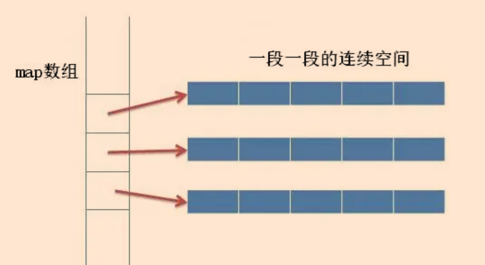

* **分段连续的好处**

1. **快速两端操作：** 由于`std::deque`是分段连续的，它允许在队列的两端（前端和后端）进行快速的插入和删除操作，而不受中间元素的影响。这使得 `push_front`、`pop_front`、`push_back` 和 `pop_back` 操作的时间复杂度都是常数级别。
2. **动态大小：** `std::deque` 允许在两端动态添加或删除缓冲区，而不是像单一数组那样固定大小。这使得 `std::deque` 能够动态地适应不同的使用情况，从而更灵活地管理内存。
3. **减小内存浪费：** 由于每个缓冲区都是独立分配的，可以更灵活地分配内存以适应实际需要的元素数量。这有助于减小内存浪费，尤其是当 `std::deque` 的大小不断变化时。
4. **迭代器保持有效：** 由于 `std::deque` 的元素存储在多个缓冲区中，插入或删除元素不会使所有迭代器失效，而只是可能使涉及到的迭代器失效。这是相对于使用单一数组的 `std::vector` 更具优势的一点。


#### **stack和queue**

栈和队列。基于deque实现，属于容器配接器。

#### **priority_queue**

优先队列，底层为vector容器，以heap作为处理规则，heap是一个完全二叉树。

插入元素的时候**自底向上**完成调整操作

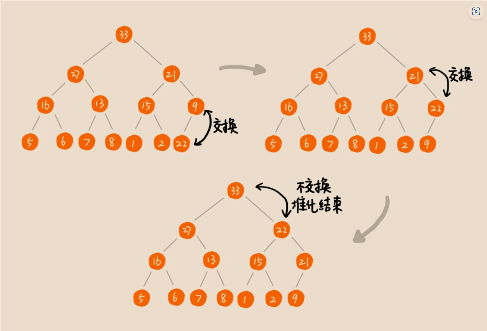

删除元素的时候 **自顶向下**完成调整操作

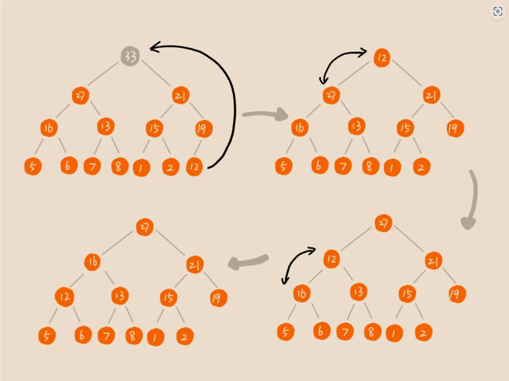


#### **set和map**

底层都是红黑树实现，红黑树是一种二叉搜索树，平衡二叉树(AVL)和红黑树的区别：AVL 树是高度平衡的，频繁的插入和删除，会引起频繁的rebalance（旋转操作），导致效率下降；红黑树不是高度平衡的，算是一种折中，插入最多两次旋转，删除最多三次旋转。

* **红黑树原则**

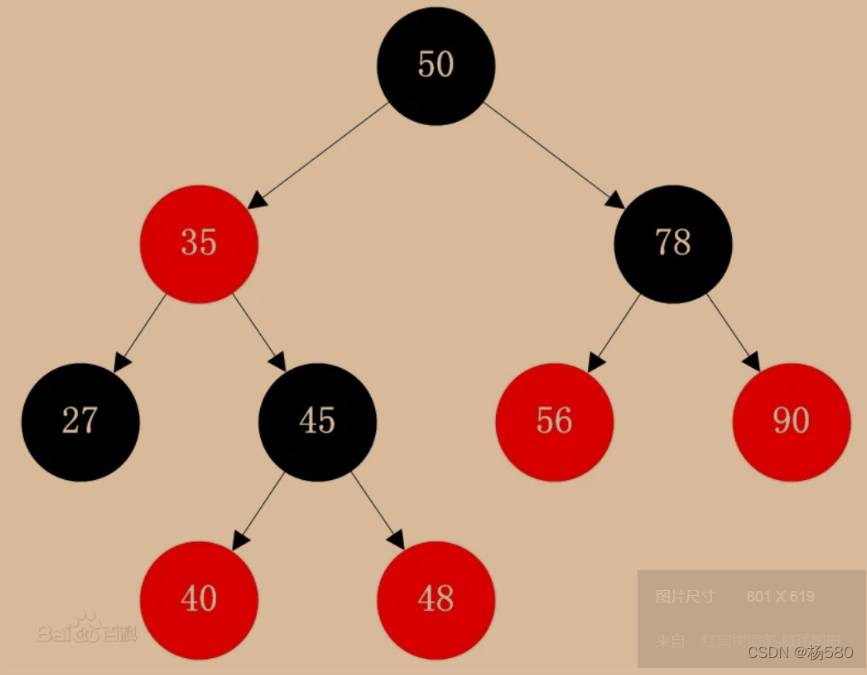

1. 节点分为红色或者黑色；
2. 根节点必为黑色；
3. 叶子节点都为黑色，且为null；
4. 连接红色节点的两个子节点都为黑色（红黑树不会出现相邻的红色节点）；
5. 从任意节点出发，到其每个叶子节点的路径中包含相同数量的黑色节点；
6. 新加入到红黑树的节点为红色节点；


* **自定义数据怎么使用map**

使用 `std::map` 存储自定义数据结构（如自定义类或结构体）涉及到两个关键点：定义比较函数或运算符，以及使用该比较方式作为 `std::map` 的模板参数。

```cpp
#include <iostream>
#include <map>
#include <string>

// 自定义数据结构：Person
struct Person {
    std::string name;
    int age;

    // 构造函数
    Person(const std::string& n, int a) : name(n), age(a) {}

    // 重载小于运算符，用于在 std::map 中比较 Person 对象
    bool operator<(const Person& other) const {
        return age < other.age;  // 按年龄比较
    }
};

int main() {
    // 定义 std::map，键为 Person，值为一些信息
    std::map<Person, std::string> personMap;

    // 插入数据
    personMap.insert({Person("Alice", 25), "Engineer"});
    personMap.insert({Person("Bob", 30), "Doctor"});
    personMap.insert({Person("Charlie", 22), "Student"});

    // 查询数据
    Person queryPerson("Bob", 30);
    auto it = personMap.find(queryPerson);
    if (it != personMap.end()) {
        std::cout << "Profession of " << queryPerson.name << ": " << it->second << std::endl;
    } else {
        std::cout << "Person not found." << std::endl;
    }

    // 遍历输出
    for (const auto& pair : personMap) {
        const Person& person = pair.first;
        const std::string& profession = pair.second;
        std::cout << person.name << " (" << person.age << " years old): " << profession << std::endl;
    }

    return 0;
}
```


* **C++中map的种类、区别和扩容方式**

在C++标准库中，有两种主要的Map实现- `std::map`和`std::unordered_map`，它们有一些区别和特点。

1. `std::map`：
   - 基于红黑树实现的有序关联容器。
   - 内部元素根据键值进行排序。
   - 查找、插入和删除元素的平均时间复杂度为O(log N)。
   - 不支持快速的随机访问，但可以按序遍历。
   - 使用比较函数来保持键的有序性。

2. `std::unordered_map`：
   - 基于哈希表 (Hash Table) 实现的无序关联容器。
   - 内部元素无特定顺序。
   - 查找、插入和删除的平均时间复杂度为O(1)，具有较快的性能。
   - 支持快速的随机访问。
   - 使用哈希函数对键进行分布和存储。

关于Map的扩容：
- `std::map`的底层实现采用红黑树，不需要改变节点的位置和重新调整树的平衡，因此不需要进行扩容操作。
- `std::unordered_map`的底层实现是哈希表，当容量不足以容纳更多元素时，会发生扩容操作。
   - 扩容时，会创建一个更大的哈希表，并重新将元素散列到新的存储位置。


* **STL内存管理方式，Allocator次级分配器的原理以及内存池的优势和劣势**
  
  * 为了提升内存管理的效率，减少申请小内存导致的内存碎片的问题，STL采用了两级配置器，当分配空间大小超过128B的时候，会使用第一级空间配置器，直接使用malloc、realloc、free等函数进行内存空间的分配和释放，如果空间分配大小小于128B，将使用第二级空间配置器，采用了内存池技术，通过空闲链表来管理内存。
  * 次级配置器的内存池管理技术：每次配置一大块内存，并维护对应的自由链表(free list)。若下次再有相同大小的内存配置，就直接从自由链表中拔出。如果客户端释还小额区块，就由配置器回收到自由链表中；配置器共要维护16个自由链表，存放在一个数组里，分别管理大小为8-128B不等的内存块。分配空间的时候，首先根据所需空间的大小（调整为8B的倍数）找到对应的自由链表中相应大小的链表，并从链表中拔出第一个可用的区块；回收的时候也是一样的步骤，先找到对应的自由链表，并插到第一个区块的位置。
  * 优势：避免了内存碎片(外部碎片)，不需要频繁从用户态切换到内核态
  * 劣势：仍会造成一定的内存浪费、比如申请120B就必须分配128B（内部碎片）。
  
* **STL容器的push_back和emplace_back的区别？**
  
  - 传统C++中，emplace/emplace_back函数使用传递来的参数直接在容器管理的内存空间中构造元素（只调用了构造函数）；push_back会创建一个局部临时对象，并将其压入容器中（可能调用拷贝构造函数或移动构造函数）
  - 现代C++无区别
  
* **STL的排序用到了哪种算法，具体如何执行？**
  * 快速排序、插入排序和堆排序；当数据量很大的时候用快排，划分区段比较小的时候用插入排序，当划分有导致最坏情况的倾向的时候使用堆排序。
  
* **排序算法分析**

  * 稳定性

  分析算法为什么不稳定？

  1. shell排序：但在不同的插入排序过程中，**相同的元素可能在各自的插入排序中移动，最后其稳定性就会被打乱**(在不同组内的顺序变化，可能导致不稳定)
  2. 选择排序：一趟选择，如果一个元素比当前元素小，而该小的元素又出现在一个和当前元素相等的元素后面，那么交换后稳定性就被破坏了。举个例子，序列arr = [5 8 5 2 9]，我们知道第一遍选择第1个元素5会和2交换，那么原序列中两个5的相对前后顺序就被破坏了，所以选择排序是一个不稳定的排序算法。
  3. 堆排序：在堆调整的过程中，元素会发生交换，打破它们在原始数组中的相对顺序。
  4. 快速排序：快速排序之所以不稳定，主要是由于在分区过程中对相等元素的处理可能导致它们的相对顺序改变。

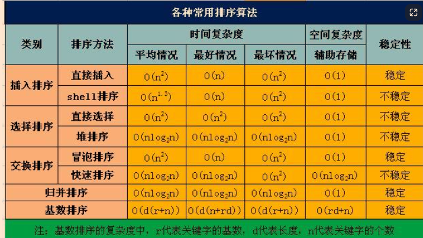


* **哈希表**
  
  * 哈希散列可能会存在冲突，解决冲突一般有开放定址法法和拉链法，开放定址法包括线性测探、平方测探法，本质上都是对应位置被占用了就向后查找；
  * 哈希表的长度使用质数，可以降低发生冲突的概率，使哈希后的数据更加均匀，如果使用合数，可能会导致很多数据集中分布到一个点上，造成冲突；
  
  

* **如何评价hash函数的好坏**

1. **均匀性（Uniformity）：**
   - 一个好的哈希函数应该尽可能均匀地将输入映射到哈希值空间，避免出现簇集（cluster）或者热点区域。均匀性意味着哈希值的分布是平滑的，不容易导致哈希冲突。
2. **碰撞概率（Collision Probability）：**
   - 碰撞是指两个不同的输入映射到相同的哈希值。一个好的哈希函数应该使碰撞的概率尽可能小。低碰撞概率可以减小在使用哈希函数的数据结构中出现冲突的可能性，如哈希表。
3. **计算效率：**
   - 哈希函数应该是高效计算的，特别是当处理大量数据时。计算效率对于实际应用的性能至关重要。好的哈希函数应该能够在短时间内完成计算。


* **map和unordered_map区别**

`std::map` 和 `std::unordered_map` 是 C++ 标准模板库（STL）中提供的两种关联容器，用于存储键值对。它们之间的主要区别在于底层实现和性能特征。

1. **底层实现：**
   - **`std::map`：** 使用红黑树（Red-Black Tree）实现的有序关联容器。红黑树是一种自平衡的二叉搜索树，确保插入、删除和查找操作的时间复杂度为 O(log n)。
   - **`std::unordered_map`：** 使用哈希表（Hash Table）实现的无序关联容器。哈希表通过散列函数将键映射到存储桶（buckets），以提供快速的插入、删除和查找操作。在平均情况下，哈希表的操作具有常数时间复杂度 O(1)。
2. **有序性：**
   - **`std::map`：** 元素按键的大小有序排列。
   - **`std::unordered_map`：** 元素没有特定的顺序，插入顺序和散列函数有关。
3. **性能特征：**
   - **`std::map`：** 由于红黑树的自平衡特性，适用于需要保持元素有序性的场景。在有序插入和查找的情况下，性能较为稳定。
   - **`std::unordered_map`：** 适用于需要快速插入、删除和查找的场景。在无序插入和查找的情况下，平均性能更高。
4. **空间复杂度：**
   - **`std::map`：** 需要额外的空间来存储红黑树的节点，因此通常比哈希表占用更多的内存。
   - **`std::unordered_map`：** 在一些情况下，由于哈希冲突和桶的分配，可能占用的内存较少。


* **STL容易出错的地方？**

1. **迭代器失效：** 在对容器进行插入或删除操作时，可能会导致迭代器失效。在使用迭代器遍历容器的同时进行插入或删除操作时，需要小心确保迭代器的有效性。解决方法可以是使用返回新迭代器的插入和删除操作，或者在修改容器后重新获取迭代器。
2. **内存泄漏：** 在动态分配内存的容器元素（如`std::vector`、`std::list`）中，如果忘记释放这些元素的内存，就可能导致内存泄漏。使用智能指针或者手动释放内存来避免这个问题。
3. **越界访问：** 在使用像`std::vector`这样的序列容器时，越界访问数组元素可能导致未定义行为。务必确保访问容器的索引在有效范围内，否则会发生错误。
4. **比较和查找问题：** 在使用关联容器时，如`std::map`和`std::set`，需要确保元素类型支持正确的比较操作。如果没有正确定义比较函数或者元素类型没有比较操作符，可能导致查找和插入操作出错。
5. **使用过期容器：** C++标准可能会引入新的容器或修改容器的规范。使用已经过期或不推荐使用的容器和算法可能导致代码不兼容未来的标准。建议使用现代C++标准中推荐的容器和算法。
6. **线程安全性：** 大多数STL容器都不是线程安全的，如果在多线程环境中使用容器，需要采取适当的同步措施，例如使用互斥锁。
7. **异常安全性：** 在进行容器操作时，要确保代码具有良好的异常安全性。即使发生异常，资源也能被正确释放，不会导致资源泄漏或数据不一致。
8. **对容器元素的正确使用：** 确保对容器元素的操作是正确的、有效的，不会破坏容器的不变式和约定。


### STL容器算法性能比较


## 多线程

* **主线程退出了，子线程会退出吗？**

如果是正常的`return 0`,子线程会退出，即使线程是被detach出去的，在C++中，`return 0;` 通常用于表示程序正常退出，并返回给操作系统一个退出码（通常0表示成功）。当 `main` 函数中执行了 `return 0;` 时，主线程的 `main` 函数即将返回，这会导致整个程序的生命周期结束。

在程序生命周期结束时，操作系统可能会强制终止所有线程，包括主线程和其他线程。这是因为程序的生命周期结束，操作系统认为不再需要继续执行线程。这种情况下，即使其他线程仍在执行，它们可能会被强制终止。

如果使用了`pthread_exit(nullptr)`则detach的子线程不会退出，`pthread_exit` 函数的调用会导致当前线程退出，但它并不会影响其他线程。其原理是在 POSIX 线程库中，每个线程都有自己的执行上下文（包括寄存器状态、栈等），调用 `pthread_exit` 时，会释放当前线程所占用的资源，并通知线程库清理相关资源，但并不会影响其他线程的执行。

* **如果子线程没有调用join和detach，会发生什么呢？**

如果一个 `std::thread` 对象被创建，但既没有调用 `join` 也没有调用 `detach`，而且当 `std::thread` 对象的析构函数被调用时线程仍然在运行，会导致 `std::terminate` 被调用，从而终止整个程序。这是因为 `std::terminate` 是 C++ 标准中规定的在某些情况下的终止处理函数。

* **C++多线程下访问共享内存要注意什么？**

在C++中，多线程下访问共享内存时，需要特别注意线程安全性，以避免出现竞态条件（Race Condition）等问题。以下是一些需要注意的事项：

1. **互斥锁（Mutex）：** 使用互斥锁来保护共享数据的访问。在进入临界区之前，线程应该先获取锁，执行完后再释放锁。这确保在同一时间只有一个线程可以访问共享资源。
2. **避免死锁：** 谨慎设计锁的获取顺序，以避免死锁的发生。当多个线程试图以不同的顺序获取多个锁时，可能发生死锁。
3. **内存可见性：** 考虑多线程环境下的内存可见性问题，确保一个线程对共享数据的修改对其他线程是可见的。可以使用`std::atomic`或者适当的内存顺序来解决。

* **访问共享内存除了用锁，还用什么？**

1. **原子操作：** 使用`std::atomic`和相关的原子操作函数，可以在没有锁的情况下执行一些基本的原子操作。例如，`std::atomic<int>`可以用于原子地更新整数。
2. **无锁数据结构：** 使用无锁数据结构，如无锁队列（Lock-Free Queue）或无锁栈，以减少对互斥锁的依赖。这些数据结构使用一些原子操作来实现线程安全。
3. **使用信号量：** 可以使用信号量进行线程同步，确保在共享资源上的访问符合预期的顺序。`std::semaphore`在C++20中引入，用于实现信号量
4. **事务内存（Transactional Memory）：** 使用事务内存是一种较新的技术，它试图通过事务的方式简化并发编程。在C++中，事务内存的支持并不普遍，但一些编译器和硬件架构可能提供了相关支持。


* **原子操作怎么是实现的？**
  原子操作的底层实现通常涉及硬件层面的支持，特别是涉及到多核处理器或多处理器系统。原子操作的目标是在多线程环境下保证某个操作的不可分割性，即在执行该操作时不会被其他线程中断。

下面是一些底层原子操作的实现机制：

1. **总线锁定（Bus Locking）：**
   - 在多处理器系统中，有一些特殊的CPU指令，如`LOCK`前缀，可以在执行某个指令时锁定系统的总线，确保此时只有一个CPU能够访问内存。这样的机制可以保证在锁定期间，其他CPU无法修改相同的内存区域。
2. **原子指令：**
   - 一些处理器提供特定的原子指令，如 Compare-and-Swap（CAS）或 Load-Link/Store-Conditional（LL/SC）等。这些指令允许在一个操作中读取和更新内存值，并且在整个操作过程中不会被中断。如果内存值与期望值相同，就执行更新操作；否则，操作不执行。
3. **硬件事务内存（Hardware Transactional Memory，HTM）：**
   - 一些现代处理器支持硬件事务内存，这是一种在硬件级别上提供原子性的机制。它允许程序员使用事务块，将一系列内存操作作为原子操作执行。如果事务成功，所有更改都会被提交；如果事务失败，所有更改都会被回滚。
4. **缓存一致性协议：**
   - 多处理器系统中，处理器通常使用缓存来提高性能。然而，缓存的存在可能导致数据不一致。缓存一致性协议，如MESI（Modified, Exclusive, Shared, Invalid）协议，确保在多个处理器之间共享的数据保持一致。这有助于实现原子性。

需要注意的是，具体的原子操作实现方式依赖于硬件体系结构和操作系统。不同的处理器架构和操作系统可能使用不同的机制来支持原子操作。在C++中，通过 `<atomic>` 头文件提供的原子类型和操作可以在不同平台上使用这些底层机制，而不必关心具体的实现细节。

## 工程问题

* **如果一个类有其他的类作为数据成员，构造函数调用顺序是怎么样的？**

成员对象的构造函数是在主题构造函数体开始之前调用的，基类的构造函数会在派生类构造函数之前调用。

### 编译原理

* **编译链接原理，源文件->可执行文件**

  预处理、编译、汇编、链接

  * 预处理阶段处理头文件包含关系，宏定义，对预编译命令进行替换，生成预编译文件；
  * 编译阶段将预编译文件编译，生成汇编文件（编译的过程就是把预处理完的文件进行一系列的词法分析，语法分析，语义分析及优化后生成相应的汇编代码)；
  * 汇编阶段将汇编文件转换成机器码，生成可重定位目标文件（.obj文件）（汇编器是将汇编代码转变成机器可以执行的命令，每一个汇编语句几乎都对应一条机器指令。汇编相对于编译过程比较简单，根据汇编指令和机器指令的对照表一一翻译即可
  * 链接阶段，将多个目标文件和所需要的库连接成可执行文件（.exe文件）

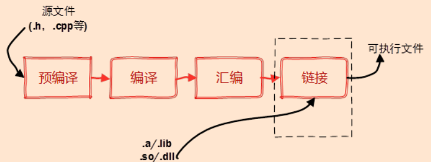

* **静态库与动态库**

  * 静态库

  静态库链接是在程序运行前的链接阶段完成，浪费空间和资源，在链接阶段，会与汇编生成的obj文件一起链接生成可执行文件。

  * 动态库

  在程序编译的时候不会链接到目标代码，是在程序运行时才被载入的，因此链接时动态链接。将一些程序升级变得简单。解决了静态库对程序的更新、部署和发布页会带来麻烦。用户只需要更新动态库即可，**增量更新**。
  
  动态库通过函数符号表重定位调用的函数进行执行。


* **如何优化内存**
  * 减少内存泄露。避免使用不必要的局部变量和静态变量，及时释放不再使用的内存空间。
  * 优化内存分配。合理分配内存，避免频繁的申请和释放。
  * 避免内存碎片。使用内存池技术，复用分配好的内存。


### 对象池思想

对于频繁创建和销毁的对象，对象池的思想是，首先从给对象池中寻找有没有可用的对象，如果没有就创建对象来使用，然后当一个对象不使用的时候，不是把它删除，而是将它设置为未激活状态并放在对象池中，等需要使用的时候再去对象池中寻找，并把它激活。

**大小问题：**

通常情况下，我们需要控制对象池的大小

如果对象池没有限制，可能导致对象池持有过多的闲置对象，增加内存的占用

如果对象池闲置过小，没有可用的对象时，会造成之前`对象池无可用的对象时，再次请求`出现的问题

对象池的大小选取应该结合具体的使用场景，结合数据（触发池中无可用对象的频率）分析来确定。


## C++缺陷

### 反射

* **C++如何实现反射机制？**


# 设计模式

## 单例模式

保证一个类仅有一个实例，并提供一个访问它的全局访问点，该实例被所有程序模块共享。

* **懒汉单例**

单例实例在第一次被使用时才进行初始化，这叫做延迟初始化。线程不安全，需要加锁，并且不能简单的在前面判空加锁，因为可能某个线程正在初始化单例，另一个线程却在判断单例是否为空，这样就会获取到不完全的单例，造成错误。

```cpp
class Singleton  
{ 
public:  
  	static Singleton* getInstance() {
        //第一个检查，如果只是读操作，就不许用加锁
        if (m_pInstance == nullptr) {
            std::lock_guard<std::mutex> lck(m_mutex);
            //第二个检查，保证只有一个
            if (m_pInstance == nullptr) {
                m_pInstance = new Singleton;
            }
        }
        return m_pInstance;
    }
    static void delInstance(){ // 为了多线程安全，本人觉得释放操作也要做 double-check
    	if(m_pInstance != nullptr) 
    	{
    		std::lock_guard<std::mutex> lck(m_mutex);
    		if(m_pInstance != nullptr) 
    		{
            	delete m_pInstance;
            	m_pInstance = nullptr;
        	}
    	}        
    };
private:
 	Singleton(){
        std::cout << "Singleton Hello" << std::endl;
    };
    ~Singleton() { // 私有化 可以避免 直接 delete s1 ，必须 使用 delInstance
        std::cout << "Singleton Bye" << std::endl;
    }
    static Singleton* m_pInstance;
    static std::mutex m_mutex;
};  
Singleton* Singleton::m_pInstance = nullptr;
std::mutex Singleton::m_mutex;
```

最简单的实现方式：

```cpp
class SingletonInside  
{  
private:  
    SingletonInside(){}  
public:  
    static SingletonInside* getInstance()  
    {  
        Lock(); // not needed after C++0x  
        static SingletonInside instance;  
        UnLock(); // not needed after C++0x  
        return instance;   
    }  
};  
```

* **饿汉单例**

在main函数开始的时候即创建对象，线程安全；

```cpp
class Singleton
{
public:
	static Singleton* GetInstance()
	{
		return &m_instance;
	}
private:
	// 构造函数私有
	Singleton(){};
	// C++98 防拷贝
	Singleton(Singleton const&);
	Singleton& operator=(Singleton const&);
	// or
	// C++11
	Singleton(Singleton const&) = delete;
	Singleton& operator=(Singleton const&) = delete;
	static Singleton m_instance;
};
Singleton Singleton::m_instance; // 在程序入口之前就完成单例对象的初始化
```


## 工厂模式

- 该模式用来封装和管理类的创建，终极目的是为了解耦，实现创建者和调用者的分离。
- **简单工厂**

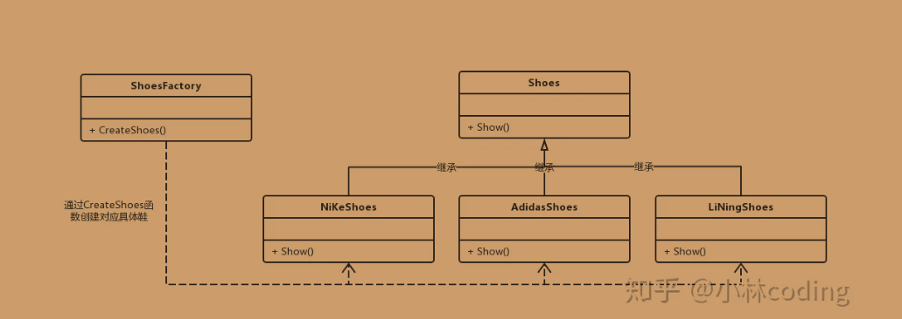


* **工厂方法**

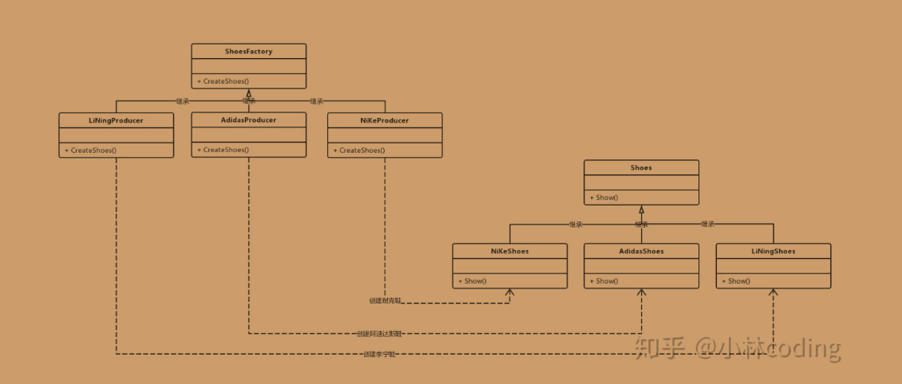

* **抽象工厂**

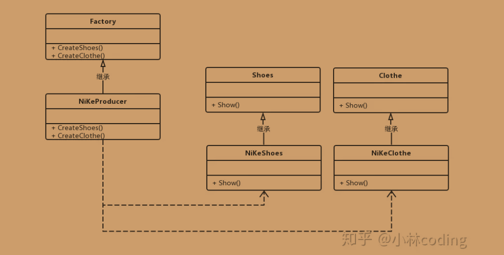

## 观察者模式

* 又叫发布-订阅模式（Publish/Subscribe），定义对象间一种一对多的依赖关系，使得每当一个对象改变状态，则所有依赖于它的对象都会得到通知并自动更新。该模式属于行为型模式。

  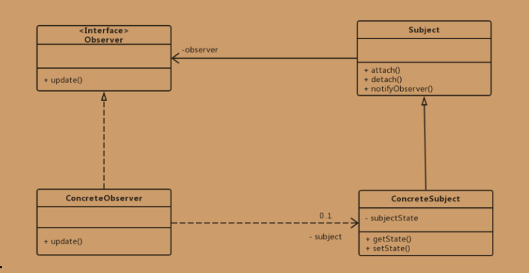

# 图形学

## 渲染

### 渲染管线

* **什么是图形渲染管线，分为哪些阶段？**

图形渲染管线实际上指的是一堆原始图形数据途径一个输送管道，期间经过各种处理变化最终出现到屏幕的过程，在概念上可以分为四个阶段：应用程序阶段、几何阶段、光栅化阶段、像素处理阶段。

（1）应用程序阶段，该阶段主要是在软件层面上执行的一些工作，包括空间加速算法、视锥剔除、碰撞检测、动画物理模拟等。大体逻辑是：执行视锥剔除，查询出可能需要绘制的图元并生成渲染数据，设置渲染状态和绑定各种Shader参数，调用DrawCall，进入到下一个阶段，GPU渲染管线。

（注：应用程序阶段在**CPU**端完成，后面的所有阶段都是在**GPU**端完成）

（2）几何阶段，包含顶点着色、投影变换、裁剪和屏幕映射阶段。

a. 顶点处理阶段：这个阶段会执行**顶点变换**和**顶点着色**的工作。通过模型矩阵、观察矩阵和投影矩阵(也就是MVP矩阵)计算出顶点在裁剪空间下的位置(clip space)，以便后续阶段转化为标准化设备坐标系(NDC)下的位置。也可能会计算出顶点的法线(需要有法线变换矩阵)和纹理坐标等。同时，在这个阶段也可能会进行顶点的着色计算，如平面着色 (Flat Shading)和高洛德着色 (Gouraud Shading)都是在顶点着色器中进行着色计算。因为这个阶段是完全可控制的，因此执行什么样的操作由程序员来决定。（此外，在顶点处理阶段的末尾，还有一些可选的阶段，包括曲面细分(tessellation)、几何着色(geometry shading)和流输出(stream output)，此处不详细描述）

b. 裁剪阶段：对部分不在视体内部的图元进行裁剪。这部分是几乎完全由硬件控制的，因此没必要详细描述，至于为什么有了视锥剔除，到这个阶段还需要进行一次裁剪，可参考这个问题[为什么在ndc归一化坐标已经包含了视锥体剔除功能的情况下 还需要视锥体裁剪？ - 知乎 (zhihu.com)](https://www.zhihu.com/question/304277310/answer/562221670)。简单来说就是两次裁剪的粒度不同，前者是在物体对象层面的，一般对对象的包围盒做剔除，剔除掉不在视锥体内的物体，NDC裁剪是在三角形层面做的，裁剪掉不在屏幕内的像素。


c. 屏幕映射阶段：主要目的是将之前步骤得到的坐标映射到对应的屏幕坐标系上。

（3）光栅化阶段，包含三角形设置和三角形遍历阶段。


a. 三角形设置(图元装配)，计算出三角形的一些重要数据(如三条边的方程、深度值等)以供三角形遍历阶段使用，这些数据同样可用于各种着色数据的插值。

b. 三角形遍历，找到哪些像素被三角形所覆盖，并对这些像素的属性值进行插值。通过判断像素的中心采样点是否被三角形覆盖来决定该像素是否要生成片段。通过三角形三个顶点的属性数据，插值得到每个像素的属性值。此外透视校正插值也在这个阶段执行。


（4）**像素处理阶段**，包括像素着色和测试合并。

a. 像素着色，进行光照计算和阴影处理，决定屏幕像素的最终颜色。各种复杂的着色模型、光照计算都是在这个阶段完成。

b. 测试合并，包括各种测试和混合操作，如裁剪测试、透明测试、模板测试、深度测试以及色彩混合等。经过了测试合并阶段，并存到帧缓冲的像素值，才是最终呈现在屏幕上的图像。

（5）**各个阶段的可控性**


* **GPU渲染管线有哪些流程**

**应用程序-》顶点着色器-》曲面细分着色器-》几何着色器-》裁剪与消除-》屏幕映射-》光栅化-》像素着色-》深度模板测试与混合**


* **简述OpenGL中由顶点数据输入会知道一幅图像的具体过程**

  (1) vbo将数据存储到缓存中，vao绑定顶点属性关系，然后vbo将缓存数据传给vertex_shader；

  (2) 在顶点着色器中进行坐标变换，由mvp矩阵将其转换到裁剪坐标系，以及顶点着色；

  (3) 然后到了图元装配阶段，将顶点着色器的输出数据装配成指定图元的形状，之后还有一个可选的几何着色器阶段，将输入的点或线扩展成多边形；

  （注意，这个地方的表述正是和平常的图形渲染管线不一致的地方，这里应该是将图形渲染管线中的三角形设定或者说图元组装阶段表述为图元装配阶段，然后下面的光栅化阶段就是三角形遍历阶段）

  (4) 然后到裁剪和屏幕映射阶段；裁剪掉视体外的图元，将当前坐标映射到屏幕坐标；

  (5) 然后进入光栅化阶段，找到哪些像素被三角形覆盖，以及进行插值计算；

  (6) 然后进入到了fragment_shader，执行光照计算，进行着色；

  (7) 最后进入到测试混合阶段，包括Alpha测试、模板测试、深度测试等，然后进行混合。


* **什么是early-Z？在哪个阶段执行？什么时候会失效？**

early-Z就是提前进行深度测试，剔除不可见的片段，以提高渲染性能。

现代GPU中运用了Early-Z的技术，在Vertex阶段和Fragment阶段之间（光栅化之后，fragment之前）进行一次深度测试，如果深度测试失败，就不必进行fragment阶段的计算了，因此在性能上会有很大的提升。但是最终的ZTest仍然需要进行，以保证最终的遮挡关系结果正确。


失效情况：

	1. 开启了alpha test。early-Z是测试完就会更新深度缓存，如果某个片元通过了测试，但是后面alpha test没通过，那这块像素被丢弃，假如该位置上后面的片元都无法通过测试，那就直接G了。
	1. 手动修改GPU插值得到的深度
	1. 关闭了深度测试


* **背面剔除怎么实现？**

首先确定什么是背面？如何定义的？
例如OpenGL在渲染图元的时候将使用这个信息来决定一个三角形是一个正向三角形还是背向三角形。默认情况下，逆时针顶点所定义的三角形将会被处理为正向三角形。

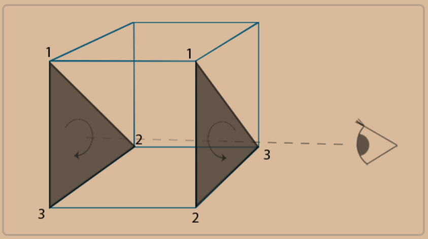


在实现背面剔除时，通常采用以下步骤：

1. **确定顺时针或逆时针方向：**
   - 确定顶点顺序的方向，例如逆时针（Counter-Clockwise，CCW）为正面，或者顺时针（Clockwise，CW）为正面。这通常由图形API或引擎的设置来决定。
2. **计算三角形法向量：**
   - 对于每个三角形，计算法向量。法向量表示三角形所在平面的方向。
3. **计算视点方向向量：**
   - 计算从视点到三角形的一个顶点的向量。这个向量是视点方向。
4. **计算法向量和视点方向向量的点积：**
   - 计算法向量和视点方向向量的点积。如果点积的结果与顺时针或逆时针方向相符，说明该三角形面朝向视点；如果不符，则说明该三角形背对视点。
5. **剔除或裁剪背面三角形：**
   - 根据点积的结果，确定是要剔除背面的三角形还是正面的三角形。背面的三角形可以直接不绘制，或者进行裁剪，从而提高渲染效率。


* **视锥体剔除是怎么实现的？**
  图形学中的视锥剔除是一种优化技术，用于排除不在视锥体内的几何体，以提高渲染效率。这个过程通常发生在相机坐标系或裁剪坐标系中。以下是视锥剔除的一般步骤：

1. **变换到裁剪坐标系（裁剪空间）：**
   - 对于场景中的几何体，进行模型变换、视图变换和投影变换，将它们的顶点坐标变换到裁剪坐标系（裁剪空间）。这包括将几何体的坐标从世界坐标系变换到相机坐标系（视图变换），然后进行投影变换。
2. **视锥剔除测试：**
   - 对于每个几何体，检查其顶点是否在视锥体内。这个测试通常包括以下几个步骤：
     - **近平面剔除：** 检查顶点是否在视锥体的近平面内。
     - **远平面剔除：** 检查顶点是否在视锥体的远平面内。
     - **左、右、上、下平面剔除：** 检查顶点是否在视锥体的左、右、上、下平面内。
3. **裁剪算法：**
   - 如果某个几何体部分在视锥体内，而部分在视锥体外，需要进行裁剪。裁剪算法可以采用各种方法，例如 Sutherland-Hodgman 算法用于裁剪三角形，Cohen-Sutherland 算法用于裁剪线段。

Sutherland-Hodgman 算法是一种用于对多边形进行裁剪的算法，而不仅仅是三角形。该算法的基本思想是对多边形的每条边进行裁剪，通过对多边形的每个顶点进行逐步的裁剪，最终得到被裁剪后的多边形。以下是 Sutherland-Hodgman 算法用于裁剪三角形的一般步骤：

1. **初始化：**
   - 对于三角形的每一条边，标记其是否与裁剪窗口（裁剪区域）相交。这可以通过检查每条边的端点是否在窗口的两侧来完成。
2. **边裁剪：**
   - 对于三角形的每一条边，如果该边与裁剪窗口相交，计算交点，并将交点添加到结果多边形的顶点列表中。
3. **遍历多边形：**
   - 对于三角形的每一个顶点，检查它是否在窗口内。如果在窗口内，将该点添加到结果多边形的顶点列表中。
4. **构建结果多边形：**
   - 将步骤2和步骤3得到的顶点按顺序构建为一个新的多边形，即为裁剪后的三角形。


* **提前剔除应该怎么做**


提前剔除（Frustum Culling）是图形渲染中的一种优化技术，用于在渲染前排除不在视锥体（视椎体）内的对象，从而减少不必要的渲染工作。这是通过检查对象是否在相机的视锥体内来实现的。以下是一般的提前剔除步骤：

1. **计算视锥体：**
   - 根据相机的位置、视点和投影矩阵，计算视锥体的六个裁剪平面。
2. **对象包围体检测：**
   - 对于每个对象，计算它的包围体（Bounding Volume），通常是一个包围盒（AABB，Axis-Aligned Bounding Box）或包围球（Bounding Sphere）。
3. **包围体与视锥体相交测试：**
   - 对于每个对象的包围体，检查它是否与视锥体相交。如果包围体完全在视锥体之外，可以安全地剔除整个对象，因为它不可能在视图中可见。
4. **精细化剔除：**
   - 对于那些包围体与视锥体相交的对象，进行更详细的剔除测试。这可能包括对对象的几何形状进行进一步的裁剪测试，以确保只有在视锥体内部的部分被保留。
5. **渲染剩余对象：**
   - 只有通过所有剔除测试的对象才会被传递到渲染管线中，进行后续的顶点着色、光照、投影等阶段。


* **几何着色器的作用**

几何着色器（Geometry Shader）是图形渲染管线中的一个可编程阶段，位于顶点着色器（Vertex Shader）和片段着色器（Fragment Shader）之间。几何着色器的主要作用是在图元级别对图元进行处理，产生新的图元（顶点、线段或三角形）。


* **什么时候vs比fs运行的次数还要多**
  * 提前模板测试(?)
  * 自定义裁剪空间(?)


* **除了 fs、vs 还有哪些着色器？它们的作用？写代码时用过哪些着色器？**

1. 几何着色器，用于处理几何图形，通常在顶点着色器喝片元着色器之间执行，用于生成新的几何图形、增加几何细节、执行投影和裁等等
2. 细分着色器是用于曲面细分的一对着色器。TCS（细分控制着色器）用于控制如何细分曲面，而TES（细分评估着色器）用于计算细分曲面的最终顶点坐标。
3. 计算着色器，可以执行通用计算任务，而不涉及图像渲染，通常用于GPGPU任务，数据处理以及物理模拟等等。

* **什么是DrawCall**

  * 在应用阶段，尽管CPU把数据准备得十分充分，在完成传送任务后，CPU也不能一走了之，还需要向GPU下达一个渲染命令，这个命令就是Draw Call，由于之前我们把这个数据准备得十分完善了，所以DrawCall仅仅是一个指向被渲染的图元列表，没有其他材质信息。
  * CPU向GPU发送指令也是像流水线一样，CPU王命令缓冲区中一个个放入命令，GPU一个个取出，在实际的渲染中，GPU的渲染速度往往超过了CPU的提交命令的速度，这就导致大部分时间都消耗在了CPU的Draw Call上，有一种解决办法是**批处理**，即要把渲染的模型合并在一起交给GPU。

  

* **各种测试的含义以及相对顺序**

  * 裁剪测试，在裁剪测试中，允许程序员开设一个裁剪框，只有在裁剪框内的片元才会被显示出来，在外部的偏远均被剔除，通常情况下，我们会让视口的大小和屏幕空间一样大，此时可以不需要使用到裁切测试。但当两者大小不一样大时，我们需要用到裁切测试来避免其产生的一些问题。如下图所示。

  

  * Alpha测试：像素值一般是由RGBA四个分量来表示的，其中的A是alpha，表示的是物体的不透明度。1代表完全不透明，0代表完全透明。可选的 alpha 测试可在深度测试执行前在传入片段上运行。片段的 alpha 值与参考值作某些特定的测试（如等于，大于等），如果片段未能通过测试，它将不再进行进一步的处理。 alpha 测试经常用于不影响深度缓存的全透明片段的处理。简单来说，就是根据物体的透明度来决定是否渲染。

  * 模板测试：模板缓冲是用于记录所呈现图元位置的离屏缓存，如下图所示，如果使用了模板缓冲，就相当于在屏幕上有一块模板盖在上面，只有位于这个模板中的图元片段，才会被渲染出来。模板测试就是用片段指定的参考值与模板缓冲中的模板值进行比较，如果达到预设的比较结果，模板测试就通过了，然后用这个参考值更新模板缓冲中的模板值；如果没有达到预设的比较结果，就是没有通过测试，就不更新模板缓冲。简单来说，就是根据物体的位置范围决定是否渲染。

    

    

  * 深度测试： 我们在观察物体的时候，位于前面的物体会把后面的物体挡住，所以在渲染的时候，图形管线会先对每一个位置的像素存储一个深度值，称为深度缓冲，代表了该像素点在3D世界中离相机最近物体的深度值。于是在计算每一个物体的像素值的时候，都会将它的深度值和缓冲器当中的深度值进行比较，如果这个深度值小于缓冲器中的深度值，就更新深度缓冲和颜色缓冲的值，否则就丢弃（深度测试和深度写入）；简单来说，就是根据物体的深度决定是否渲染。

  * 测试顺序:裁剪测试-》alpha测试-》模板测试-》深度测试

    


* **延迟渲染的优缺是什么？在移动端需要考虑什么问题**

优点：

	1. 支持大量光源。延迟渲染可以支持大量官员，他仅需要对场景的几何信息进行一次渲染，然后为每个光源执行光照计算，而不必对每个光源进行完整的渲染。
	1. 灵活性，延迟渲染允许多个光照和材质通道，以实现复杂的光照效果。
	1. 后期处理，延迟渲染可以方便的进行后期处理，如SSAO等。

缺点：

1. gbuffer显存占用比较大，存储的信息比较多，几何、法线、深度、材质等等。
2. 透明物体问题，延迟渲染不适用于大量半透明物体，因为它难以正确处理半透明物体的混合效果。
3. 硬件要求，需要叫高性能的GPU

在移动端，主要需要考虑：

1. **性能考虑**：移动设备的GPU性能有限，因此需要仔细优化渲染管线，以确保渲染保持流畅。
2. **内存管理**：移动设备的内存有限，需要小心管理渲染缓冲区，以避免内存泄漏和性能问题。
3. **适应硬件**：不同移动设备的GPU性能和特性不同，需要为不同的设备进行适配。
4. **移动设备特性**：移动设备通常具有触摸屏、加速计、陀螺仪等特性，可以在游戏中进行互动和控制，需要考虑如何集成这些特性。
5. **电池寿命**：在移动设备上，渲染过程对电池寿命有影响，需要优化以减少能耗。

在移动端可以将多个 gbuffer 压缩成一张纹理，苹果的 metal 有实现移动端 gbuffer 的优化，通过 Lossy compression 压缩 Render Target 的大小以节省显存带宽


* **如何光栅化一条线**

  [绘制直线的光栅化算法 - 知乎 (zhihu.com)](https://zhuanlan.zhihu.com/p/20213658)

  

  

* **Gamma 校正，何时切换到gamma空间**

显示器电压和亮度的变换不是线性的，而是 gamma 2.2

在线性空间计算光照、颜色，输出的时候要做一次 gamma 0.454 抵消显示器的变换


* **顶端属性太多，槽位不够怎么办**

1. 可以用一个大Buffer存struct，然后顶点属性只存索引，类似于opengl生成一个大的VBO，再有一个VAO根据偏移设定不同的顶点属性。


* **vs、fs开销很大，怎么优化解决？**

vs：避免连续矩阵乘法，可以在 cpu 上预先算好；vs 开销大也可能是远处高模几何体太多，LOD简化

fs：检查 over draw 现象是否严重。检查代码有无分支、大循环。检查某些 feature 能否降分辨率实现


* **CSM问题**

draw call 开销大，显存带宽开销大


* **从深度图如何还原法线？**

[【知识补充】深度信息还原位置和法线 - 知乎 (zhihu.com)](https://zhuanlan.zhihu.com/p/367257314#:~:text=在了解如何用深度,即可，伪代码如下)

如何在一个三角形面片中求法线？ **叉乘嘛！**

在对应空间(世界、视角等)找出来近似的面片，叉乘！！！

一个很大的应用情景是在后处理的阶段，或是计算一些屏幕空间的效果（如SSR、SSAO等），只能获取到一张深度贴图，而不是每一个几何体的顶点数据，很多的计算中却又需要用到世界空间的法线或者是视空间的法线，这时我们就需要通过深度图来重建视空间的法线。

```glsl
vec3 P  = GetViewPos(v2f_TexCoords);
vec3 Pl = GetViewPos(v2f_TexCoords + vec2(-xOffset,0));
vec3 Pr = GetViewPos(v2f_TexCoords + vec2(xOffset,0));
vec3 Pu = GetViewPos(v2f_TexCoords + vec2(0,yOffset));
vec3 Pd = GetViewPos(v2f_TexCoords + vec2(0,-yOffset));
vec3 leftDir = min(P - Pl, Pr - P) ? P - Pl : Pr - P//求出最小的变换量
vec3 upDir   = min(P - Pd, Pu - P) ? P - Pd : Pu - P//求出最小的变换量
vec3 normal = normalize(cross(leftDir,upDir))
```

* **如何解决因为顶点过近和浮点数的精度不足带来的穿模问题**
  * 增加深度缓冲的精度值。
  * 开启深度偏移。渲染物体前，可以通过一定量的偏移来调整深度值。
  * 调整相机的远近裁剪面。
  * 几何着色器可以在顶点和片元处理之间执行操作，可以在此处进行一些深度值的处理，以缓解穿模问题。


* **Alpha Test和Alpha Blending的区别是什么？**
  * Alpha Test采用一种很霸道极端的机制，只要一个像素的alpha不满足条件，那么它就会被fragment shader舍弃，“我才不要你类！”。被舍弃的fragments不会对后面的各种Tests产生影响；否则，就会按正常方式写入到缓存中，并进行正常的深度检验等等，也就是说，Alpha Test是不需要关闭ZWrite的。Alpha Test产生的效果也很极端，要么完全透明，即看不到，要么完全不透明。
  * Alpha Blending则是一种中庸的方式，它使用当前fragment的alpha作为混合因子，来混合之前写入到缓存中颜色值。但Alpha Blending麻烦的一点就是它需要关闭ZWrite，并且要十分小心物体的渲染顺序。如果不关闭ZWrite，那么在进行深度检测的时候，它背后的物体本来是可以透过它被我们看到的，但由于深度检测时大于它的深度就被剔除了，从而我们就看不到它后面的物体了。因此，我们需要保证物体的渲染顺序是从后往前，并且关闭该半透明对象的ZWrite。


### GPU架构

* **GPU与CPU的区别**
  * CPU存在性能限制，而GPU不存在，我们可以吃掉GPU的所有运算资源，而不能吃掉所有CPU的运算资源，否则会导致系统崩溃
  * CPU性能再高，是以高并发的形式调度的，尽管现在有4核、8核，但始终不够自由，而GPU实现了真正的并行，GPU有很多小的运算单元，可以同时完成简单的运算。
    * 如果一个计算内核做的很小，但是做很多个，那么我们就可以同时在这些核上做同样的运算，基于SIMD模型，这就是GPU算力强的原因。


* **GPU 渲染一般都是以Tile为基本单元的，为什么？**

[Tile-Based Rendering学习笔记 - 知乎 (zhihu.com)](https://zhuanlan.zhihu.com/p/393712805)

所谓Tile，就是将几何数据转换成小矩形区域的过程。光栅化和片段处理在每Tile的过程中进行。Tile-Based Rendering的目的是在最大限度地减少fragment shading期间GPU 需要的外部内存访问量,从而来节省内存带宽。TBR将屏幕分成小块，并在将每个小图块写入内存之前对每个小图块进行片段着色。为了实现这一点，GPU 必须预先知道哪些几何体属于这个tile.因此，TBR将每个渲染通道拆分为两个处理通道：

提高渲染效率和性能。

1. **并行处理：** 瓦片化允许GPU并行处理多个小区域。每个瓦片可以独立处理，这意味着不同的处理单元（如CUDA核心）可以同时处理不同的瓦片，从而加速整个光栅化过程。这种并行处理方式充分利用了GPU的强大并行计算能力。
2. **局部性优势：** 瓦片化可以提高空间局部性，因为相邻像素通常会在相邻的瓦片中处理。这意味着在进行纹理采样、深度测试等操作时，可以更好地利用缓存，减少对全局内存的访问，从而提高数据访问效率。
3. **减少带宽需求：** 将屏幕分成小块，减少了在光栅化阶段需要处理的像素数量，从而减少了内存带宽的需求。这对于高分辨率屏幕和复杂场景来说尤为重要，因为在渲染时需要处理的像素数量可能会非常庞大。‘
4. **偏导计算：**在瓦片内部完成偏导计算，获取梯度信息。


* **IMR\TBR\TBDR**

  现在主流的渲染 API 采用的都是 IMR 或 TBR 的渲染架构，TBR 有时也会叫 TBDR，但 PowerVR 认为他们的才能叫 TBDR，关于这些，下面一一说明。

  * **IMR**

  IMR (Immediate Mode Rendering)是 PC 和主机 GPU 使用的渲染方式，是指：每一次渲染API的调用，都会直接绘制图形对象。因此，每一次物体颜色和深度的渲染，都要读写Frame Buffer和Depth Buffer (深度缓冲)。

  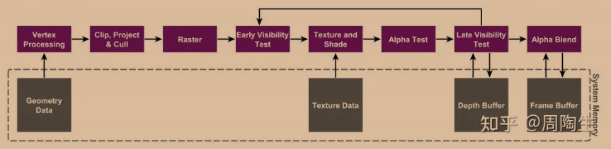

  1. 上半部分：渲染管线
  2. 下半部分：涉及到的显存数据，包括几何数据、纹理数据、Depth Buffer (深度缓冲)、Frame Buffer

  ​	IMR (Immediate Mode Rendering)架构需要大量的带宽，这点可通过L1、L2缓存优化

  ​	但对于移动端可怜的GPU尺寸和功耗需求，不可能将Cache做得太大。因此，通常对于移动端，是不可能使用IMR (Immediate Mode Rendering)的

  

  * **TBR**

  

移动设备的显卡不能使用 IMR (Immediate Mode Rendering)，使用的是TBR (Tile-Based Rendering)，其核心思想是：将帧缓冲分割为一小块一小块，然后逐块进行渲染。

具体实现上是：渲染时，直接渲染对象不再是当前的Frame Buffer和Depth Buffer (深度缓冲)，而是叫Tile Buffer的高速缓存。从而将IMR (Immediate Mode Rendering)中对Color/Depth Buffer进行的读写操作，改为对GPU中高速内存的读写操作。具体如下图所示：


上图有3层结构：

1. 最上一层：Render Pipeline (渲染管线)

2. 中间一层：On-Chip Buffer（a.k.a. 片上内存，Tiled Frame Buffer & Tiled Depth Buffer）

3. 最下一层：系统内存，CPU和GPU共享

   ​		Primitive List

固定长度数组，长度为tile的数量

数组中，每个元素是一个linked list，存的是和当前tile相交的所有三角形的指针，指针指向Vertex Data

Vertex Data

存放顶点和顶点属性数据

TBR (Tile-Based Rendering)是基于Tile（块）的绘制，这就影响到GPU的绘制策略了，因为不能每次来一个物体就提交一次。TBR (Tile-Based Rendering)的处理流程如下：

第1阶段：几何处理阶段

- Clipping
- Vertex Processing
- Tiling/Binning Pass

Tiling/Binning Pass 根据每个三角形在Frame Buffer (帧缓冲)中的位置，记录它的引用到受这个三角形影响的那些Tiles中。


第2阶段：Rasterization (光栅化)，以Tile为单位执行

Rasterization (光栅化)会等所有的三角形完成第1阶段，才进入第2阶段。它会从Primitive List取出tile的三角形列表，然后根据列表对当前tile的所有三角形进行光栅化以及顶点属性的插值。


第3阶段：像素着色，以Tile为单位执行。因为Deferred Rendering（延迟渲染）只需要读取当前像素的几何信息进行着色，因此场景仍然可以使用Deferred Rendering（延迟渲染）一个Tile一个Tile地处理其中的像素。


可以简单的认为TBR牺牲了执行效率，但是换来了相对更难解决的带宽功耗。PC端更关心执行效率。

* **TBDR**

其实只有PowerVR的GPU是TBDR架构，别的移动GPU是TBR架构。因为TBDR这个架构是PowerVR提出来的对TBR的一次改进，在TBR的基础上再加了一个Deferred。

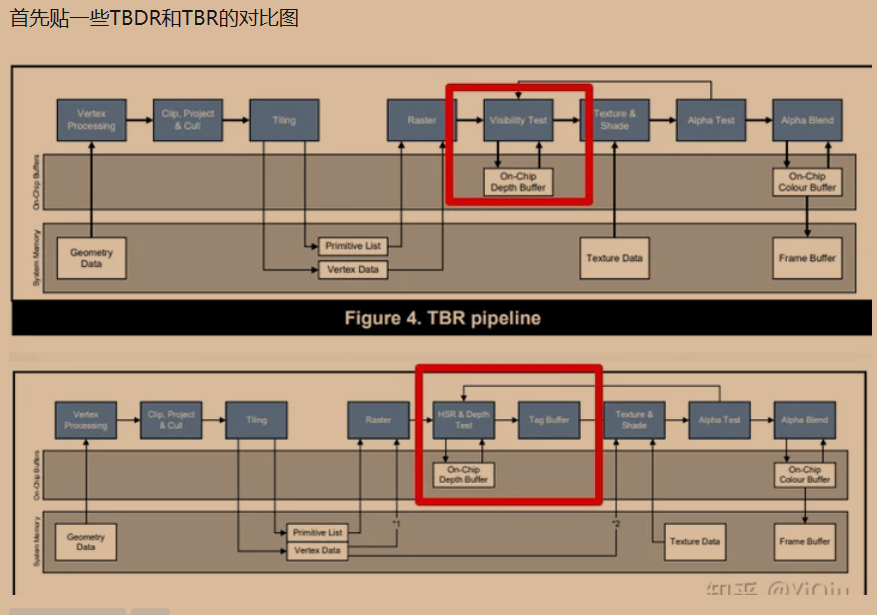


我们可以看到PowerVR在绘制管线中新增了一个阶段，叫做HSR & Depth Test，

常规TBR渲染过程是这样子（这里忽略前面几何阶段过程，直接从光栅化开始）：

第一步渲染物体1：光栅化 -> early-Z（更新Z-buffer） -> fragment shader -> （Late-Z）Rendering output

第二步渲染物体2：光栅化 -> early-Z（更新Z-buffer） -> fragment shader -> （Late Z）Rendering output

第三步渲染物体3：光栅化 -> early-Z（更新Z-buffer） -> fragment shader -> （Late Z）Rendering output

PowerVR架构最大的创新就在于完全解决了overdraw问题，且不用关系物体渲染的顺序。其渲染顺序是这样子的：

物体1：光栅化 -> Z-test并更新Z-buffer ，并记录这些像素和该物体的映射关系；Deferred, 暂不进行shader计算；

物体2：光栅化 -> Z-test并更新Z-buffer ，并记录这些像素和该物体的映射关系；Deferred, 暂不进行shader计算；

物体3：光栅化 -> Z-test并更新Z-buffer ，并记录这些像素和该物体的映射关系；Deferred, 暂不进行shader计算；

最后，统一进行shader 计算，根据最终不同像素分属不同的物体，每个像素只执行一次shader运算。

## 辐射度量学

### 基础名词

* 辐射能(Radiant energy)Q：电磁辐射的能量，单位是$J$


* 辐射通量(Radiant flux)或功率(power)$\phi$:单位时间释放、反射、投射、或者接受的能量。单位是$W$或者$lm$


* 辐射强度(Radiant Intensity):辐射强度是单位立体角(solid angle)由点光源发出的功率（power）。


各向同性点源：


* 辐照度(Irradiance)

辐照度就是每(垂直投影)单位面积入射到一个表面上一点的辐射通量。


兰伯特余弦定律：**表面辐照度**与**光方向和表面法线夹角的余弦值**成**正比**(也就是说只要在表面法线方向的的辐射度分量)。


* 辐射(Radiance)：是指一个表面在**每单位立体角、每单位投影面积**上所发射(emitted)、反射(reflected)、透射(transmitted)或接收(received)的**辐射通量(功率)**。


**辐射强度(Radiant Intensity)、辐照度(Irradiance)、辐射(Radiance)三者关系：**

辐射强度：单位立体角的辐射通量

辐照度：单位投影面积的辐射通量

辐射：**单位投影面积**的**辐射强度**或者是**单位立体角**的**辐照度**(单位立体角、单位投影面积的辐射通量)

**入射辐射**(Incident Radiance)：指**到达表面的单位立体角**的**辐照度**。即它是沿着给定光线到达表面的光(入射方向指向表面)


**出射辐射**(Exiting Radiance)：**离开表面**的**单位投影面积**的**辐射强度**。例如：对于面光(area light)，它是沿着给定光线发射的光(出射方向指向表面)


### **辐照度**(Irradiance) **VS. 辐射**(Radiance)

辐照s度：在面积$dA$ 的总辐射通量

辐射： 在面积$dA$ 、方向$dw$ 上的辐射通量


### BRDF

* **基本概念**

双向反射分布函数(Bidirectional Reflectance Distribution Function)，是一个用来描述物体表面如何反射光线的方程，表示了给定一条入射光的时候，某一条特定的出射光线的性质是怎么样的。定义的是出射辐射率(Radiance)的微分和入射光辐射度(Irradiance)的微分之比。

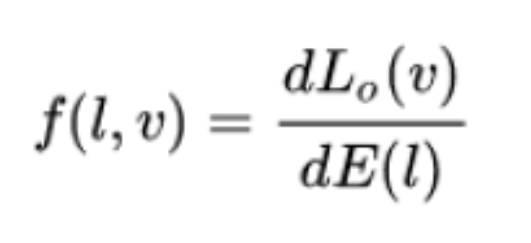

入射光找到物体表面上，反射光线为v，那么反射光的亮度(辐射率)和入射光的能量(辐照度)会成一个比例，这个比例就是BRDF，可以理解为，在某一个特定角度观看某个点时，各个方向的入射光对该点的最终光亮度产生的贡献比例。

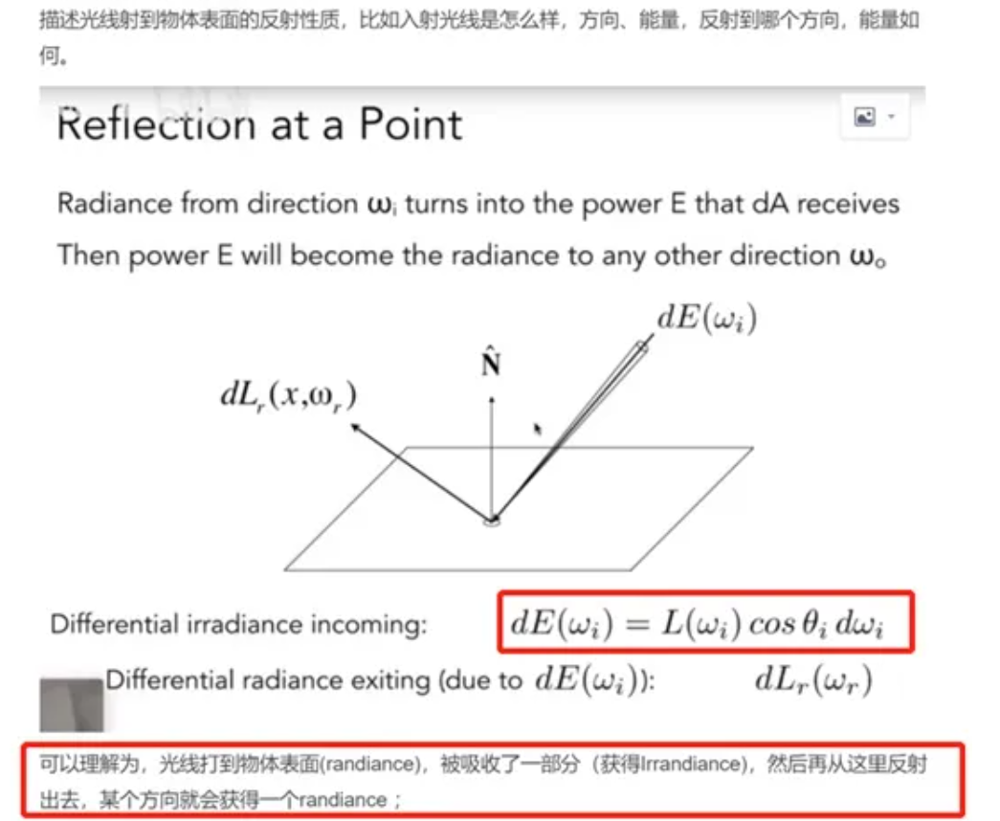


#### cook-torrance模型

一般使用一种被称为Cook-Torrance BRDF的模型。

1. **整体公式**

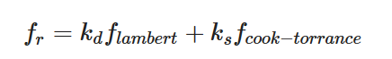

2. **镜面反射部分**

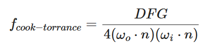

- **法线分布函数**：估算在受到表面粗糙度的影响下，朝向方向与半程向量一致的微平面的数量。这是用来估算微平面的主要函数。
- **几何函数**：描述了微平面自成阴影的属性。当一个平面相对比较粗糙的时候，平面表面上的微平面有可能挡住其他的微平面从而减少表面所反射的光线。
- **菲涅尔方程**：菲涅尔方程描述的是在不同的表面角下表面所反射的光线所占的比率。

分母是校正因子，作为微观几何局部空间和宏观几何局部空间变换的校正。

#### Disney Principled BRDF

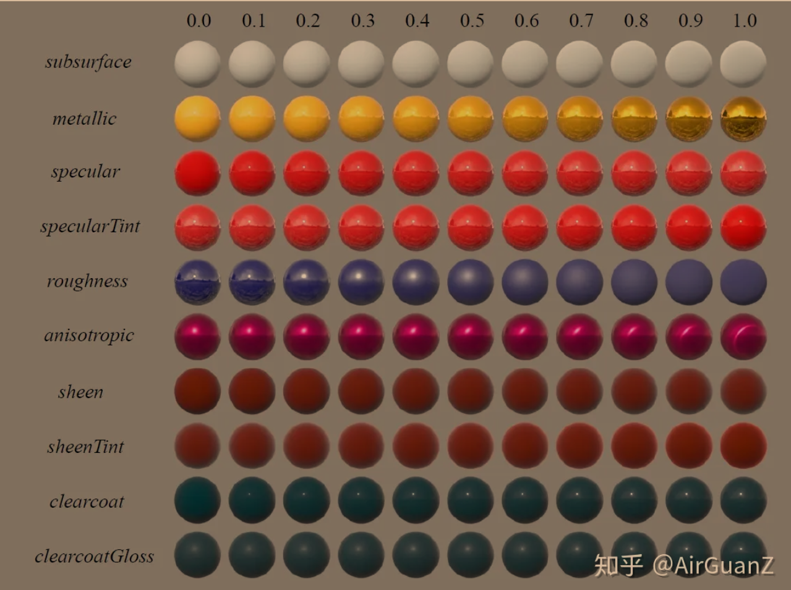

如上图所示，Disney BRDF有11项用于调节材质外观的参数，它们分别是：

1. baseColor，材质的基本颜色，通常设定为常数或由纹理提供。
2. subsurface，用于控制材质的漫反射成分向次表面散射靠拢的程度。
3. metallic，金属度，指材质的外观向金属靠拢的程度。
4. specular，高光度，控制材质中非金属部分的高光明亮程度。
5. specularTint，高光颜色向基本颜色靠拢的程度。
6. roughness，材质粗糙程度。
7. anisotropic，各向异性度，即材质反射的非对称程度。
8. sheen，模拟一些纺织物边缘的明亮效果。
9. sheenTint，sheen分量的颜色向基本颜色靠拢的程度。
10. clearcoat，一个额外的高光项，用于模拟清漆的效果。
11. clearcoatGloss，清漆的光滑程度。


**Disney BRDF是一种相对通用的模型，适用于多种材质类型，而Cook-Torrance BRDF更专注于金属表面的反射行为。**


### 渲染方程

* **基本概念**

渲染方程是一个描述光能在场景中流转的方程，基于能量守恒定律，在理论上给出了一个完美的光能求解结果。

含义：在某个视点看向特定的位置x，看到的出射光亮度(辐照率)Lo等于x点自发光亮度Le(辐射率)以及该点的反射光亮度之和，可以由以下公式表示：

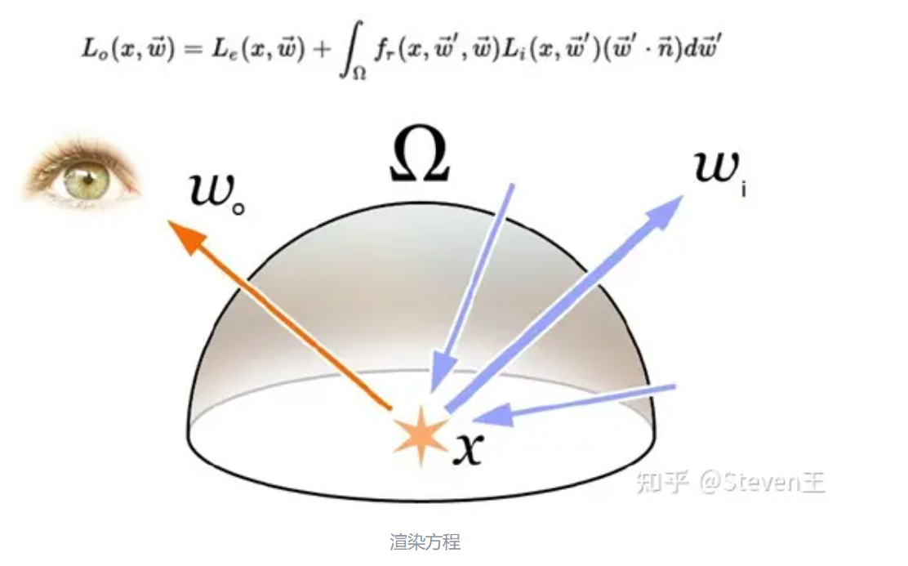

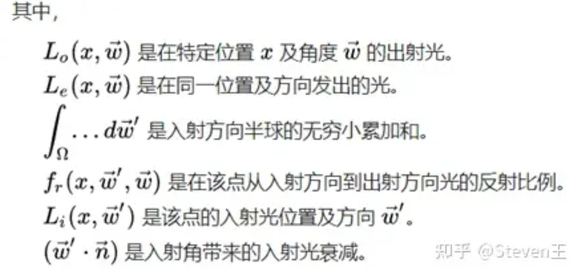


反射方程：其实就是除去了自发光的部分，只保留半球积分部分。


### PBR

* **什么是PBR**

  基于物理的渲染(Physically Based Rendering， PBR)指的是基于物理原理和微平面理论建模的着色/光照模型，使得渲染效果更加真实。常见基础理念：

  * **微平面理论：**微平面理论是将物体表面建模成做无数微观尺度上有随机朝向的理想镜面反射的小平面（microfacet）的理论。在实际的PBR 工作流中，这种物体表面的不规则性用粗糙度贴图或者高光度贴图来表示。
  * **能量守恒：**出射光能量永远不可能超过入射光能量。随着粗糙度的上升，镜面反射区域会增大，同时反射区域的平均亮度会减少。
  * **菲涅尔反射：**光线从不同角度入射有不同的反射率。相同的入射角度，不同的物质也会有不同的反射率。F0是即0度角入射的菲涅尔反射值。大多数非金属的F0范围是0.02~0.04，大多数金属的F0范围是0.7~1.0。
  * **线性空间：**光照计算必须要在线性空间完成。shader中输入的gamma空间的贴图比如漫反射贴图需要被转换成线性空间，在具体操作时需要根据不同引擎和渲染器的不同做不同的操作；而描述物体表面属性的贴图，粗糙度、高光贴图、金属贴图等必须是线性空间。
  * **色调映射：**是将宽范围的照明级别拟合到屏幕有限色域内的过程，因为基于HDR渲染出来的亮度可能会超过显示器的最大亮度，所以需要色调映射，将光照结果从HDR转换到LDR。
  * **物体的光学特性：**现实世界中有不同类型的物质可分为三大类：绝缘体（Insulators），半导体（semi-conductors）和导体（conductors）。在渲染和游戏领域，我们一般只对其中的两个感兴趣：导体（金属）和绝缘体（电解质，非金属）。其中非金属具有单色/灰色镜面反射颜色。而金属具有彩色的镜面反射颜色。即非金属的F0是一个float。而金属的F0是一个float3，如下图。
    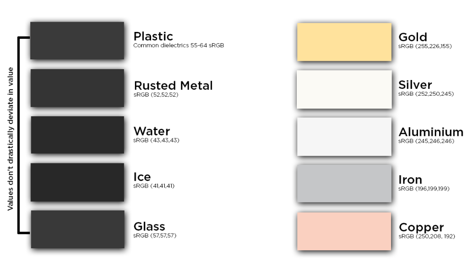

* **PBR的范畴**


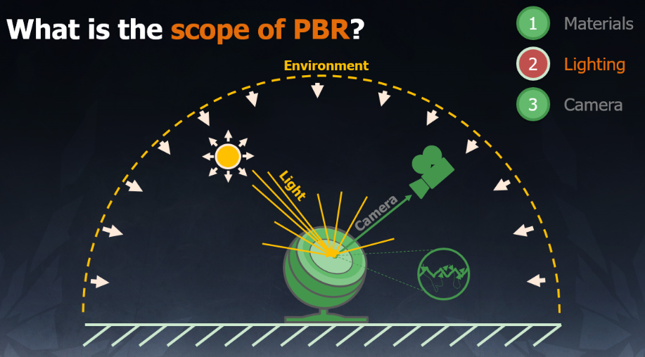

#### **PBR Material**


#### **PBR Lighting(IBL)**

PBR的光照可以通过反射方程来计算，分为两步，一部分是漫反射，一部分是镜面反射，如下图的公式所示：

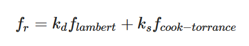

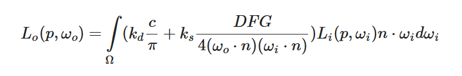

* 漫反射部分的$f_{lambert}$是一个常数，直接积分就可以了。通过环境立方贴图来获取每一个方向的radiance，然后对于每一个出射方向的积分结果存储到一张辐照度贴图中(对radiance)的卷积，在实时渲染中直接采样出射方向就可以得到积分结果。

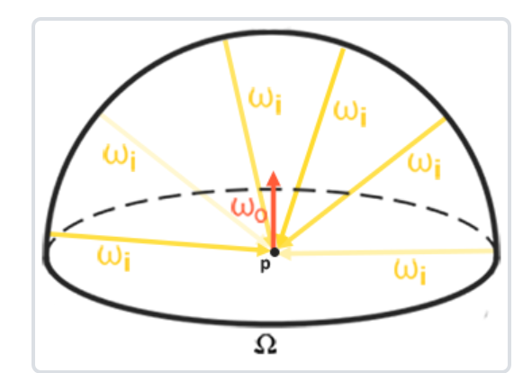


根据离散公式，均匀采样求结果平均值，公式转化为离散版本：

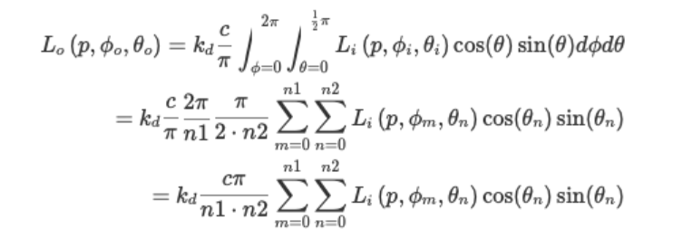


* 镜面反射部分比较麻烦，先用分割近似求和的方法，将积分划分为两个卷积式子：

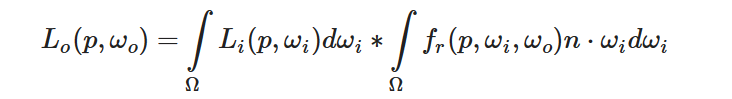

第一部分是预滤波环境贴图，将不同粗糙度的卷积结果存到不同的mipmap中(不同粗糙度对着不同的mipmap级别，处于中间的粗糙度可以插值)。同时还做了假设镜面反射方向——总是等于输出采样方向$w_0$。


所有可能出射的反射光构成的形状称为镜面波瓣。随着粗糙度的增加，镜面波瓣的大小增加；随着入射光方向不同，形状会发生变化。因此，镜面波瓣的形状高度依赖于材质。 在微表面模型里给定入射光方向，则镜面波瓣指向微平面的半向量的反射方向。考虑到大多数光线最终会反射到一个基于半向量的镜面波瓣内，采样时以类似的方式选取采样向量是有意义的，因为大部分其余的向量都被浪费掉了，这个过程称为重要性采样。


第二部分是BRDF部分，他可以进一步拆分为跟菲涅尔项相关的两部分，分别代表菲涅尔相应的比例和偏差，然后对这两项做卷积预运算，并存储到一张查找贴图中(look-up texture, LUT)。渲染时可以将n·wi作为横坐标，以粗糙度roughness作为纵坐标，去LUT中采样获得该条件下的BRDF响应结果，以加快计算速度。

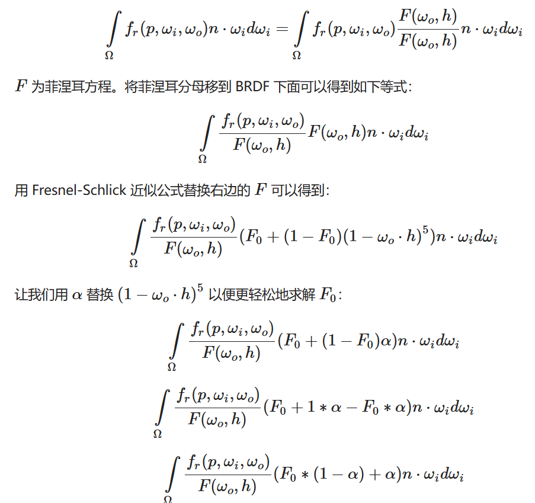

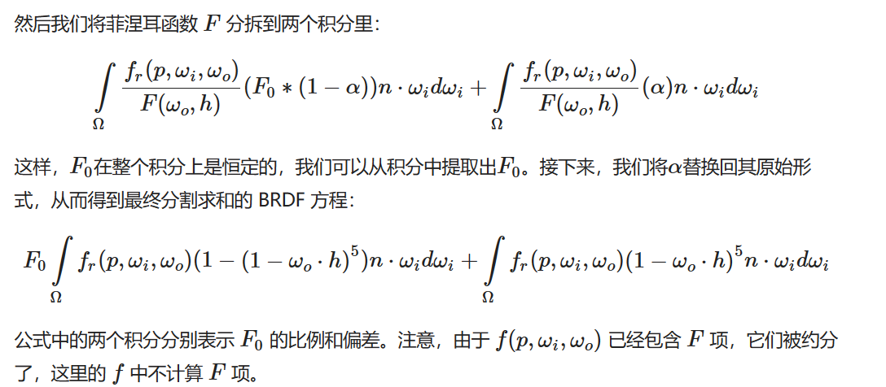


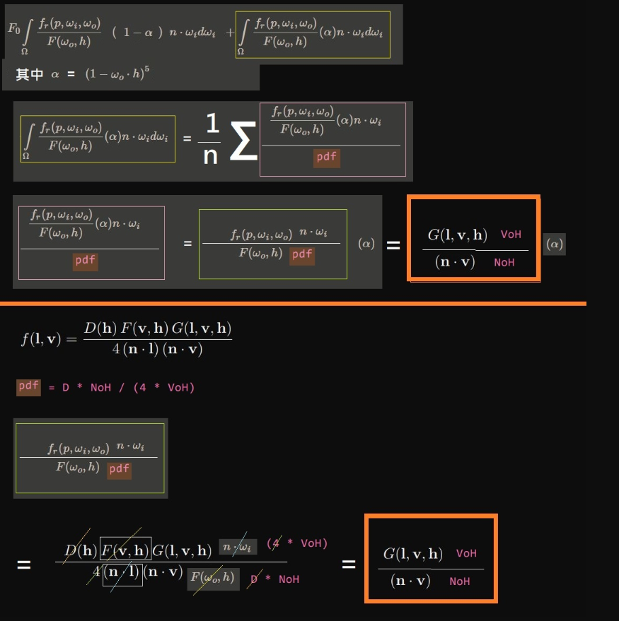


* **反射探针**


#### **PBR Camera**

* **谈一下BRDF中，D、F、G项？菲涅尔项会带来什么样的视觉效果？**

1. D：表示的是微表面结构中法线分布函数，它描述了光线以多大的概率在不同方向上的散射。业界常用的法线分布函数是GGX，具有更好的高光长尾

   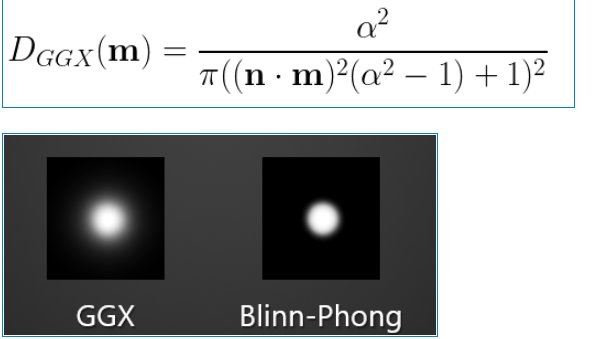

2. F：菲涅尔项，表示的是光线在材质表面与介质之间的反射和折射的行为，掠视金属时反射较多的光而俯视时反射光较少

   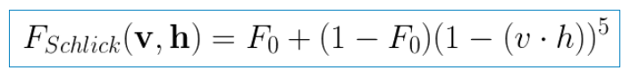

3. G：表示的是几何遮蔽的情况，返回一个未被遮蔽的表面的百分比，常用GGX模型，通过史密斯法叠加入射和出射两个方向。


* **PBR 材质贴图很多，纹理槽位不够应该怎么处理？**

1. 合并多个属性到一个通道，比如将roughness和metallic可以存在8bit纹理的高低4bit上
2. 虚拟纹理，将小贴图合并成大贴图，按需调入


* **PBR贴图格式需要注意什么？**

1. **颜色空间**：确保在加载贴图时使用正确的颜色空间。漫反射和环境反射贴图通常使用sRGB颜色空间，而法线贴图和金属度贴图通常使用线性颜色空间。

## 纹理

### 纹理基础

* **纹理技术的基本原理**

简单的理解就是将一张二维图像，按照一定的映射关系，将每个像素贴合到物体表面的对应位置。纹理技术可以增加物体表面的细节。

* **纹理采样模式**
  * Warp(重复寻址)。最常见的模式，四方连续贴图可以无限延伸用的就是这种算法，即超过1之后重复0到1。
  * Clamp(钳位寻址)。最边缘像素拉伸的效果。
  * Border(边框寻址)。坐标越界后，返回的颜色为给定的颜色值。
  * Mirror(镜像寻址)，类似于重复，只不过是镜像重复效果。
* **mipmap的概念，如何实现？**
  * 提出背景：在一个场景中有多个物体，有远近之分，远的物体只占很少的片段，此时如果要从高分辨率的纹理中采样，会比较困难，一个小物体中的像素映射到了纹理上会占据很大一块，包含了很多个纹理像素，不好直接采样，因此引出了mipmap的概念。
  * 原理：将纹理划分为了不同大小的分辨率图集，每次缩小$\frac{1}{2}$,根据物体的大小，来对不同级别的纹理进行采样，对于远处的物体，采用低分辨率，对于进出的物体，采用高分辨率。
  * 占据额外存储1/3，等比数列


* **GPU如何确定mipmap采样的层级的？**

Games101：

任何一个像素都可以映射到纹理上的一个区域，那么怎么计算要应用的Mipmap层级呢？一个简单的微分思想：看一个像素在屏幕空间的两个方向上的变化，对应在像素空间两个方向上的变化-取两个方向上变化的较大值，近似为当前像素在纹理空间覆盖的方形区域的边长，此时对应的mipmap level =  $log_2L$ (如果L = 1，那么刚好使用原始那张图，如果L= 4，**那么在第2层 会对应1个像素**），也就是说，在第 $log_2L$层会对应到一个像素，只要在该层去查这一个像素就行，这算mipmap 很巧妙的一个地方

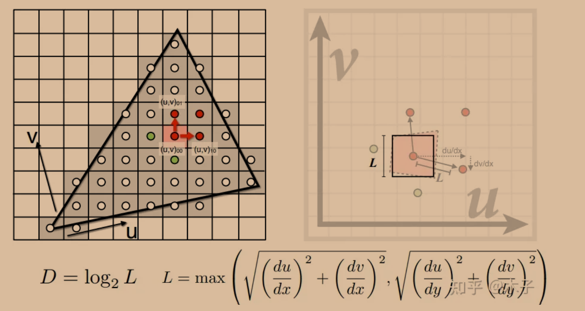

光栅化的过程中，GPU是并行处理很多Fragement pixel的，但是，并不是一个pixel处理，而是分成2*2的块来处理；GPU中有求偏导的ddx 和ddy函数，以UV为变量的时候，求出来的值就是相邻像素之间的uv差；

GPU是得到pixel相邻的像素之间最大UV差的大小，再取对数，得到mipmap level的值；


* **法线贴图及其他贴图的作用**

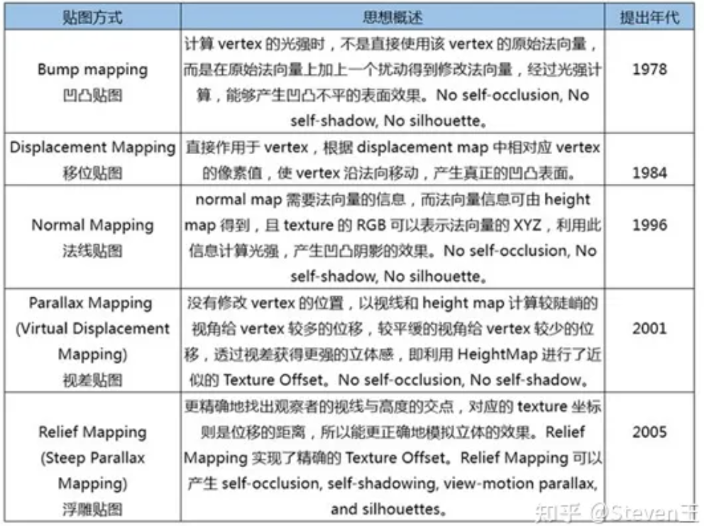

* **说一下双线性插值和三线性插值**

  * **双线性插值**

    ```cpp
    nx0 = lerp(c00,c10,tx)
    nx1 = lerp(c01,c11,tx)
    p = lerp(nx0,nx1,ty)
    ```

    

  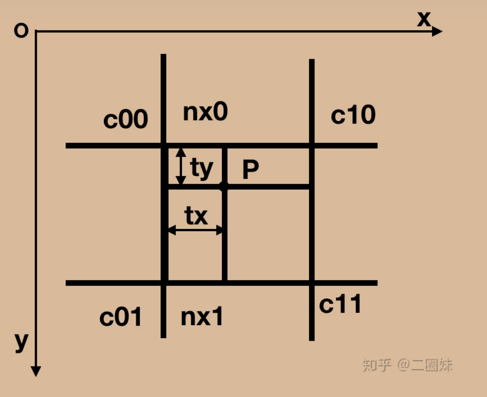

  * **三线性插值**

  

```cpp
a = lerp(c000,c100,tx)
b = lerp(c010,c110,tx)
c = lerp(c001,c101,tx)
d = lerp(c011,c111,tx)
```

* **常见纹理贴图压缩算法**

游戏绘制中图片压缩不可以使用jpg等的压缩算法，因为算法复杂并且不能拿取特定位置的数据
游戏中基本使用基于块的压缩算法:PC-BC7,DXTC;Mobile:ASTC,ETC,PVRTC

这里介绍一个非常经典的算法。对于DXT类型的纹理，在一个4×4的色块中，可以找到最亮的点和最暗的点，即颜色最鲜艳和颜色最暗的点，然后将该方块中的其他点都视为这两个点之间的插值。因为对于很多图片来说，相邻的像素之间都有一定的关联度（Coherence）。所以我们可以存储一个最大值和一个最小值，然后为每个像素存储一个距离最大值和最小值的比例关系，这样就可以近似地表达整个色块中的每个像素的颜色值。**在计算机图形学领域中，纹理压缩（Texture Compression）都是基于这个思想，称为块压缩（Block Comppression）。**在DirectX中，最经典的就是DXT系列的压缩算法。块压缩系列压缩算法的最新版本已经演进到了BC7。DXT系列压缩算法的优势在于，当我们生成了一个纹理后，就可以在CPU上对纹理进行实时压缩。因为无论是压缩还是解压缩，这一系列算法的效率都非常高。

另外一类压缩算法就是手机上使用的压缩算法，使用较多的就是ASTC算法。ASTC压缩的分块就不再是严格的4×4了，它可以使用任意的形状，而且ASTC的压缩效果是最好的，解压缩的效率也不低。然而，ASTC算法压缩时的性能消耗较大，因此无法在运行中进行压缩。总而言之，对于计算机的渲染系统来说，纹理压缩的基本逻辑都是按照这个思想来进行压缩的。

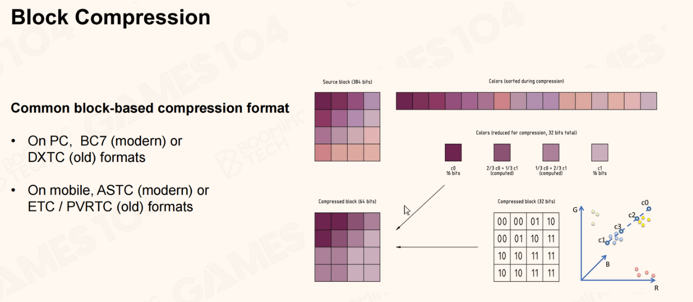

### 法线贴图

* **TBN矩阵**

[结合Unity的TBN与法线贴图思考 - 知乎 (zhihu.com)](https://zhuanlan.zhihu.com/p/389680745#:~:text=首先，TBN应该是对于三角形而言的，那么对于每个顶点，其TBN三个向量应该是一样的才对。,但是显然在大多情况下，顶点被多个三角形共用，法线被软化平均，因而同一个三角形的三个顶点法线没有一个指向面法线。 实际上，在平滑是法线、切线、副切线都将会被平均化，我们只管用当前的顶点去计算出TBN然后使用就行了。)


* **法线贴图存储在切线空间有什么优势？**

将法线贴图存储在切线空间有几个优点：

1. 方便的纹理编辑：在切线空间下，法线贴图中的RGB通道分别表示法线在X、Y、Z轴上的分量。这种表示方式使得编辑法线贴图更加直观和方便，可以直接对每个法线的分量进行调整和编辑，而无需考虑其他转换。

2. **独立于物体变换：切线空间是相对于每个三角面片的局部坐标系，因此与物体的缩放、旋转和平移无关。这意味着无论物体如何变换，法线贴图的效果保持一致。这在处理复杂的物体变换和动画时非常有用。**

3. 兼容切线空间光照：切线空间中的法线与切线空间中的光照方向相乘，可以得到表面的光照结果。这种光照计算方式可以更好地处理具有法线贴图的表面细节，包括凹凸、纹理细节和法线扭曲等效果。

尽管切线空间在法线贴图存储中具有这些优势，但也需要一些额外的计算步骤来将切线空间法线转换为世界空间或视图空间法线，以用于光照计算和其他需要使用不同空间的着色器效果。


* **两种计算方法的对比**

  现在光照计算有了两种方式

  * 在切线空间计算光照

  ​		在切线空间计算，我们用TBN矩阵的逆矩阵将所有相关的世界空间向量转变到采样所得法线向量的空间：切线空间。TBN的建构还是一样，但我们在将其发送给像素着色器之前先要求逆矩阵；将向量从世界空间转换到切线空间有个额外好处，我们可以把所有相关向量在顶点着色器中转换到切线空间，不用在像素着色器中做这件事。这是可行的，因为lightPos和viewPos不是每个fragment运行都要改变，对于fs_in.FragPos，我们也可以在顶点着色器计算它的切线空间位置。基本上，不需要把任何向量在像素着色器中进行变换，而第一种方法中就是必须的，因为采样出来的法线向量对于每个像素着色器都不一样。

  所以现在不是把TBN矩阵的逆矩阵发送给像素着色器，而是将切线空间的光源位置，观察位置以及顶点位置发送给像素着色器。这样我们就不用在像素着色器里进行矩阵乘法了。这是一个极佳的优化，因为顶点着色器通常比像素着色器运行的少。这也是为什么这种方法是一种更好的实现方式的原因。

  * 在世界空间计算光照

  ​		从法线贴图采样得来的法线向量，是在切线空间表示的，尽管其他光照向量都是在世界空间表示的。把TBN传给像素着色器，我们就能将采样得来的切线空间的法线乘以这个TBN矩阵，将法线向量变换到和其他光照向量一样的参考空间中。因为最后的normal现在在世界空间中了，就不用改变其他像素着色器的代码了，因为光照代码就是假设法线向量在世界空间中。


### 虚拟纹理

这个概念取自于Virtual Memory,与虚拟内存类似的是，一个很大的Texture将不会全部加载到内存中，而是根据实际需求，将需要的部分加载。与虚拟内存不同的是，它不会阻塞执行，可以使用更高的mipmap来暂时显示，它对基于block的压缩贴图有很好的支持。 基本思路是，会将纹理的mipmap chain分割为相同大小的tile或page,这里的纹理叫虚纹理，然后通过某种映射，映射到一张内存中存在的纹理，这里的纹理是物理纹理，在游戏视野发生变化的时候，一部分物理纹理会被替换出去，一部分物理纹理会被加载。

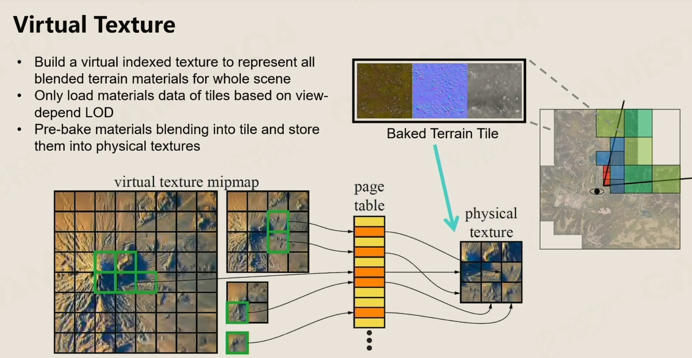

虚拟纹理是一种以时间换空间的纹理流送技术，他最大的好处在于我们能够使用多种高分辨率纹理，而不像传统流送一样受到内存和带宽的限制。

**虚拟内存类比**：虚拟存储技术的基本思想时利用大容量外存来扩充内存，产生一个比有限的实际内存空间大得多的、逻辑的虚拟空间，简称虚存，以便能够有效地支持多道程序系统的实现和大型程序运行的需要，从而增强系统的处理能力。**(按需调入的核心思想)**

**虚拟内存工作原理：**当进程开始运行时，先将一部分程序装入内存，另一部分暂时留在外存；当要执行的指令不在内存时，由系统自动完成将它们调入内存的工作；当没有足够的内存时，系统自动选择部分内存（暂不执行的程序）空间，将其中原有的内容交换到磁盘上，并释放这些内存空间供其他进程使用。

 


## 光照模型

### 局部光照模型

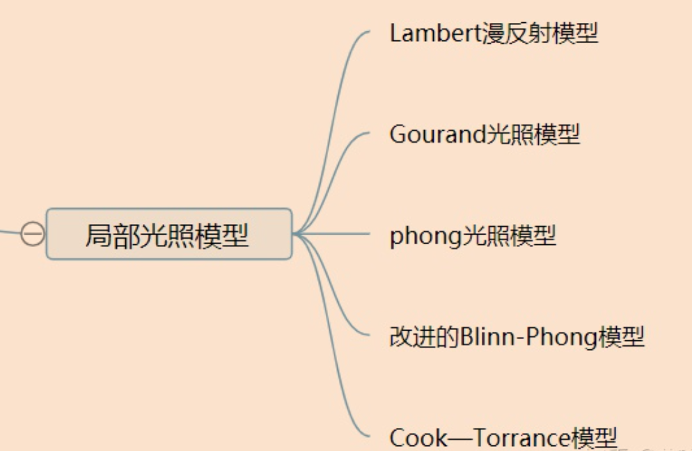

在真实感图形学中，进处理光源直接照射物体表面的光照模型被称为局部光照模型。

* **Lambert漫反射模型**

  特点：

  * 反射强度和观察者角度没关系
  * 反射强度和光线的入射强度有关系

Lambert是光源照射到物体表面后，向四面八方反射，产生的漫反射效果，这是一种理想的漫反射光照模型。 

```cpp
half3 FinalColor;
FinalColor=Kd*dot(Normal,LightDir);//实现Lambert光照模型
FinalColor*=BaseColor;//叠加模型基础颜色
return FinalColor;
```

* **phong模型**

Phong模型由三种反射光组成，反别是漫反射光，环境光，镜面反射光。

Phong模型会有一个问题，在镜面反射会在一些情况下出现问题，特别是物体反光度低的时候，会导致大片的高光区域，会出现断层的情况，这是因为观察向量和反射向量之间的夹角不能大于90°，如果点积为负数，镜面光分量会变成0.0，

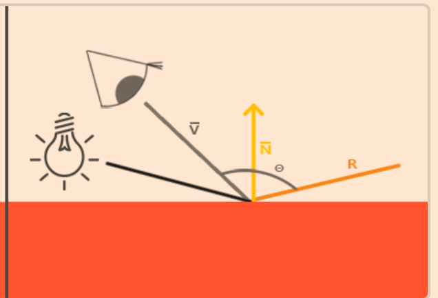

* **Blin-phong模型**

Blin-Phong模型在计算高光的时候，选择用半程向量与法线的夹角来代替反射向量和视角的夹角，这样就解决了上面的问题。

* **cook-torrance**

Cook-Torrance模型兼顾漫反射和镜面反射两个部分。

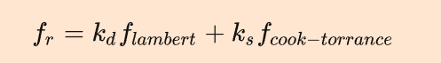

这里的 $k_d$是早先提到过的入射光线中**被折射**部分的能量所占的比率，而 $k_s$ 是**被反射**部分的比率。BRDF的左侧表示的是漫反射部分，这里用 $f_{lambert}$来表示。它被称为Lambertian漫反射。
$$
f_{lambert} = \frac{c} {\pi}
$$
BRDF镜面反射公式
$$
f_{cook-torrance} = \frac{DFG}{4(w_0 ·n)(w_i ·n)}
$$
D：法线分布函数：描述的是各个为表面法线的集中程度。

F：菲涅尔项，跟观察方向和法线方向有关，当从掠射角观察时没看到的反射现象就越明显

G：几何自遮挡项，考虑的是微表面之间的相互作用，当一个平面相对比较粗糙的时候，平面表面上的微平面有可能挡住其他的微平面从而减少表面所反射的光线。


* **phong和blin-phong有什么区别？**

都是经验模型，`finalColor = diffuse + specular + ambient`，

1. ambient环境光分量用于模拟全局光照效果，是整体提了一个亮度；

2. diffuse项用到了光线到片段向量与片段平面法线向量的点乘，乘上光的颜色和物体颜色；
3. specular项计算有所不同，phong模型计算的时候用的反射方向和视角方向的点积；blin-phong计算的时候用的半程向量和法线的夹角的点积，解决了高光不连续的情况。


### **全局光照模型**

* **光线追踪**

光线追踪算法通过模拟光的传播方式，即光从光源出发经过若干次反射、折射到达摄像机的过程来实现全局光照的效果。

1. whitted光线追踪

可实现直接光照、镜面反射和折射效果。从摄像机出发发射光纤，打到世界空间最近的物体，找到着色点，着色点向光源发射一条阴影线以寻找焦点，如果交点存在，则意味着物体被挡住了，该着色点处于阴影之中，否则，着色点可以被直接光源照亮。为了实现镜面的反射和折射的效果，当光源命中了一个镜面材质的物体的时候，继续反射或者折射出新的光线，如此递归下去。

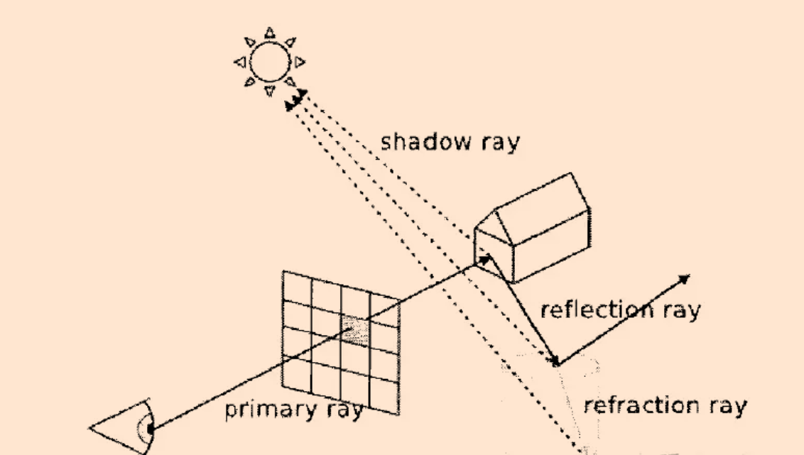

```cpp
Vector3f castRay(
        const Vector3f &orig, const Vector3f &dir, const Scene& scene,
        int depth)//传入原点，方向，屏幕，深度
{
    if (depth > scene.maxDepth) {
        return Vector3f(0.0,0.0,0.0);
    }

    Vector3f hitColor = scene.backgroundColor;
    if (auto payload = trace(orig, dir, scene.get_objects()); payload)
    {
        Vector3f hitPoint = orig + dir * payload->tNear;
        Vector3f N; // normal
        Vector2f st; // st coordinates
        payload->hit_obj->getSurfaceProperties(hitPoint, dir, payload->index, payload->uv, N, st);
        switch (payload->hit_obj->materialType) {
            case REFLECTION_AND_REFRACTION:
            {
                Vector3f reflectionDirection = normalize(reflect(dir, N));
                Vector3f refractionDirection = normalize(refract(dir, N, payload->hit_obj->ior));
                Vector3f reflectionRayOrig = (dotProduct(reflectionDirection, N) < 0) ?
                                             hitPoint - N * scene.epsilon :
                                             hitPoint + N * scene.epsilon;
                Vector3f refractionRayOrig = (dotProduct(refractionDirection, N) < 0) ?
                                             hitPoint - N * scene.epsilon :
                                             hitPoint + N * scene.epsilon;
                //重新在hitPoint生成两条光线
                Vector3f reflectionColor = castRay(reflectionRayOrig, reflectionDirection, scene, depth + 1);
                Vector3f refractionColor = castRay(refractionRayOrig, refractionDirection, scene, depth + 1);
                float kr = fresnel(dir, N, payload->hit_obj->ior);
                hitColor = reflectionColor * kr + refractionColor * (1 - kr);
                break;//
            }
            case REFLECTION:
            {
                float kr = fresnel(dir, N, payload->hit_obj->ior);
                Vector3f reflectionDirection = reflect(dir, N);
                Vector3f reflectionRayOrig = (dotProduct(reflectionDirection, N) < 0) ?
                                             hitPoint + N * scene.epsilon :
                                             hitPoint - N * scene.epsilon;
                hitColor = castRay(reflectionRayOrig, reflectionDirection, scene, depth + 1) * kr;
                break;
            }
            default:
            {
                Vector3f lightAmt = 0, specularColor = 0;
                Vector3f shadowPointOrig = (dotProduct(dir, N) < 0) ?
                                           hitPoint + N * scene.epsilon :
                                           hitPoint - N * scene.epsilon;

                for (auto& light : scene.get_lights()) {
                    Vector3f lightDir = light->position - hitPoint;
                    // square of the distance between hitPoint and the light
                    float lightDistance2 = dotProduct(lightDir, lightDir);
                    lightDir = normalize(lightDir);
                    float LdotN = std::max(0.f, dotProduct(lightDir, N));
                    // is the point in shadow, and is the nearest occluding object closer to the object than the light itself?
                    auto shadow_res = trace(shadowPointOrig, lightDir, scene.get_objects());
                    bool inShadow = shadow_res && (shadow_res->tNear * shadow_res->tNear < lightDistance2);

                    lightAmt += inShadow ? 0 : light->intensity * LdotN;
                    Vector3f reflectionDirection = reflect(-lightDir, N);

                    specularColor += powf(std::max(0.f, -dotProduct(reflectionDirection, dir)),
                        payload->hit_obj->specularExponent) * light->intensity;
                }

                hitColor = lightAmt * payload->hit_obj->evalDiffuseColor(st) * payload->hit_obj->Kd + specularColor * payload->hit_obj->Ks;
                break;
            }
        }
    }
    return hitColor;
}
```


2. path tracing路径追踪

路径追踪的基本思想是从视点发出一条光线，光线与物体表面相交时根据表面的材质属性继续采样一个方向（选择一个随机方向），发出另一条光线，如此迭代，直到光线打到光源上（或逃逸出场景），然后用蒙特卡洛的方法，计算其贡献，作为像素的颜色值；由于单条光路的蒙特卡洛积分肯定会不准确，产生很多噪点，所以一般是单个像素发射多条光线进行路径追踪，一条路径就是视点和场景中各个物体反射交点的连线;基于蒙特卡洛法，在半球上做随机的采样，一般会做重要性采样，引入权重，递归终止条件可以采用俄罗斯轮盘赌的方法，为了提高采样的质量，可以利用积分变换从光源出发发射光线。

```cpp
float shade(vec3 p, vec3 wo)
{
    //直接光部分
    vec3 q = random() by pdf_light;//光源上随机采样一个q点
    vec3 wi = normalize (q - p);
    float l_dir = 0.0;
    ray r2light = ray(p, wi);
    if(r2light hit light at q)//没有障碍物
        l_dir = fr(p, wi, wo) * li * dot(n, wi) * dot(n', wi) / pdf_light(q) / len(q-p)^2;
    
    //间接光部分
    float l_indir = 0.0;
    float prob = 0.6;
    float num = random(0,1);
    if(num < prob)
    {
        vec3 wi = random() by pdf;
        ray r = ray(p, wi);
        // object不能是光源，如果r打在了光源上则忽略。
        if(r hit object at o)
            l_indir = fr(p, wi, wo) * shade(o, -wi) * dot(n, wi) / pdf(wi) / prob;
    }
    return l_dir + l_indir;
}
```

### PRTGI

PRT思想：将光照切割成Lighting, Light Transport两部分。


* **基于Unity URP上的实现**

漫反射。

1. 捕捉场景中的几何信息。

   用的是Sponza场景，放了一组探侦组，覆盖整个场景，对于单独的一个probe来说，因为用于漫反射物体，采用了512个样本，每一个样本都是一哥surfel，记录了albedo、normal、worldpos以及skymask的信息，采样方法是用了UE4里面的均匀采样方法，（uv~0-1，计算出对应的极坐标位置  $/phi = 2 /pi*  u$ ），用的也是前三阶的球谐函数，球谐函数就是一组表示球面上信息的一组基函数，然后做了一些可视化的debug 信息，将采样位置、采样方向都做了可视化，方便一些debug。

2. 实时光照计算。

​	PRTGI投影到球谐函数上，light transport也投影到球谐函数上，根据球谐函数的正交性，就将渲染方程积分形式转化成了一个点乘这样的形式。在Relight的时候，我第一步是将每一个Surfel对probe贡献的radiance计算出来，因为没有记录PBR的一个信息，目前就是使用的简单的Lamber光照模型去计算radiance，如果采样点是场景的中的物体，是这样的，如果是sky那就对环境贴图进行采样。计算好了radiance以后，我们将worldPos到probe position这个方向投影到球谐函数上，根据公式计算出这个方向上的SH信息，最后用原子操作累加到最终的结果上，就可以得到所有采样点投影到SH上的一个光照信息，这样就有了一个光照的信息，算是对radiance完成了一个编码，在应用的时候解码对应的信息即可，将shading point的法线方向投影到球谐函数上，与对应阶数的SH信息做一个点乘即可，还有一些计算好的系数，这是直接拿来用的，根据shading  point的位置计算离他最近的probe，用了8个probe，最后做了一个三线性插值。

​	这样就初步完成了一个PRTGI漫反射的实现吧。


### RSM(Reflective shadow map)

1.考虑一次间接反射，需要先知道二级光源，即直接光照可以照亮的地方，什么信息可以告诉我们这一点呢？Shadow Map可以，存储了从光源看过去最远的点。


在此，还有一个假设，被直接光照照亮的物体反射都是diffuse的，这样radiance比较好求。这里是假设reflector，没有要求receiver也是diffuse。

2. 考虑哪些次级光源会对着色点p产生贡献。

考虑所有surface patch的贡献，进行求和；并且每个surface patch可以看成是一个area light。

我们之前说过每一个小的patch都可能对照亮p点做出贡献,因此我们可以先计算出一个patch做出的贡献,之后用求和的形式将所有patch的贡献加在一起.


我们可以看到q是一个patch去照亮点P

q其实就是RSM中一个Texel所对应的patch,在games101中我们说过,原本计算q对p点的贡献,我们应该是对整个立体角进行采样,但是这样的话很浪费很多的sample,为何不直接在light处采样然后去计算p点的shading值呢.


也就是把立体角的积分变成了对light区域面积的积分,如果当区域足够小的时候dA甚至不用积分，直接相乘后相加就行,现在我们要解的是patch在接受直接光照后反射出的radiance是多少,也就是从q点到p点的radiance,那么如何解呢?


对于每个次级光源点来说,由于我们假设它的brdf是diffuse的,因此次级光源的fr积分后是个常数,此时我们把Li代入到式子中会发现dA刚好会被抵消.之后式子会少去dA,会多出来一个$\phi_p$，然后$\phi_p$和 $\frac{cos\theta_q cos\theta_p}{||p-q||^2}$ 又组成了下列公式中的Ep与剩余部分结合求出了一个次级光源p对着色点所得到的shading结果,再将积分域中所有的结果加在一起,就是着色点最后被间接光照照亮所得到的shading值.


公式求的是次级光源的光线贡献在着色点上的Irradiance,Ep表示次级光源对着色点贡献的入射irradiance.


还有什么问题嘛？

首先关于可见性，次级光源到着色点是否可见呢？需要为每个次级光源算一个shadow map，这显然不太可能！难办，那就别办了。


显然，不是所有的pixels都会产生贡献，可见性、朝向、距离都是影响因素。

- -Visibility（仍然非常难算）；
- -方向：比如X-1点在SM中记录的是桌子的表面，而且这个表面的点法线方向是朝上的，因此根本不可能照亮X点；
- -距离：因为远处的次级光源贡献很少，通常只要找距离足够近的次级光源就行了。

因此为了加速这一过程,我们认为在shadow map中着色点$x$的位置和间接光源$x_p$的距离可以近似为它们在世界空间中的距离。所以我们认为，对着色点$x$影响大的间接光源在shadow map中一定也是接近的。

于是我们决定先获取着色点$x$在shadow map中的投影位置(s,t)，在该位置附近采样间接光源，多选取一点离着色点近的VPL，并且为了弥补越往外采样数越少可能会带来的问题，引入了权重，越近了权重越小，越远的权重越大。那么对于一个shading point差不多找400个次级光源来计算是比较合适的。如下图所示。


现在ShadowMap上存储的东西就比较多了，深度值、世界坐标、法线、flux


优点：容易实现。

缺点：性能会随着直接光源的数量的增加而降低（光源越多，shadow map越多，次级光源越多）

​			没有做可见性检查，并且假设反射物是diffuse的

​			需要在质量和采样率上做一个平衡（采样多，性能低，质量高；采样少，性能高，质量垃；典型trade off）

### LPV(Light Propagation Volumes)

核心思想：在3D空间中传播光线，从而利用它做出间接光照而实现了GI

LPV特点：

1. fast
2. Good quality

问题：如果我们能获得从任何一个shading point上来自四周的radiance的话们就可以立刻得到间接光照。

核心思路：我们假设光在传播的过程中，radiance是uniform的（intensity 平方衰减）

解法：将场景划分为若干个3D网络，每一个网络叫做Voxel，在计算直接光照后，将接收到直接光照的表面看作间接光照在场景中的传播点。


步骤：

1. 找出接收直接光照的点。
2. 把这些点注入到3D网络中作为间接光照的传播起点。
3. 在3D网络中传播radiance
4. 传播完成后，渲染场景

具体步骤：

* **生成**

  

  * 首先通过Shadow Map找出接受直接光照的物体表面
  * 对得到的光源数量可以通过采样一些进行简化进而降低次级光源的数量，最后获得一系列的虚拟光源

* **注入**

  

  * 预先将场景划分为3D网格
  * 将虚拟光源注入到对应的格子中
  * 一个格子内可能含有多个不同朝向的虚拟光源，把各自内所有虚拟光源不同朝向的radiance算出来并sum求和，从而得到一个往四面八方发射的radiance
  * 由于是在空间上的分布，可以看作球面函数，用SH(球谐函数)表示（工业界一般用两阶SH就可以表示各个方向上的radiance初值）

  

* **传播**

  

  * 由于是3D网络，因此可以向六个面传播(上下、前后、左右)，由于radiance是沿着直线传播，我们认为radiance是从网格中心往不同方向进行传播的，穿过哪个表面就往哪个方向传播比如穿过右表面的radiance,就传播到右边的格子里(不考虑斜角,比如右上方向,我们认为是先到右边格子,再到上面格子)
  * 每个格子计算收到的radiance,并用SH表示
  * 迭代四五次之后,场景中各voxel的radiance趋于稳定

* **渲染**

  - 对于任意的shading point，找到他所在的网格

  - 获得所在网格中所有方向的Radicae；

  - 渲染

* **问题**

  * 漏光

  由于我们认为radiance是从格子正中心向四周发散的,当遇到这种情况时,

  

  按理说点P反射的radiance是无法照亮墙壁的背后,但是由于我们的假设,会导致墙壁后面也被间接光照照亮,也就是所谓的漏光现象.

  

如图,你看房屋的下部本不应该被照亮,但由于使用了LPV导致了light leaking现象.

我们是可以解决漏光现象的,那样需要我们划分的格子足够小,这样会导致存储量增多,而且传播过程中传播的格子量增多,也就导致了速度慢.

对于两个格子之间的可见性也进行了假设，假设相邻格子都能看见，同时工业界会用不同大小的格子 也就是**Cascade层级加速结构**，来优化LPV的方法。


### VXGI(Voxel Global IIIumination)

VXGI也是一个2-pass算法，但是与RSM有一些区别。

* **区别1：次级光源从RSM中的pixel→VXGI中的Voxel（格子）**

RSM 中次级光源是像素中所包含的微小表面，这些表面是根据Shadow Map来划分的.

VXGI把场景完全离散化成了一系列微小的格子，可以理解为场景是由一堆乐高堆起来的,如图,这些是最细的层级,也就是最小的格子我们可以在这一层基础上去建立一层大点的格子,依此类推从而根据场景的不同划分建立出一个Hierachical树形结构的体素。


* **区别2：光线从传播变为了追踪**

在LPV中,我们将受到直接光照的点注入到场景划分的Voxel之后进行传播,只需要传播一次就可以知道场景中任何一个shading point收到间接光照的radiance.

而在VXGI中第二趟我们从camera出发,就像有一个Camera Ray打到每一个pixel上,根据pixel上代表的物体材质做出不同的操作,如果是glossy则打出一个锥形区域,diffuse则打出若干个锥形区域,打出的锥形区域与场景中一些已经存在的voxel相交,这些voxel对于Shading point的贡献可以算出来,也就是我们要对每一个shading point都做一个cone tracing


* **具体步骤**

  * **Pass1：Light Pass**

  首先找出来那些Voxel会被照亮，那么我们要从接收到直接光照的patch开始，不管是RSM还是什么，先找出来受直接光照影响的patch。

  但是场景现在是由voxel表示的，那么对于任何一个格子，跟LPV注入很像，这里不再记录表面的出射分布或者说认为表面是diffuse的半球分布，也就是不再像LPV一样将所有的radiance加在一起求一个各方向的初始值。

  

  记录的是直接光源从哪些范围来（绿色部分），记录各个反射表面的法线（橙色部分），通过**输入方向**和**法线范围**两个信息然后通过表面的材质，来准确的算出出射的分布，这样就比LPV认为格子表面是diffuse再用SH来压缩的方法要准确，然后建立更高层级格子的这些特性。

  * **Pass2：Camera Pass**

从这一步开始考虑场景的渲染了,对于任何一个像素，知道了Camera Ray的方向，

**I)** 对于Glossy的表面，向反射方向追踪出一个锥形(cone)区域；


基于追踪出的圆锥面的大小，对格子的层级进行查询，就是对于场景中的所有体素都要判断是不是与这个锥形相交，如果相交的话就要把对于这个点的间接光照的贡献算出来(我们存储了体素的光照输入方向和法线方向,因此可以算出其输出的radiance,将cone区域内所有体素的radiance都算出来从而在shading point得到间接光照)，也就是根据传播出的距离远近找对应层级的体素，然后找覆盖的范围。

**II)** 对于diffuse的情况来说,通常考虑成若干圆锥，忽略圆锥Tracing时的重叠和空隙。


* **总结**

LPV是把所有的次级光源发出的Radiance传播到了场景中的所有位置，只需要做一次从而让场景每个Voxel都有自己的radiance，但是由于LPV使用的3D网格特性，并且采用了SH进行表示和压缩，因此结果并不准确，而且由于使用了SH因此只能考虑diffuse的,但是速度是很快的。

VXGI把场景的次级光源记录为一个层次结构，对于一个Shading Point，我们要去通过Corn Tracing找到哪些次级光源能够照亮这个点。


### SSR(屏幕空间光线追踪)


### 光子映射

光子映射分为两个阶段(pass).

第一个阶段构建一张光子图，存储从光源发射的所有光子的能量信息。

第二阶段，从相机进行传统的路径追踪，在追踪到漫反射表面的时候，统计光子信息，并根据这些信息计算最终的辐射率(radiance)。

[光子映射总结（1/4）：基本全局光子映射（Basic Photon Mapping） - 知乎 (zhihu.com)](https://zhuanlan.zhihu.com/p/208356944)


## 抗锯齿处理

### 锯齿产生原因

屏幕是由一系列离散的点组成，光栅化的时候，是以像素中心点是否被三角形覆盖来决定是否生成片段，就产生了锯齿。

### SSAA(超采样抗锯齿)

先映射到高分辨率缓存中，然后对每个像素图像像素采样，一般取临近2-4个像素，采样混合后，生成最终的像素再缩小到原来图像一样的大小。

加入屏幕分辨率为 M*N，超采样次数为k，每个像素都会进行k次着色

### MSAA(多重采样抗锯齿)

MSAA运行在光栅化阶段，会计算一个覆盖率，在片段着色阶段，每个像素仍然只运行1次着色，只是最后的结果会乘上覆盖率。

缺点：MSAA不支持延迟渲染，MSAA本质上是发生在光栅化阶段的技术，需要用到场景的几何信息，延迟渲染着色计算的时候已经丢失了该信息，如果强行这么处理，MSAA会增加数倍的带宽主要来源于对depth buffer、Color Buffer扩充到了N倍，也是一个非常严峻的问题，

* MSAA一个点在三角形内部就最后相乘的覆盖率就是100吗？

不是，还要通过深度测试！

**还要考虑深度缓冲。**

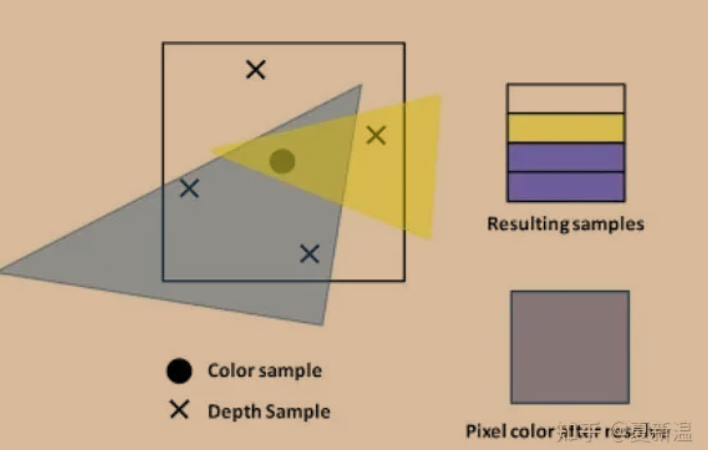

以上图为例，说明MSAA的步骤

1. 光栅化阶段，对四个x位置的sample执行三角形覆盖判断，在一个四倍分辨率大小的coverage mask中记录每个Sample被覆盖的情况，比如下面的2个sample通过了覆盖测试，则掩码为0011。
2. 像素着色阶段，对至少有1个sample通过了覆盖测试的像素着色，用像素中心点或者某个已覆盖的sample的坐标执行像素着色器。（注：有的时候，三角形可能没有覆盖到像素的中心位置，这时候如果再使用像素中心点的坐标着色，就可能得到错误的渲染效果。GPU 硬件会使用**centroid sampling**来调整采样点的位置，当像素中心点被覆盖时，是正常的像素中心点的采样，而当像素中心点未被三角形覆盖时，GPU就会挑选最近的通过覆盖测试的次像素点，作为采样点。）
3. 对4个sample中通过覆盖测试的执行深度测试，并将测试通过的sample插值得来的深度值写入深度缓冲。每个sample都拥有自己的深度值。
4. 上图中左下两个Sample通过了深度测试，并且coverage mask为1，因此将像素着色阶段得到的颜色copy到这两个Sample对应的颜色缓冲中（依然是每个Sample一个颜色，共四倍大小）。其他两个Sample暂为背景色。
5. 重复上述流程绘制第二个黄色三角形，将像素着色获得的黄色复制到右上角的Sample中。
6. 所有绘制结束之后，将四个Sample的颜色resolve获得最终输出的像素颜色。


* **我的疑问1：为什么Depth_Buffer要跟着扩充？不能直接覆盖率X像素点中心的颜色计算吗？**

参考Games101作业的MSAA实现，在深度缓冲和原图大小一样的情况下，边界处是这样的情况，有明显的黑边，绿色三角形在上，蓝色三角形在下：

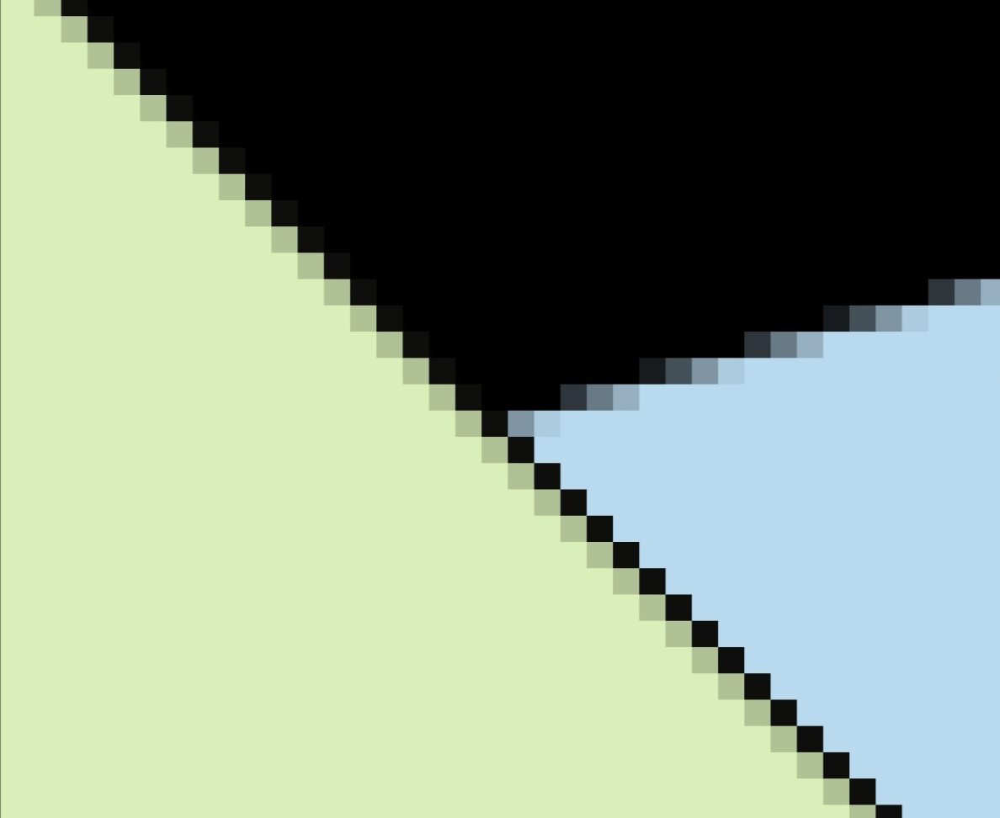

绘制顺序：先绘制绿色的，再绘制蓝色的，深度缓冲记录的那就是**绿色的咯**，在边界处最终显示的颜色就是Green Color * 覆盖率(比较低)，呈现为黑色。

在计算完第一个绿色的三角形之后，开始计算第二个蓝色的三角形，这时又遍历到了上面异常的黑边处，也就是有一点点绿色的黑边，需要比较深度缓存来决定蓝色三角形是否要在该像素绘制。在每个像素采样计算时，三角形的覆盖是按照4x4采样计算的，但是深度值是按照像素级别1x1计算和存储来的， 之前该像素位置只存储了绿色三角形的深度值，蓝色三角形在绿色之后，所以深度比较失败，从而导致了该处不会再更新像素值。


* **我的疑问2：为什么Color_Buffer要跟着扩充？**

同样是上面的情况，最终颜色怎么确定呢？

如果直接按照**中心点像素颜色*覆盖率**，没有办法打到混合的效果，要用子像素点保留历史颜色，最后求平均值，达到混合的效果。


### FXAA(近似快速抗锯齿)

FXAA是MSAA一种高性能近似，位于后处理阶段实现，不依赖于硬件，总体思想：

1. 找出来图像中的所有边缘(通过亮度比较，G分量)
2. 平滑化边缘(沿着某一个方向将一定范围的像素取出来求加权平均)

### TAA(时域抗锯齿)

从时间维度上进行抗锯齿处理，使用同个像素在不同帧上的不同采样点，根据时间先后进行一个加权平均计算；但是TAA也有缺点，就是容易出现鬼影和抖动的现象；


### 性能比较

* **MSAA、FXAA对性能的损耗是怎么样的？哪一个损耗更大？如何平衡性能和成像质量的关系？**

  * MSAA

  MSAA 会有N倍大小的color、depth/stencil buffer，占用带宽比较大，现在一般都在硬件上处理。

  * FXAA

  FXAA不依赖于硬件，完全是采用图像处理的方法，计算消耗比较大

整体上来讲，FXAA通常在计算资源上的开销较小，但是效果最差，只是对锯齿做了一个模糊。

在一些对性能要求较高的场景，或者在资源受限的环境下，FXAA可能是更合适的选择。在对图像质量要求较高、有足够计算资源和内存带宽的情况下，MSAA可能更适用。


## 阴影技术

对于静态的物体可以采用LightMap烘焙的方法来获取物体的影子，而对于动态物体，一般采用的是shadowmap技术。

### LightMap(光照贴图)

（1）原理：从光源的方向去烘培(离线渲染)一个物体，把结果存一张贴图里，因为离线渲染的时候，如果光线和物体之间有东西被遮挡，那么物体上该点处就会存在阴影，那么在Lightmap上就是一个阴影的值(较暗的像素)**，**然后渲染的时候直接对该物体从光照贴图里面采样即可，

（2）缺点：Lightmap只能存diffuse分量，不能存specular分量，没办法做动态阴影。

### ShadowMap(阴影贴图)

从光源渲染一遍场景，将深度信息存到深度图中，在正常渲染一次场景，利用shadowmap来判断那些片段落入了阴影中。

* 常见问题

  * 抖动(自遮挡)

  可以通过偏移来解决，增加一个bias来比较片段深度，还有一种更好的方式是自适应偏移，基于斜率去计算当前深度要加的偏移。

  * 锯齿

  可以使用百分比渐进过滤(Percentage Closer Filter，PCF)技术进行解决：从深度贴图中多次采样，每次采样坐标都稍有些不同，比如上下左右各取9个点进行采样（即一个九宫格），最后加权平均处理，就可以得到柔和的阴影。标准PCF算法采样点的位置比较规则，最后呈现的阴影还是会看出一块一块的Pattern（图块），可以采用一些随机的样本位置，比如Poisson Disk来改善PCF的效果

* **ShadowMap比较深度值的时候，深度值是在线性空间吗？需不需要除以w？为什么?**

ShadowMap中的深度值是**非线性**的，因为深度值在投影空间下是**不均匀分布**的。因此，需要进行**深度值的非线性变换**，以便在比较深度值时获得更好的精度。这个变换通常被称为**深度偏差（Depth Bias）**。在进行深度偏差之前，需要将深度值除以w，以将其从**齐次空间**转换为**非齐次空间**。这样做的原因是，深度值在齐次空间下是**线性分布**的，而在非齐次空间下是**非线性分布**的。因此，将深度值除以w可以将其转换为非齐次空间，使其更适合进行深度偏差。

### PCSS（Percentage-Closer Soft Shadows）

PCF filter的半径是固定的，但是根据自然现象来看，遮挡物和阴影距离越近，阴影应该越硬

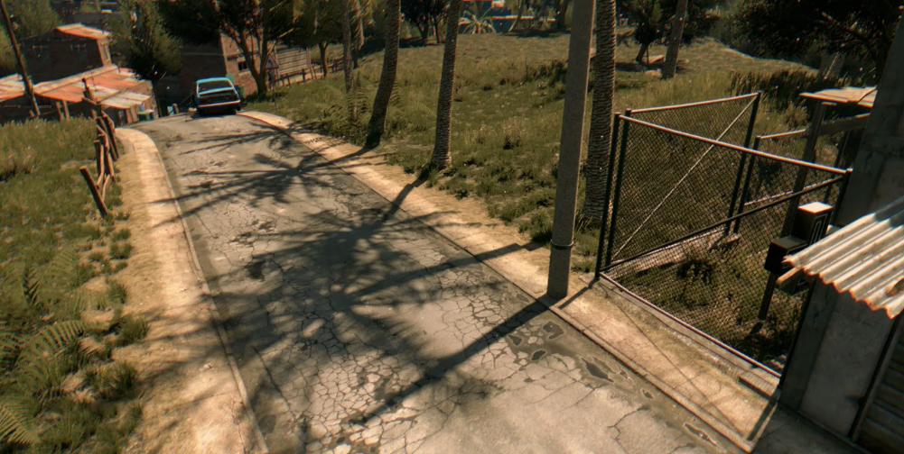

根据这样的现象，PCSS通过相似三角形原理，动态计算出PCF应该采样的范围大小：

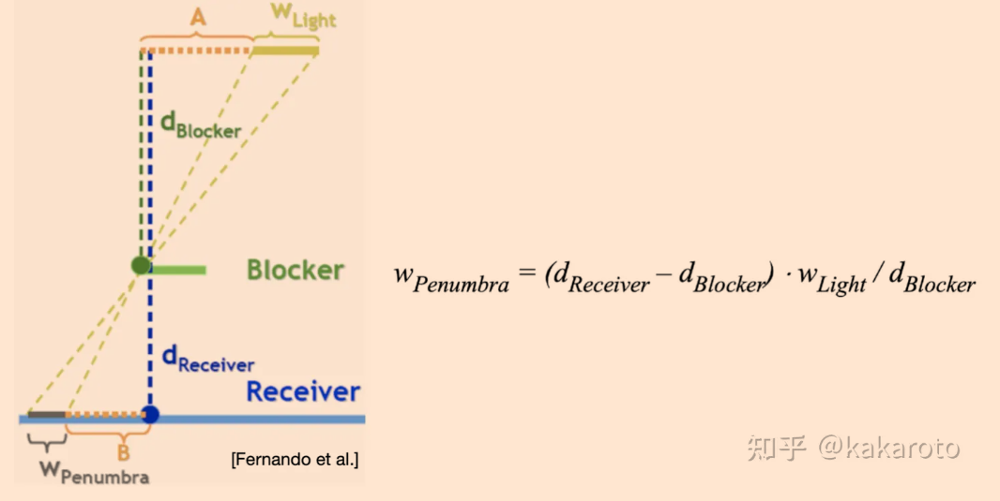


### VSSM(Variance Soft Shadow Map)

VSSM主要是解决了PCSS中第一步和第三步搜索慢的问题。

第三步PCF之中,我们要在shadow map上对其周围的一圈像素的各个最小深度与Shading point比较,从而判断是否遮挡,也就是要求出范围内有百分之多少的像素比它浅.

这个过程很像在考试成绩出来后,你知道了自己的成绩,你想知道自己在班级中的排名,因此你需要知道班级中所有人的成绩从而进行比较来判断自己是百分之几,这就是PCF的做法.

但现在我们就是为了避免这种时间消耗大的做法.

那么一个不错的办法就是,对班级所有人的成绩做成一个直方图,根据直方图我们可判断出自己的成绩排名.


如果我们不需要那么准的话就可以当做一个正态分布，正态分布就只需要方差和平均值就能得出,更加的方便快速,这也就是VSSM的核心思想,通过**正态分布**来知道自己大约占百分之几.

VSSM的**key idea**是快速计算出某一区域内的均值和方差.

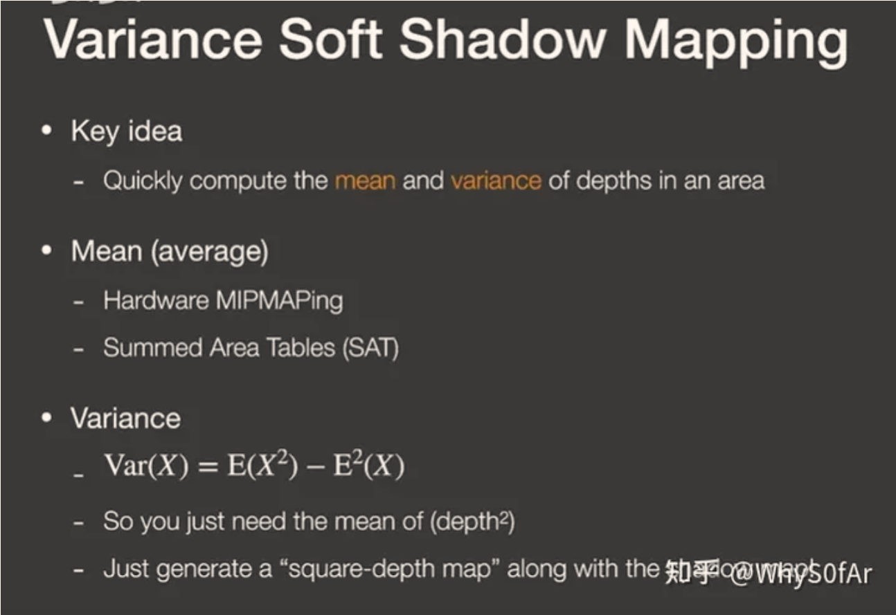

所以我们要知道**均值和方差**

**均值**

对于快速的求一个范围内的均值，我们可以想到mipmap方法，但是这是不准确的，而且只能在正方形区域内求取，因此引入了Summed Area Tables（SAT）。

**方差**

VSSM用结合了期望和方差之间的公式来得到方差：
$$
Var(X) = E(X^2) - E^2(X)
$$
即 平方值的期望-期望的平方值 = 方差。

在shadow map中我们存储的是depth,因此depth也就是公式中的x,在指定区域范围后,可以快速的求出区域范围的平均值(期望),因此也可以很快求出区域范围内平均值的平方,也就是求出了 $E^2(X)$。

那么求 $E(X^2)$ ,我们就需要额外生成一张shadow map,但是这张图上存的不是depth,而是 $depth^2$,然后再在指定范围区域内快速求出平均值,也就是求出了平方值的期望,求出了$E(X^2)$,这张存储了$depth^2$ 的shadow map叫做square-depth map.因此需要额外存储一张**square-depth map.**

到此为止我们就快速获得了均值和方差。那么回到问题本身:

有多少百分比的像素是比Shading point **大** 也就是 **不会挡住** Shading point的只需要计算出下图 **PDF中白色面积** 的值就行了。

有多少百分比的像素是比Shading point **小** 也就是 **会挡住** Shading point的只需要计算出下图 **PDF中灰色面积** 的值就行了。

注：

PDF：概率密度函数（probability density function）, 在数学中，**连续型随机变量**的概率密度函数是一个描述这个随机变量的输出值，在某个确定的取值点附近的可能性的函数。

CDF : 累积分布函数 (cumulative distribution function)，又叫分布函数，是**概率密度函数的积分**，能完整描述一个实随机变量X的概率分布。


其实想知道CDF，也就是求出PDF曲线下对应的面积.

对于一个通用的高斯的PDF，对于这类PDF，可以直接把CDF结果，输出为一个表，叫误差函数Error Fuction，误差函数有数值解，但是没有解析解，在C++ 中的函数ERF(lower_limit,[upper_limit])函数可以计算CDF。

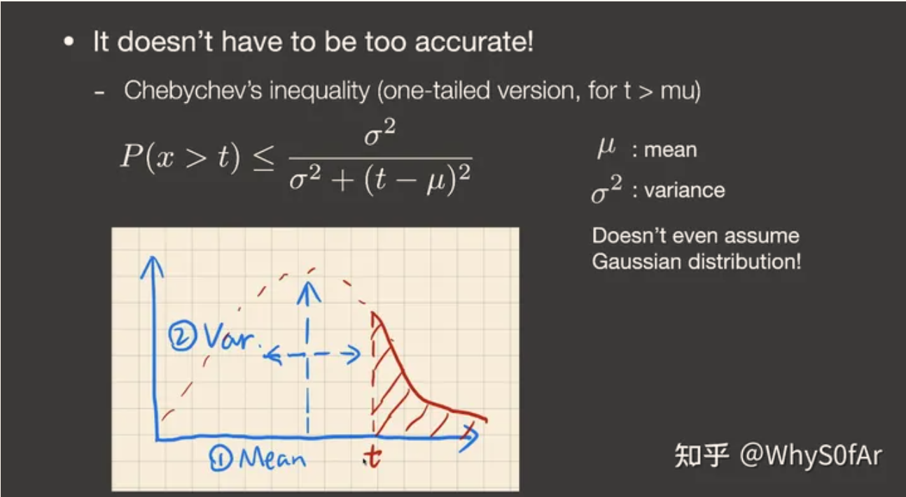

我们用切比雪夫不等式,来近似地求出在知道 **期望** 和 **方差** 时候,不考虑是不是正态分布,图中红色面积不会超过等式右边，这里使用了一个Trick的方法，将这个**不等式近似为相等.**

那么就可以通过均值和方差获得图中红色面积的值。因此就可以不用计算CDF了，而是通过1 - 求出的x>t的面积值得到CDF.但是**切比雪夫不等式有一个苛刻的条件：t 必须在均值右边，也就是t大于均值。**


**加速第三步总结:**

**1.我们通过生成shadow map和square-depth map得到期望值的平方和平方值的期望再根据公式 得到方差**

**2.通过mipmap或者SAT得到期望**

**3.得到期望和方差之后,根据切比雪夫不等式近似得到一个depth大于shading point点深度的面积.,也就是求出了未遮挡Shading point的概率,从而可以求出一个在1-0之间的visilibity.**

也就是省去了在这个范围内进行**采样**或者**循环**的操作,大大加速了第三步.


目前解决了第三步的问题，PCSS在第一步要需要求在范围内将所有像素的深度走一遍从而求平均遮挡深度Average Blocker Depth的问题并未解决。

我们以图中的5*5范围为例,假设我们的Shading point的深度是7.

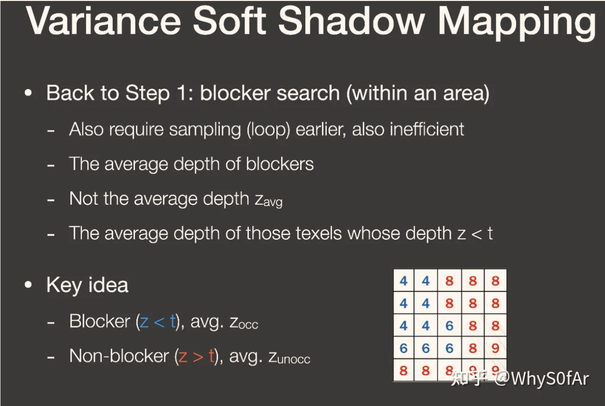

我们将其分为两个区域,**蓝色**是深度小于shading point的遮挡区域,其平均深度为Zocc，**红色**是深度大于shading point的非遮挡区域.其平均深度为Zunocc.并且我们认为区域内的像素总数为N,非遮挡的像素为N1个,遮挡的像素为N2个.

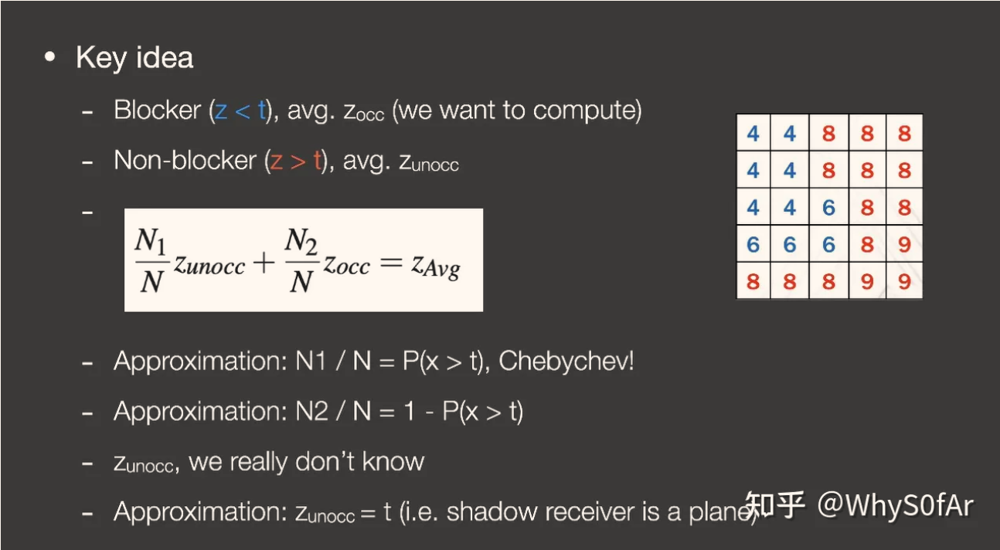


核心思路:

我们需要去计算求出$Z_{unocc}$ 和$Z_{occ}$,通过他们之间的关系我们可以得出一个数学公式:

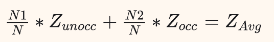

**非遮挡像素占的比例 \* 非遮挡物的平均深度 + 遮挡像素占的比例 \* 遮挡物的平均深度 = 总区域内的平均深度.**

总区域内的平均深度我们用mipmap或者SAT去求,然后用shadow map和square-depth map方差,最后根据切比雪夫不等式近似求出 **非遮挡像素占的比例 和遮挡像素占的比例.**

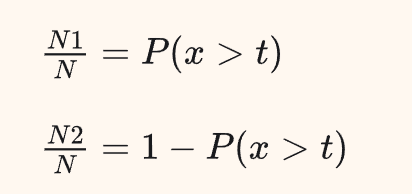

此时公式中的 $Z_{unocc}$ 和$Z_{occ}$仍然是不知道的,我们做一个大胆的假设,我们认为非遮挡物的平均深度 = shading point的深度,至此我们只剩下$Z_{occ}$的深度,将所有值代入可求出遮挡物的平均深度.但是接受平面是曲面或者与光源不平行的时候就会出问题。


VSSM的做法实在是十分聪明,采用了非常多的大胆假设，同时非常的快，没有任何噪声，本质上其实也没有用正态分布，是直接用切比雪夫不等式来进行近似。但是现在最主流的方法仍然是PCSS,因为人们对噪声的容忍度变高加上降噪的技术越来越高明,因此大多数人采用PCSS.


**MIPMAP和SAT**

VSSM中如何加速第一步和第三步的我们知道了,那么如何在区域范围内快速的求出均值呢?

有两个方法:MIPMAP 和 SAT.

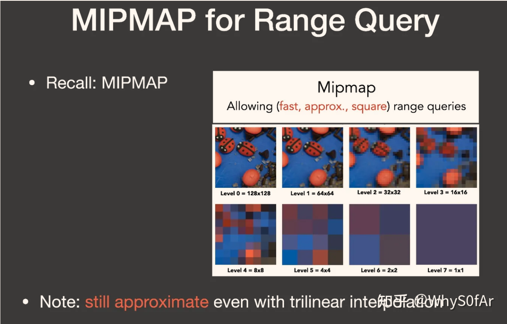

最简单的方法自然是MIPMAP,我们在GAMES101里学过,他是一个**快速的,近似的,正方形的范围查询,**由于他要做插值,因此即便是方形有时也会不准确.同时当插值的范围不是2的次方时，也就是在两个MIPMAP之间时，还要再进行一次插值，也就是“三线性插值”，这样会让结果更加不准确,因此局限性太大且准确度也不算高.


但是SAT是百分百准确的一个数据结构.SAT的出现是为了解决范围查询(在区域内快速得到平均值),并且,范围内求平均值是等价于范围内求和的,毕竟总和除以个数=平均值.

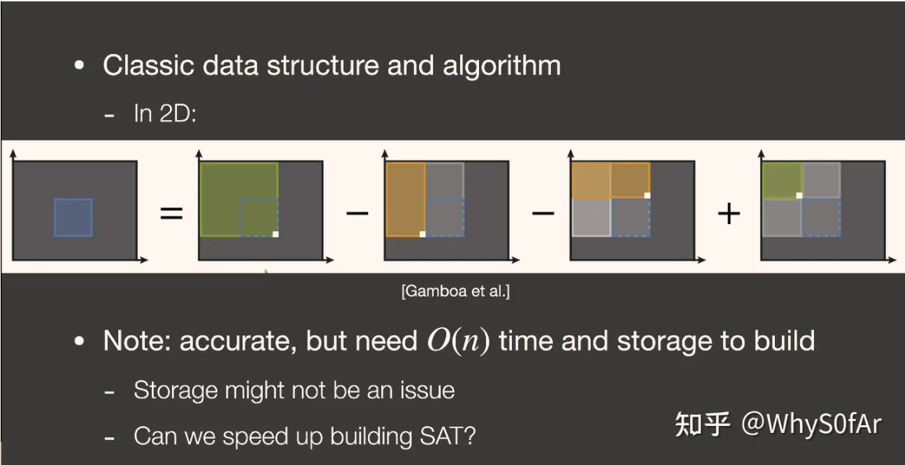

问题：不是正态分布强行按正态分布算就会出现漏光和过暗的结果。在阴影的承接面不是平面的情况下也会出现阴影断掉的现象。


### CSM(Cascade ShadowMap，级联阴影贴图)

CSM根据对象到观察者的距离距离提供不同分辨率的深度纹理来解决上述问题。CSM将相机的谁锥体分割成了若干部分，然后为分割的每一个部分生成独立的深度贴图。

CSM通常用于大型场景模拟太阳的投射，对于**近处**的场景使用**较高分辨率**的**阴影贴图**，对于**远处**的场景使用**粗糙**的**阴影贴图**。

首先要生成CSM：

1.对视锥体进行划分

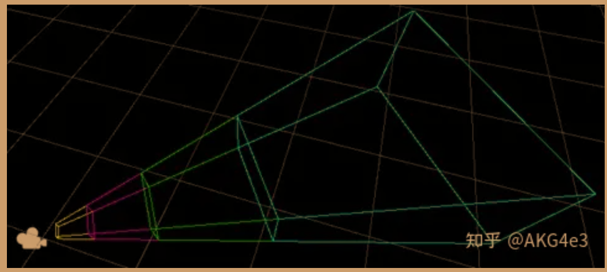

2. 每一个子视锥体都是一个场景，所以我们每一级Shadow map都要至少覆盖整个视锥体，阴影相机通常使用正交投影，正交投影的视野范围是长方体故不难想到通过 AABB 盒子来包围：

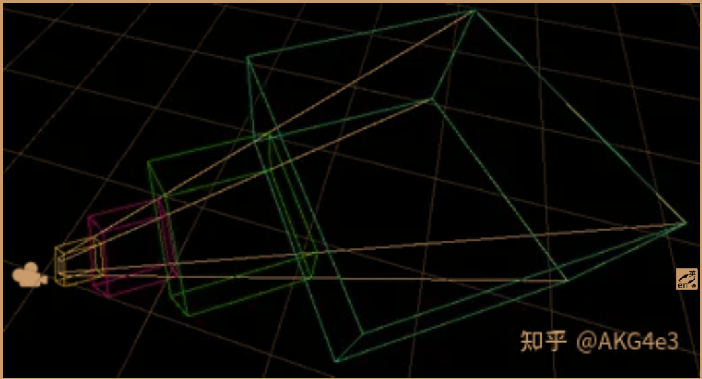

3. 生成深度图，有了视锥划分的box之后，我们还需要设置阴影相机以生成深度贴图，阴影相机的正交范围和包围盒保持一致。

采样思路如下：

1. 使用每个光源的**光椎体**渲染**场景**的**深度值**。
2. 从相机位置渲染场景。根据**片段**的**z值**，选择**合适**的**阴影贴图**查询片段对应的**阴影贴图**中的**深度数据**，将其和**片段**在**光椎体**下的**深度值**进行比较，根据比较结果决定**片段**的**最终颜色**。

CSM明显存在抖动问题：

* 相机的平移抖动，在移动的时候，对场景的同一个三角形采样出来的深度图不一样，我们可以通过控制每次偏移的距离来解决这个问题，保证每次偏移都是深度图 空间长度/resolution的整数倍

```c#
// 计算 Box 中点, 宽高比
Vector3 center = (box[3] + box[4]) / 2;
float w = Vector3.Magnitude(box[0] - box[4]);
float h = Vector3.Magnitude(box[0] - box[2]);
//float len = Mathf.Max(h, w);
float len = Vector3.Magnitude(f_far[2] - f_near[0]);
float disPerPix = len / resolution;

Matrix4x4 toShadowViewInv = Matrix4x4.LookAt(Vector3.zero, lightDir, Vector3.up);
Matrix4x4 toShadowView = toShadowViewInv.inverse;

// 相机坐标旋转到光源坐标系下取整
center = matTransform(toShadowView, center, 1.0f);
for (int i = 0; i < 3; i++)
    center[i] = Mathf.Floor(center[i] / disPerPix) * disPerPix;
center = matTransform(toShadowViewInv, center, 1.0f);
```

* 相机的旋转抖动

在旋转的时候相机的包围盒长宽时刻在变化，单张阴影贴图能覆盖的面积也不断变换，自然造成了生成图像的走样：

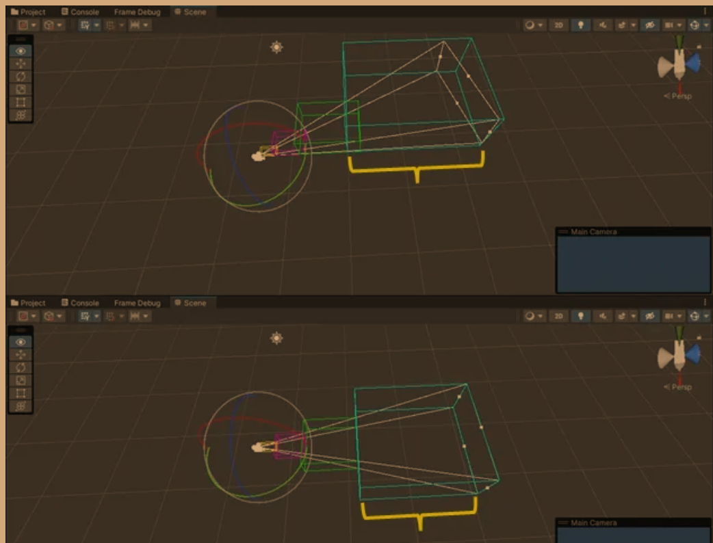


因为我们的包围盒设定上就是要严密包围视锥体，所以对旋转变换比较敏感。可以粗暴的将主相机子视锥体（梯形台）的长对角线作为包围盒的宽高，因为只要主相机参数和 CSM 划分参数不变那么长对角线就不会变，况且包围盒最长不会超过长对角线。

这样一来能够保证正交投影视锥体的宽高和主相机旋转无关。这么做虽然损失一些阴影贴图的精度但仍是合理的交换，况且低精度的 Shadow Map 我们有各种 trick 来料理它。再次修改 CSM.ConfigCameraToShadowSpace 函数，首先取得当前 level 的子视锥体（梯形台）然后计算长对角线。


* **如何降低DrawCall？**


* **如何处理阴影衔接的部分？**


### 基于SDF实现软阴影

**SDF的应用**

* **Ray Marching**

任意一点的SDF我们是已知的,因此在$P_0$点时,我们以它的$SDF(P_0)$为半径做一个圆(此处假设在2D内,如果在3D内则是一个球),在这个圆内无论是哪个方向前进,只要不超过半径距离,都不会碰见物体,是安全的.

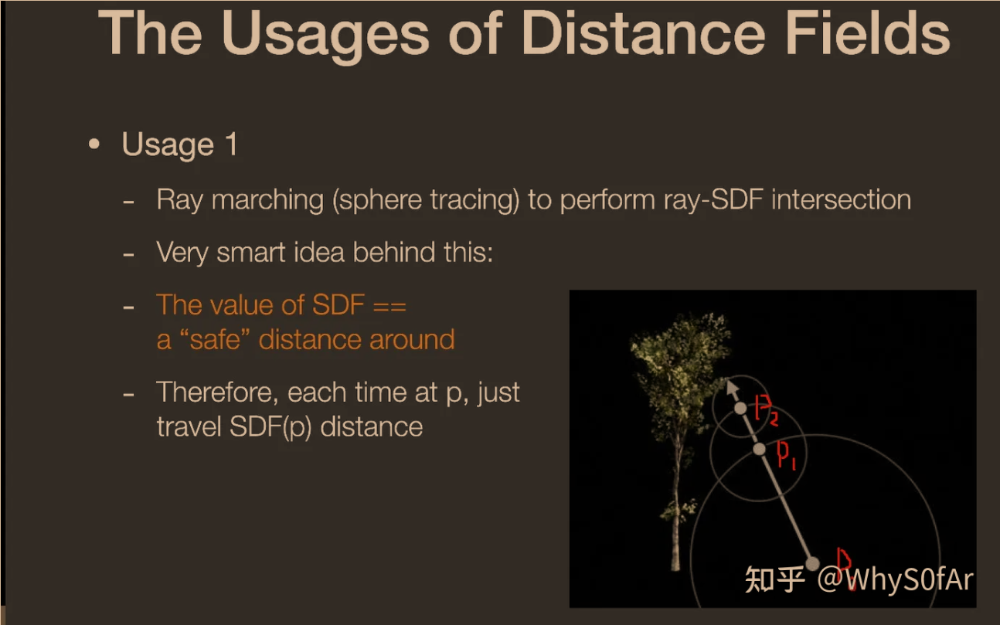

* **生成阴影**

将安全距离的概念进行延伸，在任意一点通过sdf可以获得一个safe angle.


我们取点P为shading point往一方向打出一根光线,光线上的一点a,有一个SDF值SDF(a),也就是在a点以SDF(a)为半径所做的球或圆内是安全的,不会碰到物体.

把shading point和**面光源**相连，所得到的安全角度越小，被遮蔽的可能越高，就可以认为

**safe angle越小，阴影越黑,越趋近于硬阴影;**

**safe angle够大就视为不被遮挡没有阴影,也就越趋近于软阴影。**

因此我们需要知道的应是如何从ray marching中求出safe angle:

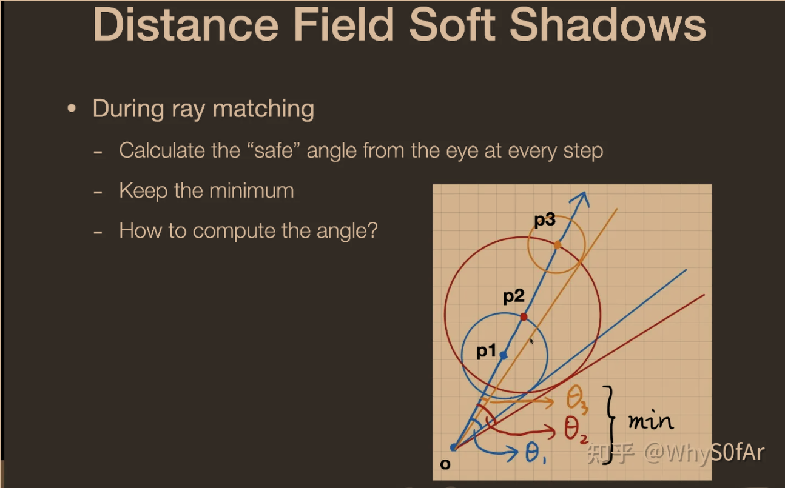

我们以o为起点,沿一个方向推进,仍然是ray marhcing的步骤,在p1点以SDF(p1)进行推进,其余点也是一样,此处主要是为了求safe angle,我们在起点o沿每个点的sdf为半径所形成的圆做切线,从而求出各个点的safe angle,我们最后再取其中最小的角度作为总的safe angle.

也就是我们在trace的每次过程中都求出一个safe angle,到最后进行相交操作时取最小的safe angle来用.

**那么我们该怎么去计算这个角度?**

从图我们可以知道,以p1点为例,从o点到p1的距离为斜边,sdf(p1)是直角边,因此我们用arcsin就可以求出safe angle了.

但是!!!!!!!!!

arcsin的计算量其实是十分大的,因此在shader中我们不用反三角函数.

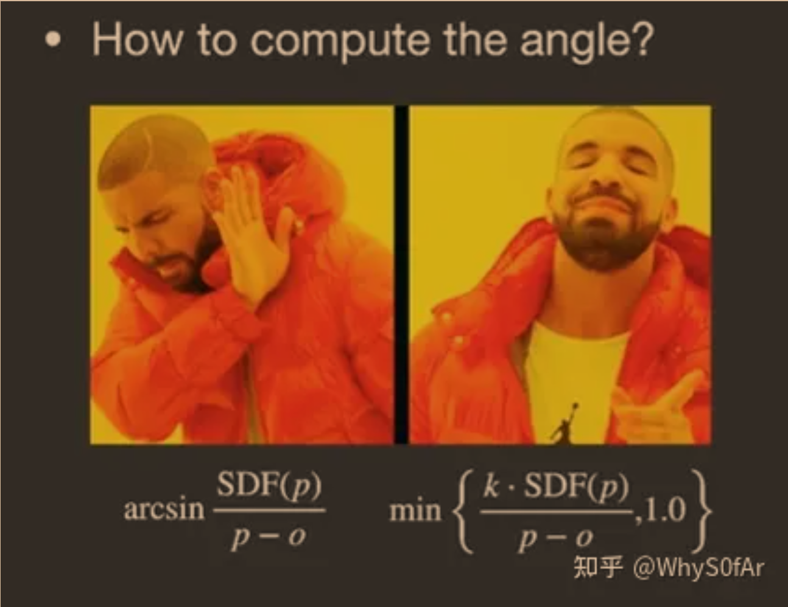

只要sdf长度除以光线走过的距离乘一个k值，再限定到1以内，就能得到遮挡值或者说是visibility，而k的大小是控制阴影的软硬程度.

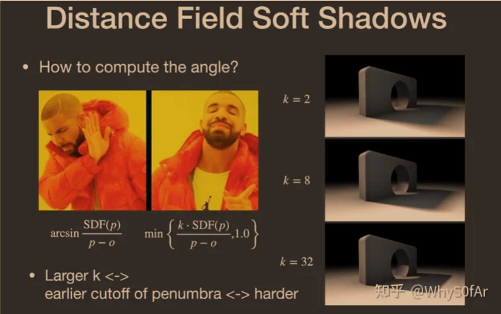

我们从图中右半部分可以看出来,当k值越大时候,就越接近硬阴影的效果,也就是它限制了可能半影的区域:

k越小,半影区域越大,越接近软阴影效果.

K越大,半影区域越小,越接近硬阴影效果.

这个思想并不是去考虑一个 安全角度面光源覆盖的总角度安全角度面光源覆盖的总角度 从而求出一个比值,再用这个比值作为visibility.

**而是求出safe angle,安全角度越大,阴影越软;安全角度越小,阴影越硬.**

**Conclusion:**

SDF是一个快速的高质量的软阴影生成方法(比shadow map快是忽略了SDF生成的时间),但是在存储上的消耗非常大，而且生成SDF的花的时间也要很久，SDF是预计算，在有动态的物体的情况就得重新计算SDF。

## Shader

* **什么样得shader是高质量shader？**
  一个好的着色器（shader）通常具有以下特征和品质：

1. **高性能：** 能够在目标硬件上高效运行，避免不必要的计算和资源消耗。考虑到 GPU 的并行性，合理地优化代码以提高渲染性能是至关重要的。
2. **可读性：** 具备良好的代码结构和注释，易于理解和维护。可读性强的着色器代码能够帮助其他开发人员或未来的自己更容易理解其逻辑。
3. **可配置性：** 具备参数化和可配置的选项，以便根据需要进行定制和调整。通过在代码中引入一些参数，可以更灵活地适应不同的场景和效果。
4. **模块化：** 使用模块化设计，使得代码可以被轻松地重用。将不同的功能划分为模块，这样可以更方便地在不同的着色器中共享和重用代码片段。
5. **真实感和艺术效果：** 能够产生逼真的视觉效果，符合艺术设计的要求。这可能涉及光照模型、阴影效果、材质贴图等方面的技术实现。
6. **支持多平台：** 能够在不同的图形 API 和硬件上运行，并兼容不同的渲染管线。这是为了确保着色器的可移植性，可以在多种环境中使用。
7. **良好的错误处理和调试支持：** 提供清晰的错误信息和调试信息，以便更轻松地识别和修复潜在的问题。有助于加快着色器开发过程。
8. **安全性：** 能够避免潜在的渲染错误，如除以零等。确保代码的安全性和稳定性对于避免渲染问题和崩溃是至关重要的。
9. **支持多个渲染阶段：** 能够灵活地适应不同的渲染阶段，包括顶点着色、片元着色、几何着色等。
10. **合理使用计算资源：** 合理使用 GPU 计算资源，尽量避免过度使用昂贵的计算和存储。

总体而言，一个好的着色器应该能够在性能和效果之间取得平衡，同时具有清晰、可读和可维护的代码结构。这样的着色器对于实现高质量的图形效果和优化渲染性能至关重要。


## Geometry Shader

在顶点和片段着色器之间有一个可选的几何着色器(Geometry Shader)，几何着色器的输入是一个图元（如点或三角形）的一组顶点。几何着色器可以在顶点发送到下一着色器阶段之前对它们随意变换。然而，几何着色器最有趣的地方在于，它能够将（这一组）顶点变换为完全不同的图元，并且还能生成比原来更多的顶点。

### 爆破物体

可以利用Geometry Shader实现爆破物体的功能。

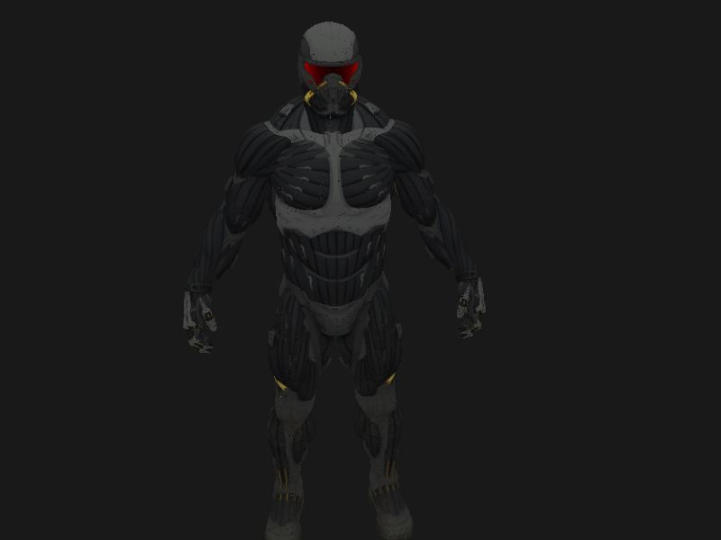


爆破碎片：

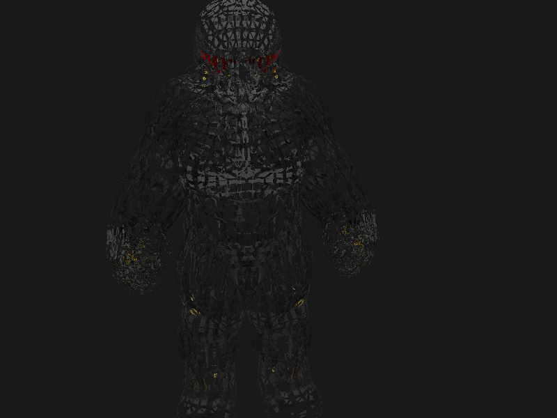

具体做法：

可以在几何着色器中先将gl_Position计算出在视图空间的坐标，并且我们输入的是一个图元面片，我们可以求出三角形面片的法线，让这个坐标沿着法线进行移动，相当于加一个offset，再进行projection变换，进行光照计算等，只是沿着法线进行了偏移，实现了效果。

```cpp
//vs
void main()
{
    vs_out.texCoords = aTexCoords;
    gl_Position = view * model * vec4(aPos, 1.0); 
}

//gs
vec4 explode(vec4 position, vec3 normal)
{
    float magnitude = 1.0;
    vec3 direction = normal * ((sin(time) + 1.0) / 2.0) * magnitude; 
    return position + vec4(direction, 0.0);
}

vec3 GetNormal()
{
    vec3 a = vec3(gl_in[0].gl_Position) - vec3(gl_in[1].gl_Position);
    vec3 b = vec3(gl_in[2].gl_Position) - vec3(gl_in[1].gl_Position);
    return -normalize(cross(a, b));
}

void main() {    
    vec3 normal = GetNormal();

    gl_Position = projection * explode(gl_in[0].gl_Position, normal);
    TexCoords = gs_in[0].texCoords;
    EmitVertex();
    gl_Position = projection * explode(gl_in[1].gl_Position, normal);
    TexCoords = gs_in[1].texCoords;
    EmitVertex();
    gl_Position = projection * explode(gl_in[2].gl_Position, normal);
    TexCoords = gs_in[2].texCoords;
    EmitVertex();
    EndPrimitive();
}
```


### 法线可视化

法线可视化也是一样的道理，分成两个pass，第一个pass正常渲染物体，第二个pass完成可视化。

可视化操作流程:

同样先求出来在视角空间下的坐标(gl_position)，把输入片元设置成三角形，输出片元设置成直线，我们可以得到每一个点的顶点坐标信息，这个点就是直线的起点，沿着法线完成一定的偏移，另一个点就是直线的终点，在fs中输出一致的颜色，完成可视化。

```cpp
//vs
void main()
{
    mat3 normalMatrix = mat3(transpose(inverse(view * model)));
    vs_out.normal = vec3(vec4(normalMatrix * aNormal, 0.0));
    gl_Position = view * model * vec4(aPos, 1.0); 
}

//gs
void GenerateLine(int index)
{
    gl_Position = projection * gl_in[index].gl_Position;
    EmitVertex();
    gl_Position = projection * (gl_in[index].gl_Position + vec4(gs_in[index].normal, 0.0) * MAGNITUDE);
    EmitVertex();
    EndPrimitive();
}

void main()
{
    GenerateLine(0); // first vertex normal
    GenerateLine(1); // second vertex normal
    GenerateLine(2); // third vertex normal
}
```

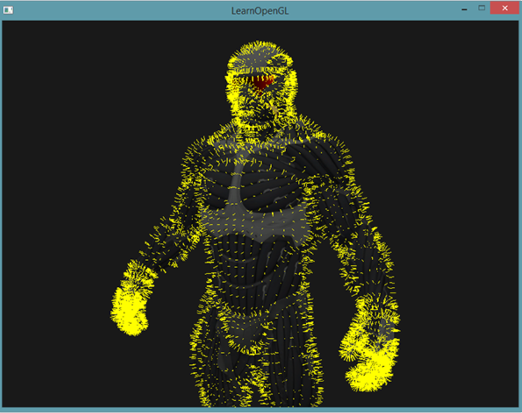


## 延迟渲染

* **什么是延迟渲染？G-Buffer要存什么东西？**

（1）延迟渲染要将物体的几何信息(位置、法线、颜色、镜面值)存到集合缓冲区中(G-Buffer)，在光照处理阶段，使用G-Buffer中的纹理数据，对每个片段进行光照计算，这种渲染方法的一个好处就是能保证在G-Buffer中的片段和屏幕上呈现的像素所包含的片段信息是一致的，因为深度测试已经最终将这里的片段信息作为最顶层的片段。这样保证了在光照处理阶段，每个像素只处理一次，延迟渲染思想：先深度测试，再着色计算，将本来在物体空间(三维空间)进行的光照计算放到了屏幕空间(二维空间)处理计算。

（2）在每一帧当中G-buffer存储的信息有：位置、法线、颜色值、镜面值（所以其实有三张纹理，分别存位置、法线和颜色+镜面值(RGB+)A)；如果是PBR，应该还要再存一个金属度和粗糙度贴图。

* **延迟渲染和正向渲染的区别？优缺点**
  * 区别：正向渲染先执行着色计算，再执行深度测试；光源数量对计算复杂度影响很大，一个像素运行多次片段着色器；延迟渲染先执行深度测试，后执行作色计算，对于延迟渲染，每个像素只会执行一次片段着色器。
  * 延迟渲染支持多光源场景，后处理也比较容易，计算复杂度低，但是不支持MSAA抗锯齿，不支持透明物体渲染，显存开销比较大。
* **G-Buffer使用不同的shader怎么处理？**

比如有不同的shader处理不同的物体，地形有对应的地形shader，模型有对应的模型shader。

1. 可以考虑用模板，写入GBuffer的时候，根据不同位置对模板写入不同的值，例如模型写入1，地形写入2，shading的时候采用模板测试。
2. 根据移动端架构，每一个图元都有一个对应的tile，类似这种架构，每一个图元记录上对应的shader信息？(瞎几把写的)


* **延迟渲染性能上最大的缺点？有没有什么优化的办法？**

缺点：带宽大，不支持透明物体渲染，通过压缩gbuffer大小来优化。

优化方法：

​	1. GBuffer的压缩(CryEngine的MicroGBuffer)

​	2. 苹果的 metal 有实现移动端 gbuffer 的优化，通过 Lossy compression 压缩 Render Target 的大小以节省显存带宽


* **延迟渲染与visibility**

延迟渲染把渲染分成了两部，第一步把surface Atrribute绘制到一个Gbuffer中，第二步根据光在Screen Space空间完成光照计算；
第一个问题：G-Buffer在高分辨率下带宽占用是比较大的，
第二个问题：G-Buffer在记录Attribute的时候，在复杂的场景下对于屏幕的一个像素可能会绘制多次，每次绘制都会进行采样、插值等等，再写到G-Buffer中


针对第二个问题，有人提出了Visibility Buffer，在第一步渲染几何的时候，将像素信息(drawID、primitiveID等)pack到一个32bit的 UNIT中，写到Screen Space的buffer，再shading阶段读取像素的几何信息，三角形顶点的位置、uv进行重心坐标插值，计算出surface attribute属性，再完成光照计算

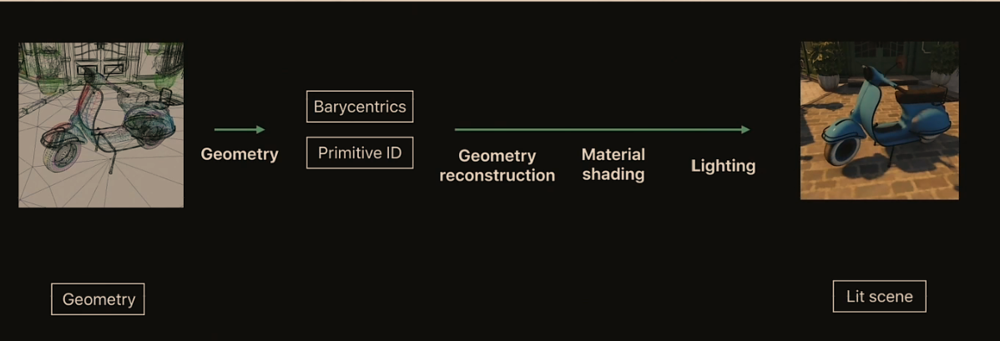

visibility buffer还可以和G-Buffer完成结合，第一遍pass仍然是visibility Pass，第二遍pass正常G-Buffer，根据visibility中的数据完成采样并写入G-Buffer，第三遍pass直接计算光照；计算光照的pass输入都是G-Buffer，无论是支持这种带有visibility buffer 的还是传统的G-Buffer，都可以完美支持、

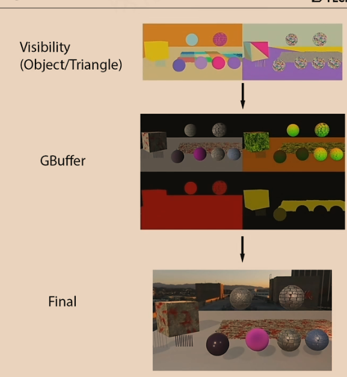


### GPU Driven

* **nanite管线**

nanite在同一个instance中不同cluster中可以拥有不同的LOD层级，这是和传统管线的区别，传统的instance level决定了cluster level。

nanite管线对几何模型分成多个cluster，并且将一定数量的cluster合成一个cluster group，在切换LOD层级的时候，保持柱cluster group边界不发生变化，保证和其他cluster group仍然水密连接，并将切换后的cluster group中的三角形继续划分成cluster。

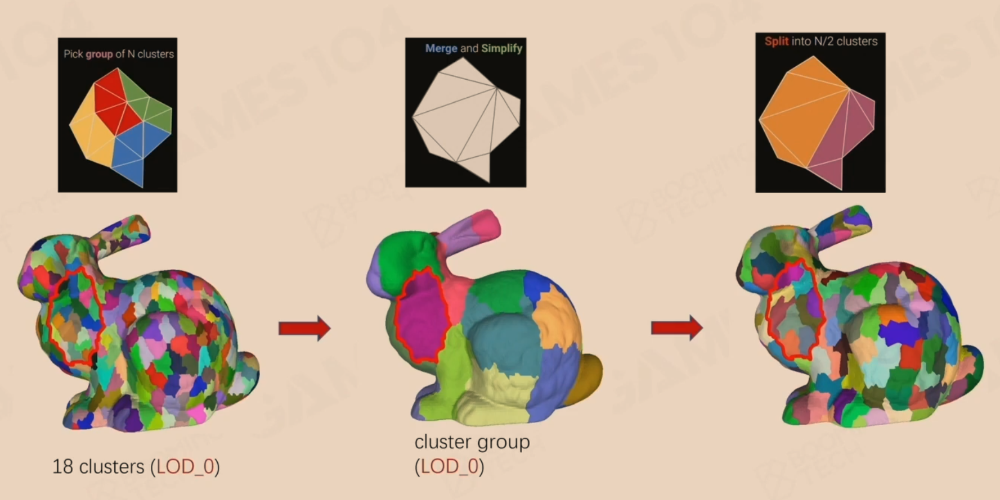

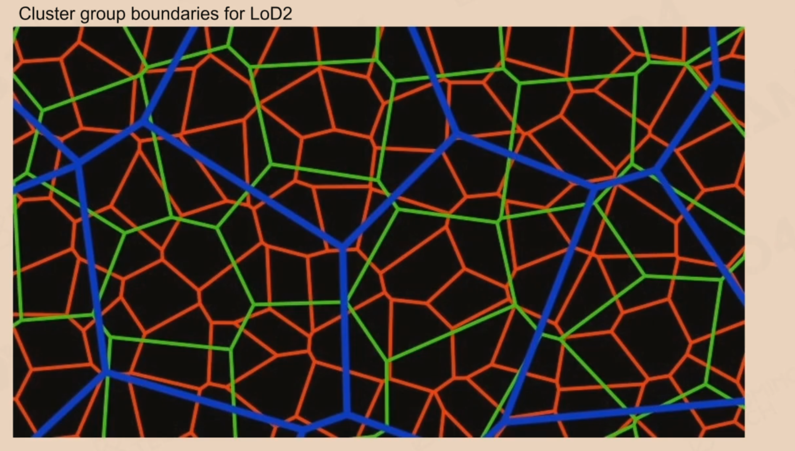

表示的是cluster group之间的边界，红色的是LOD0，绿色的是LOD1，蓝色的是LOD2，切换LOD层级的时候，边界也会重新被划分

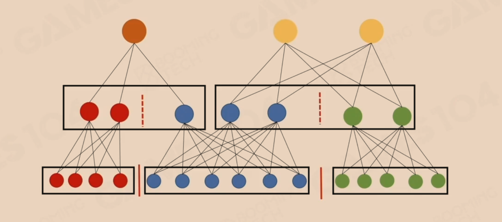

LOD Selection 通过并行计算实现，需要绘制的条件为：parentError> threshold && ClusterError <= threshold
将上述图拍平，在每一个cluster group中存放一个parent error

每一个cluster group中的cluster独立判断，每个只会判断自己的绘制情况

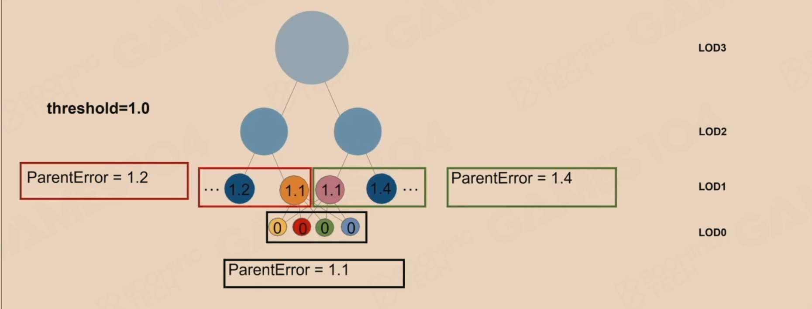


**nanite管线中的软光栅**

要弄清楚这个问题，首先需要理解硬件光栅化究竟做了什么，以及它设想的一般应用场景是什么样的，推荐感兴趣的读者读一读这篇文章[[6\]](https://zhuanlan.zhihu.com/p/382687738#ref_6)。简单来说：**传统光栅化硬件设计之初，设想的输入三角形大小是远大于一个像素的**。基于这样的设想，硬件光栅化的过程通常是**层次式的**。以N卡的光栅器为例，一个三角形通常会经历两个阶段的光栅化：**Coarse Raster**和**Fine Raster**，前者以一个三角形作为输入，以8x8像素为一个块，将三角形光栅化为若干块（你也可以理解成在尺寸为原始FrameBuffer 1/8*1/8大小的FrameBuffer上做了一次粗光栅化）。在这个阶段，借由低分辨率的Z-Buffer，被遮挡的块会被整个剔除，N卡上称之为**Z Cull**；在Coarse Raster之后，通过Z Cull的块会被送到下一阶段做Fine Raster，最终生成用于着色计算的像素。在Fine Raster阶段，有我们熟悉的**Early Z**。由于mip-map采样的计算需要，我们必须知道每个像素相邻像素的信息，并利用采样UV的差分作为mip-map采样层级的计算依据。为此，Fine Raster最终输出的并不是一个个像素，而是2x2的小像素块（**Pixel Quad**）。

对于接近像素大小的三角形来说，硬件光栅化的浪费就很明显了：首先，Coarse Raster阶段几乎是无用的，因为这些三角形通常都是小于8x8的，对于那些狭长的三角形，这种情况更糟糕，因为一个三角形往往横跨多个块，而Coarse Raster不但无法剔除这些块，还会增加额外的计算负担；另外，对于大三角形来说，基于Pixel Quad的Fine Raster阶段只会在三角形边缘生成少量无用的像素，相较于整个三角形的面积，这只是很少的一部分；但对于小三角形来说，**Pixel Quad最坏会生成四倍于三角形面积的像素数**，并且这些像素也包含在pixel shader的执行阶段，使得warp中有效的像素大大减少。


## 空间加速结构 & 算法

### AABB包围盒

把物体放在一个三个轴向对其的包围盒内(一个矩形)，如果光线无法与包围盒相交，那必然也无法和包围盒里面的物体相交，这样就可以省略大量不必要的求交计算；而且光线与包围盒的求交计算与具体的物体求交相比，速度是快得很多的；使用AABB的好处，计算可以简化，很容易计算出t，只需要用轴分量计算。

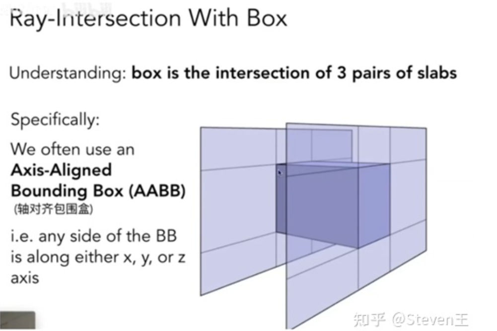

### 均匀格子法（uniform grids）

在AABB里面划分小格子，然后预处理将物体包含的格子做标记；接着遍历光线上的格子，在计算光线与标记过的格子中的物体是否相交。这样可以省略对那些不包含格子的物体进行求交计算，进一步提高求交速度：

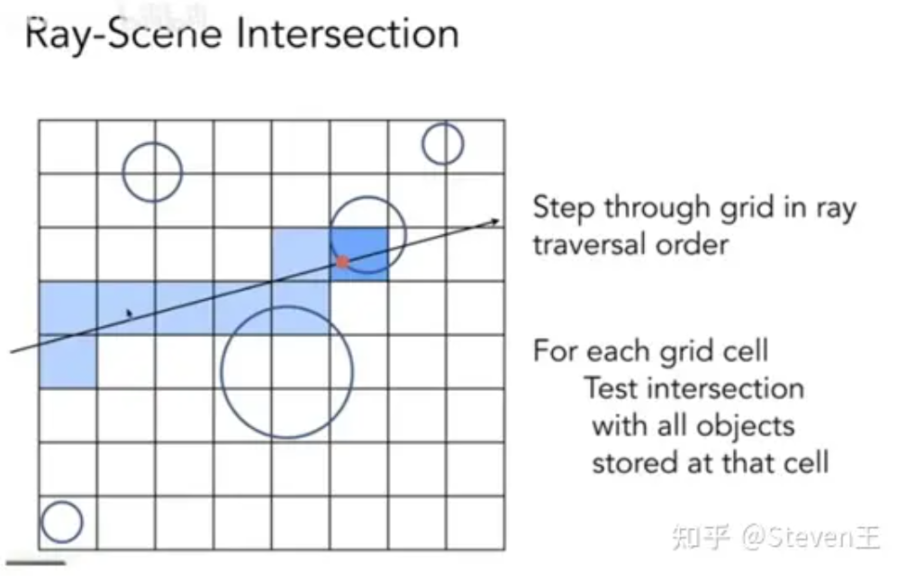

### 层次包围盒(BVH)

基于对象进行划分，目前得到最广泛的应用：

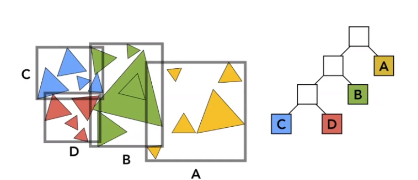

使用BVH可以避免一个对象同时存在不同的包围盒/区域中，以下是根据空间划分和根据对象进行划分的算法区别：

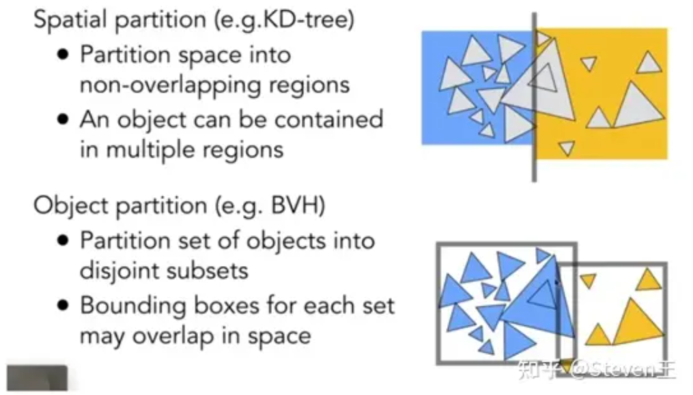


* **BVH建立代码**

具体步骤：

1. 将传入的所有物体求一个最大的包围盒
2. 按照包围盒的维度长度（取出最大值）进行划分
3. 按照这个方向上物体的一半进行二分划分，分成两部分
4. 递归建立左半部分和右半部分

```cpp
BVHBuildNode* BVHAccel::recursiveBuild(std::vector<Object*> objects)
{
    BVHBuildNode* node = new BVHBuildNode();

    // Compute bounds of all primitives in BVH node
    Bounds3 bounds;
    for (int i = 0; i < objects.size(); ++i)
        bounds = Union(bounds, objects[i]->getBounds());
    if (objects.size() == 1) {
        // Create leaf _BVHBuildNode_
        node->bounds = objects[0]->getBounds();
        node->object = objects[0];
        node->left = nullptr;
        node->right = nullptr;
        node->area = objects[0]->getArea();
        return node;
    }
    else if (objects.size() == 2) {
        node->left = recursiveBuild(std::vector{objects[0]});
        node->right = recursiveBuild(std::vector{objects[1]});

        node->bounds = Union(node->left->bounds, node->right->bounds);
        node->area = node->left->area + node->right->area;
        return node;
    }
    else {
        Bounds3 centroidBounds;
        for (int i = 0; i < objects.size(); ++i)
            centroidBounds =
            Union(centroidBounds, objects[i]->getBounds().Centroid());
        int dim = centroidBounds.maxExtent();
        switch (dim) {
            case 0:
                std::sort(objects.begin(), objects.end(), [](auto f1, auto f2) {
                    return f1->getBounds().Centroid().x <
                        f2->getBounds().Centroid().x;
                });
                break;
            case 1:
                std::sort(objects.begin(), objects.end(), [](auto f1, auto f2) {
                    return f1->getBounds().Centroid().y <
                        f2->getBounds().Centroid().y;
                });
                break;
            case 2:
                std::sort(objects.begin(), objects.end(), [](auto f1, auto f2) {
                    return f1->getBounds().Centroid().z <
                        f2->getBounds().Centroid().z;
                });
                break;
        }

        auto beginning = objects.begin();
        auto middling = objects.begin() + (objects.size() / 2);
        auto ending = objects.end();

        auto leftshapes = std::vector<Object*>(beginning, middling);
        auto rightshapes = std::vector<Object*>(middling, ending);

        assert(objects.size() == (leftshapes.size() + rightshapes.size()));

        node->left = recursiveBuild(leftshapes);
        node->right = recursiveBuild(rightshapes);

        node->bounds = Union(node->left->bounds, node->right->bounds);
        node->area = node->left->area + node->right->area;
    }
    return node;
}
```


* **包围盒用球形的好还是AABB的好？**

球形：包围球碰撞检测方法是用球体包围整个几何体, 无论是几何体还是相交测试都很简单; 但是它的紧密性太差。因为除了在3 个坐标轴上分布得比较均匀的几何体外, 几乎都会留下较大的空隙, 需要花费大量的预处理时间, 以构造一个好的层次结构逼近对象。当物体变形之后,包围球树需要重新计算。因此,它是使用得比较少的一种包围盒。当对象发生旋转运动时, 包围球不需作任何更新, 这是包围球的较优秀特性; 当几何对象进行频繁的旋转运动时, 采用包围球可能得到较好结果。

AABB：  AABB是应用最早的包围盒。它被定义为包含该对象，且边平行于坐标轴的最小六面体。故描述一个AABB，仅需六个标量。AABB构造比较简单，存储空间小，但紧密性差，尤其对不规则几何形体，冗余空间很大，当对象旋转时，无法对其进行相应的旋转。处理对象是刚性并且是凸的，不适合包含软体变形的复杂的虚拟环境情况。AABB也是比较简单的一类包围盒。但对于沿斜对角方向放置的瘦长形对象，其紧密性较差。由于AABB相交测试的简单性及较好的紧密性，因此得到了广泛的应用，还可以用于软体对象的碰撞检测。

* **给你一大堆顶点，球形包围盒怎么计算**


## 数学

### 蒙特卡罗积分与重要性采样

* **蒙特卡洛积分**

这是一种以高效的离散方式对连续的积分求近似的非常直观的方法：对于任何面积/体积进行积分，例如半球 Ω ——在该面积/体积内生成数量 N 的随机采样，权衡每个样本对最终结果的贡献并求和。

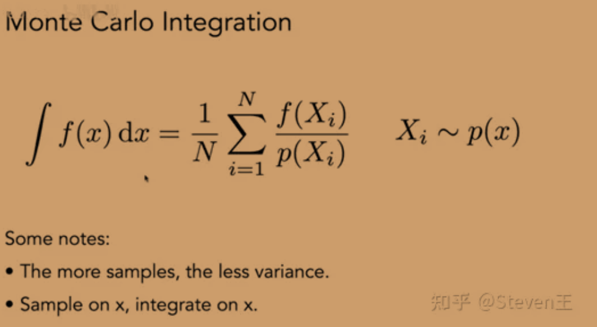

* **重要性采样**
  * 原理：重要性采样即通过现有的一些已知条件(分布函数)，想办法集中于被积函数分布可能性较高的区域(重要的区域)进行采样，进而可高效计算估算结果的一种策略。
  * 理解：因为概率密度函数可能不是均匀分布的，有些地方概率高，因此应该尽可能的多采用概率密度高的区域。
  * 举例：在使用路径追踪的时候，我们会随机生成一条反射光线，如果这个光线是均匀分布的话，很有可能可能许多发射出的光线最后都没有与光源相交，这样就造成了很多计算的浪费。重要性采样是说，着重去采样那些更有可能打到光源上的光线，比如更多地采样光源方向的光线：

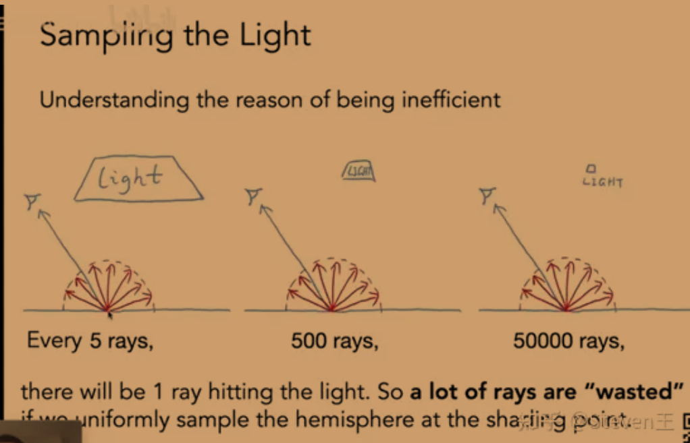

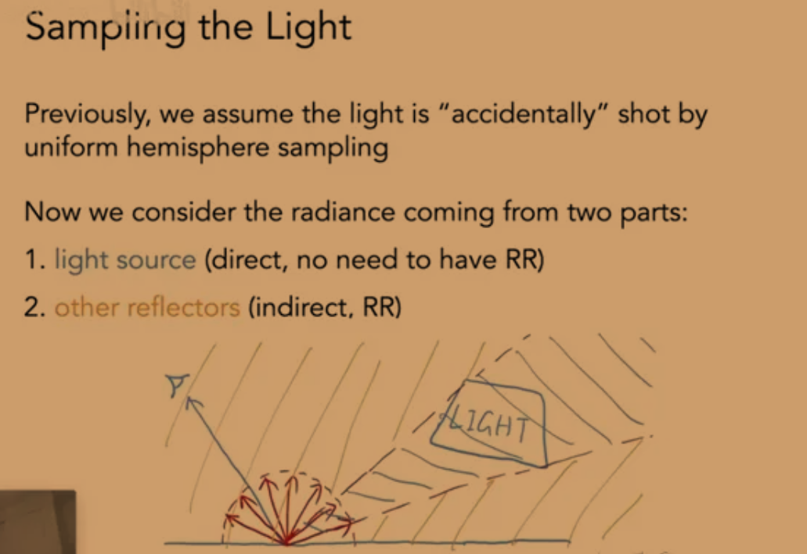

###  三维数学

* **变换矩阵的作用和推导**

[视图变换和投影变换矩阵的原理及推导，以及OpenGL，DirectX和Unity的对应矩阵 - 知乎 (zhihu.com)](https://zhuanlan.zhihu.com/p/362713511)

```cpp
template<typename T, qualifier Q>
GLM_FUNC_QUALIFIER mat<4, 4, T, Q> lookAtRH(vec<3, T, Q> const& eye, vec<3, T, Q> const& center, vec<3, T, Q> const& up)
{
    vec<3, T, Q> const f(normalize(center - eye));
    vec<3, T, Q> const s(normalize(cross(f, up)));
    vec<3, T, Q> const u(cross(s, f));

    mat<4, 4, T, Q> Result(1);
    Result[0][0] = s.x;
    Result[1][0] = s.y;
    Result[2][0] = s.z;
    Result[0][1] = u.x;
    Result[1][1] = u.y;
    Result[2][1] = u.z;
    Result[0][2] =-f.x;
    Result[1][2] =-f.y;
    Result[2][2] =-f.z;
    Result[3][0] =-dot(s, eye);
    Result[3][1] =-dot(u, eye);
    Result[3][2] = dot(f, eye);
    return Result;
}
```


[View Matrix 详解 - 知乎 (zhihu.com)](https://zhuanlan.zhihu.com/p/617190422)

[计算机图形学二：视图变换(坐标系转化，正交投影，透视投影，视口变换) - 知乎 (zhihu.com)](https://zhuanlan.zhihu.com/p/144329075)


* **法线变换矩阵和模型变换矩阵的关系**

  * 法线矩阵

  有很多计算工作是在 **观测空间 ( eye space )** 下完成的，其中包括与光照相关的计算。如果不在观测空间计算，与观测位置相关的效果将很难实现，如高光 ( specular )。

  因此，我们需要一种方法，将法线转换到观测空间。将顶点变换到观测空间的计算，可以写成：

  ```cpp
  vertexEyeSpace = gl_ModelViewMatrix * gl_Vertex;
  ```

  那为什么不能对法线做一遍同样的操作呢？法线是有 3 个浮点数分量的向量，*模型-观测矩阵* 是 4x4 的矩阵。法线是一个向量，我们只想改变其方向。*模型-观测矩阵* 左上区域的 3x3 矩阵包含改变方向的**子矩阵**，那我们为什么不直接用法向量左乘这个**子矩阵**？

  当模型发生了non-uniform缩放的时候，经过上述矩阵变换，法线就不再和模型表面垂直了，失去了法线的意义，例如下图：

  

  那么用于法线变换的矩阵应该长什么样呢?答案是：

  把法线从local space变换到view space的变换矩阵为顶点位置变换矩阵 $MV$ 的逆矩阵的转置矩阵，即 $({MV}^{-1})^{T}$。

  (如果在world space中进行光照计算，则normal matrix为$({M}^{-1})^{T}$。

  * **推导**

  

  


* **欧拉角、矩阵、四元数的区别和优缺点**

（1）欧拉角：定义了绕着三个坐标轴的旋转角，来确定刚体的旋转位置的方式，包括俯仰角pitch，偏航角yaw和滚动角roll；它的优点是比较直观，而且单个维度上的角度也比较容易插值；缺点是它不能进行任意方向的插值，而且会导致万向节死锁的问题，旋转的次序对结果也有影响

（2）矩阵：优点是不受万向节死锁的影响，可以独一无二的表达任意旋转，并且可以通过矩阵乘法来对点或矢量进行旋转变换；现在多数CPU以及所有GPU都有内置的硬件加速点积和矩阵乘法；缺点是不太直观，而且需要比较大的存储空间，也不太容易进行插值计算。

（3）四元数：四元数的好处是能够串接旋转；能把旋转直接作用于点或者矢量；而且能够进行旋转插值；另外它所占用的存储空间也比矩阵小；四元数可以解决万向节死锁的问题。


* **点到平面的距离公式**

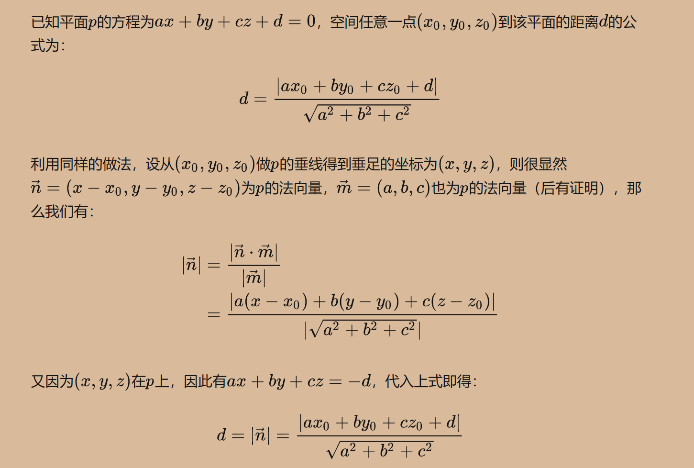

* **如何判断一个点在三角形(矩形、扇形、凸多边形)内**

（1）面积法，点划分的三个小三角形面积是否等于大三角形；

（2）叉乘法，沿逆时针方向，三角形两两顶点构成三个向量，比如AB,BC,CA，分别用这三个向量与起点和P的交点构成的向量求叉乘，如ABxAP, BCxBP, CAxCP，由右手定则，如果三个结果都是正的，说明这个点都在向量的左边；可以推导得出这个点在三角形内，否则只要有一个是负数，就说明在右手边，在三角形外了。


* **如何判断一条光线是否与一个三角形相交**

（1）先判断光线是否和三角形所在的面相交，再判断这个交点是否在三角形内，判断点是否在三角形内；

（2）用Moller Trumbore算法，简称MT算法。（光线的方程是：ray = origin + direction * t) 原理是如果一个点在三角形内，就能用重心坐标系去表示这个点；重心坐标公式，α = 1 – β - λ；带入方程，有3个未知数（β，λ，t），由因为都是三维变量，可以得到三个等式；利用克拉默法则，线性代数的知识，就可以求解出这三个未知数；解出来，判定t是否合理，t > 0，然后α、β和λ三个系数都是非负的，就是有解，在三角形内。


* **如何判断两个三角形是否相交**

如果两个三角形相交，必定至少其中一个三角形的一条边穿过了另一个三角形的内部；把边当作光线去跟另一个三角形求交，如果三条边只要有一条边跟三角形有交点，即可判断两三角形相交，当然关键是要判断计算出来的t是否合理，是否位于边长范围之内。


* **点在三角形边界怎么处理？**

概念：

光栅化的时候通常会遇到一个术语，那就是左上填充规则（ top-left rule ），它的作用是为了避免相邻的多边形重复绘制邻边。如图 1 所示，如果没有左上填充规则，绘制三角形 ABD 和 BCD 的时候，有可能同时绘制 BD 边，导致 BD 被绘制 2 次。乍一看，除了稍微影响点效率外，重复绘制好像也没什么坏处，不过在处理透明度和模板（ stenciling ）的时候，重复渲染三角形的邻边会让结果出现严重的瑕疵。

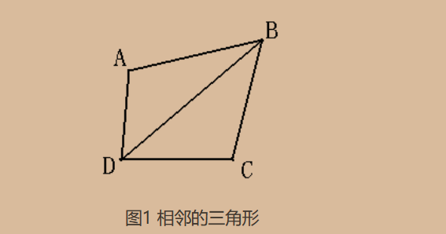

原因：如果简单的认为像素都应着色或都不着色，会致使重复填充或出现漏点。

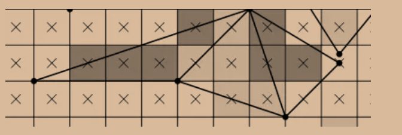

Top-Left Fill Rule就是说当一个像素刚好压在三角形边上的时候，只有这条边在三角形的左边，或者上面的时候，才判定这个像素被三角形覆盖(如上图)。

```cpp
// 输入： fymin ， fymax ，均为浮点数，分别代表多边形的最小纵坐标，和最大纵坐标
int ymin = compute_ymin(fymin);
int ymax = compute_ymax(fymax);

for(int y = ymin; y<ymax; y++)
{
       float fxmin, fxmax;
       ComputeXRange(y, fxmin, fxmax); // 计算 y 轴对应的扫描线区域
       int xmin = compute_xmin(fxmin);
       int xmax = computer_xmax(fxmax);
       for(int x = xmin; x<xmax; x++)
              SetPixel(x, y, color);

}
```


* **异面直线的距离**

公垂线一定垂直于两条直线，则$\vec{v_1} × \vec{v_2}$，就能得到公垂线的方向，则在每条直线上任意找一点，然后与公垂线方向点乘就可以得到该线段再公垂线方向的投影。

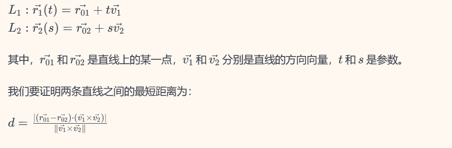


## 图形学API

* **现代图形学API(DX12、Vulkun)和传统图形学API(OpenGL)之间有什么区别？**

  现代图形API（例如DirectX 12、Vulkan）和传统的图形API（例如OpenGL）之间存在一些显著的区别。以下是其中一些主要区别的概述：

  1. 低级别接口：现代图形API（如DirectX 12和Vulkan）提供了比传统图形API更低级别的接口。这意味着开发者需要更多地管理硬件资源，如内存分配、线程管理和同步。而传统图形API（如OpenGL）更抽象一些，隐藏了底层硬件的复杂性。

  2. 显式控制：现代图形API要求开发者显式地管理渲染指令的提交、资源的加载和卸载以及线程同步。这样一来，开发者可以更好地优化应用程序的性能，但同时也增加了开发的复杂性。而传统图形API则更多地由驱动程序来管理这些细节。

  3. 多线程支持：现代图形API对多线程支持更友好。开发者可以直接控制渲染和计算任务的并行执行，从而更好地利用多核CPU。传统图形API的多线程支持相对较弱，通常需要通过扩展或辅助库来实现。

  4. 性能优化：现代图形API提供了更多的性能优化机会。开发者可以更细粒度地控制和管理渲染流水线，减少资源使用和延迟，实现更高的性能。传统图形API相对较难进行细粒度的性能优化。

  5. 跨平台支持：现代图形API（如Vulkan）设计为跨平台的，可以在不同的操作系统和设备上运行。这使得开发者可以更轻松地将图形应用程序移植到不同的平台上。传统图形API的跨平台支持相对较弱。

  总体而言，现代图形API提供了更底层、更高效和更灵活的编程接口，以获得更好的性能和可移植性。但同时，也要求开发者具备更多的硬件和并行编程知识，并需要更多的开发时间和工作量来进行性能优化和管理。传统图形API则相对更易于使用，但在性能和可控性方面可能相对较差。


## 杂项

**6.1 什么是齐次坐标，齐次坐标有什么作用？**

（1）所谓齐次坐标就是为矢量或者矩阵增加一个维度，2D平面使用3维向量和三维矩阵，3D空间使用4维向量和4维矩阵；额外的坐标值是任意的，可以看作缩放或者权重。

（2）三维矩阵可以表示旋转和缩放，它们相乘的结果是正确的，但是平移变换不能加到三维矩阵中的相乘去表达，只能将矩阵相乘的结果加一个三维向量；引入齐次坐标之后会增加一个维度，变为四维矩阵，多出来的一维向量用来表示平移，那么就可以在一个矩阵中统一所有的操作：平移、旋转、缩放。


**6.2 什么是副法线(切线)，有什么用？**

副法线是法线与切线的叉乘得来，法线、切线和副法线可以定义切线空间，有了切线空间可以很方便地进行法线贴图的计算(当然也有其他的用途)。


# 简历

## C++

* **什么是面向对象编程思想**

  * **封装**

  封装是指一种将抽象性函式接口的实现细节部份包装、隐藏起来的方法。简单来说，就是将一个对象共有的属性和行为抽离出来封装成一个类。

  * **继承**

  继承是子类继承父类的特征和行为，使得子类对象（实例）具有父类的实例域和方法，或子类从父类继承方法，使得子类具有父类相同的行为。简单来说，一个类可以继承另一个类，子类可以拥有父类所有可以访问的字段和方法。

  * **多态**

  多态是同一个行为具有多个不同表现形式或形态的能力。简单来说，是同一个接口，使用不同的实例而执行不同操作。多态还分为静态多态和动态多态，静态多态的体现主要是方法重载和模板，动态多态体现在方法虚函数重写，父类接收不同子类的实例，接口接收不同实现类的实例。

  * **抽象**

  抽象是一种过程，在这个过程中，数据和程序定义的形式与代表的内涵语言相似，同时隐藏了实现细节，一个概念或者想法不和任何特定的具体实例绑死。简单来说，就是把东西抽离出关键特性就是抽象。

  

## 图形

### 光栅化与光线追踪

* **光栅化原理**

光栅化就是把东西画在屏幕上的一个过程，光栅化渲染管线主要分为应用阶段、几何处理阶段、光栅化阶段和像素处理阶段。

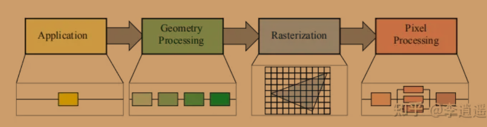

需要CPU和GPU配合去完成，首先在应用阶段，会完成加载场景、设置渲染状态、设置纹理等等，最后下达一个draw call的指令上交到命令缓冲队列中，GPU会取出命令依次进行处理，来到GPU阶段，首先会进行几何处理，在顶点着色器中，完成MVP的运算等等，还可能会有曲面细分着色器、几何着色器等等生成更加精密的模型信息，然后完成裁剪、投影、屏幕映射等，于是到了光栅化阶段，光栅化会完成插值，确定那些像素要被绘制，然后到了像素着色器进行光照运算等等，最后通过一些测试深度测试、模板测试、混合等操作，我们就得到了屏幕上的一张渲染图片结果。

* **光线追踪原理**

从摄像机出发，根据矩阵逆变换，得到光线的方向，追踪每条光的传播行为，计算对人眼的贡献值。

最早有whitted syle ray tracing，发射光线打到场景中的物体，从物体向光源连线来确定可见性，当碰到反射和折射材质的时候就会递归处理，如果是diffuse就会停下，但是这显然是有问题的，于是又有path tracing，当打到漫反射物体的时候，随机发射一条光线继续递归，推出条件一般用俄罗斯轮盘赌的方法来确定。

* **两者的区别**

两者都是通用的渲染技术

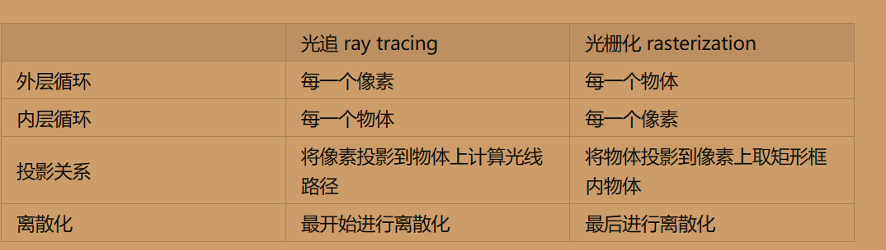

* **如何降低DrawCall**

尽可能的让我们的游戏场景的物体能最少的批次完成渲染，一次渲染尽可能多的物体,降低Drawcall能提升渲染的性能。Unity游戏开发中有哪些常用的技术能将物体合批,降低Drawcall呢？

首先物体能合批的首要条件就是提交绘制的物体一定要是”同一个材质”,只有这些物体才有合批的可能。假设我们提交给GPU渲染的物体排列如下: A1A2A3A4A5A6B1B2B3B4B5B6其中A1, …A6表示这6个物体使用同一个材质A，B1,…B6标识6个物体使用同一个材质B。


静态合批:

游戏引擎会将"能够合批“(同一个材质球)的"静态物体"(所以你要标记为静态不可移动物体) 预先合并好成一个新的整体的网格,提交给GPU渲染。

静态合批处理的局限性(缺点)

a: 要求物体是静态不可移动的;

b: 预先计算好合并整体网格,合并后的内存开销增加;

c: N个物体使用同一个网格, 把所有的网格合并到一起, 合并后会有N个网格的数据导致内存暴涨,这时候要关闭静态的合批。例如森林有1000棵树,采用 静态合批后做成一个1000个树合在一起的网格，合并后的网格占用的内存空间就会很大,所以这种情况下一般关闭静态合批。


动态合批:

游戏引擎将"能够动态合批"的(同一个材质球) 物体的每个顶点，根据世界变换矩阵，用CPU来计算合批物体的每个顶点对应的世界空间的坐标，然后就把计算后的物体的顶点(世界空间下的顶点)与单位矩阵一起提交给GPU,GPU一起把他们渲染出来出来。

由上可知,动态合批是一个双刃剑,虽然可以获得合批提升的渲染性能，但同时CPU计算出顶点的世界坐标会产生额外的运算开销, 使用动态的合批的时候，我们要关注一下, 付出+得到是不是成比例。

动态合批是引擎会自动处理的，所以引擎会对能够动态合批的物体，会有一些条件的限制，引擎和系统给的合批的限制是顶点数目不应过多;

最后总结一下动态合批的缺点:CPU的开销和drawcall减少得到性能提升之间来做平衡;


GPU Instancing合批:

同一个网格对象的N个实例的绘制可以采用GPU Instancing合批。它的本质就是提交一次网格物体给GPU, GPU绘制出这个物体的N个实例到不同的地方(位置，旋转，缩放)。如1000个小兵采用GPU Instancing 合批,提交一个小兵的网格对象给GPU, GPU根据1000个小兵的位置来绘制出来我们1000个实例。

1000个实例，可以在同一个批次进行完成(1000个实例< GPU每次处理的极限)，如果1000个兵一起合批超过了显卡的极限就分多批如: 800兵一批，200兵一批;

GPU Instacing合批是非常好的一种方式，它的缺点就是有些老的显卡不支持。


在图形编程中，减少绘制调用（draw call）是优化性能的一个重要目标。绘制调用是指向 GPU 发送渲染命令以渲染一个物体的操作。减少绘制调用的主要目的是降低 CPU 向 GPU 发送渲染命令的开销，提高图形渲染性能。以下是一些常见的方法：

1. **合并渲染对象：**
   - 将多个小的渲染对象合并成一个大的对象，以减少绘制调用的数量。这可以通过将多个物体的顶点数据合并到一个缓冲区中来实现。
2. **使用纹理集合：**
   - 将多个小的纹理合并到一个大的纹理集合（纹理图集）中。这样，可以减少切换纹理的开销，从而减少绘制调用。
3. **批量处理相似物体：**
   - 尽可能地将相似的物体一起渲染。这可以通过在同一次绘制调用中发送多个物体的数据来实现，而不是为每个物体都进行单独的绘制调用。
4. **使用实例化渲染：**
   - 当需要绘制多个相似但位置不同的物体时，可以使用实例化渲染。这允许在一个绘制调用中绘制多个实例，减少 CPU 向 GPU 发送渲染命令的次数。
5. **避免状态切换：**
   - 在绘制调用之间尽可能减少渲染状态的改变。状态切换，如切换着色器、纹理、混合模式等，可能导致 GPU 刷新其内部状态，从而增加了开销。
6. **使用批量渲染技术：**
   - 使用现代图形 API 提供的批量渲染技术，如批量渲染管道（Batch Rendering Pipeline）或 Compute Shader 进行批量渲染。
7. **动态合并静态物体：**
   - 对于静态物体，可以在运行时动态地合并它们的顶点数据，以减少绘制调用的数量。
8. **使用 Level of Detail（LOD）：**
   - 针对远处的物体使用低细节模型，从而减少绘制调用和提高性能。
9. **使用图形调试工具：**
   - 使用图形调试工具，例如 GPU Profiler，以分析和优化绘制调用的性能。


### PBR与IBL

* **什么是PBR**

  PBR是基于物理的渲染，主要基于微平面理论和一些物理原理，可以更加准确的表达物体和光的交互方式，模型一般采用cook-torrance模型。

  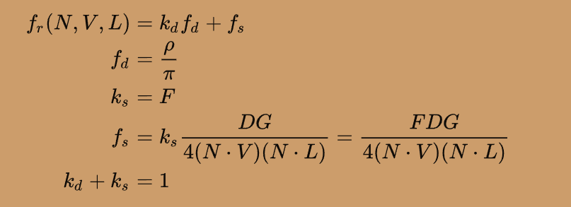

  

  推导：

  * 漫反射项

  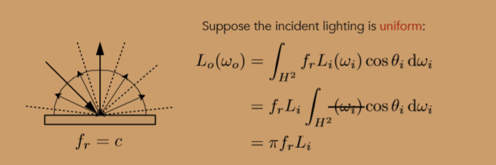

  

  由于假设入射光是均匀且遍布整个半球方向，因此Li与Lo相等，则：

  

  考虑到能量吸收，反射率，得到最终的漫反射BRDF：

  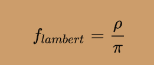

  * **镜面反射项**

  

  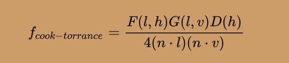

  D：法线分布函数：描述的是各个为表面法线的集中程度，一般用GGX。

  F：菲涅尔项，跟观察方向和法线方向有关，当从掠射角观察时没看到的反射现象就越明显

  G：几何自遮挡项，考虑的是微表面之间的相互作用，当一个平面相对比较粗糙的时候，平面表面上的微平面有可能挡住其他的微平面从而减少表面所反射的光线，一般也用GGX。

  

  

  目前PBR材质主要有两种工作流，一种是Metallic/Roughness(金属/粗糙度)，一种是Specular/Glossiness(镜面反射/光泽度)。

  * **MR工作流**

  Base Color（SRGB空间） + Metallic(线性空间) + Roughness(线性空间) + AO + Normal + height

  * **SG工作流**

​	   Diffuse（SRGB空间） + Specular(SRGB空间) + glossiness + AO + Normal + height


* **什么是IBL**

  IBL(Image based lighting)是将周围的环境视为一个大光源，IBL通常使用环境立方贴图，我们将贴图中的像素视为光源，对物体产生作用。

  反射方程：

  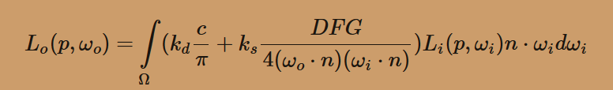

  

  我们的主要目标是计算半球 Ω 上所有入射光方向 wi的积分。

  IBL主要分为两项，漫反射IBL与镜面反射IBL，都可以提前预计算好，在光照计算的时候直接采样。

  * 漫反射IBL预计算

  与视角方向无关，且brdf项为常数，因此可以提到积分表达式外部，在半球区域内均匀采样，最终平均值即可。

  * 镜面反射IBL预计算

  将积分项拆成了两项，第一部分用来计算预滤波环境贴图，第二部分计算brdf信息，生成一张查找纹理。

  在计算预先滤波卷积的时候，这次考虑了粗糙度，粗糙度越大，会导致反射更模糊，因此可以用mipmap去存储，有假设了视角方向总是等于输出采样方向w0。

  和之前卷积环境贴图类似，我们可以对 BRDF 方程求卷积，其输入是 n 和 ωo 的夹角，以及粗糙度，并将卷积的结果存储在纹理中。我们将卷积后的结果存储在 2D 查找纹理（Look Up Texture, LUT）中，这张纹理被称为 BRDF 积分贴图，稍后会将其用于 PBR 光照着色器中，以获得间接镜面反射的最终卷积结果

###  **阴影**

* 生成过程：

  1. 从光源位置渲染场景，得到一张深度图信息
  2. 从摄像机出发，正常的渲染场景
  3. 将场景变换到光源视角下，判断深度信息是否匹配。

* 常见问题：

  1. 阴影抖动(摩尔纹)，可以通过偏移技术，增加一个bias比较片段深度，还有一种是自适应偏移的方案，基于斜率去计算当前深度要加的偏移。
  2. 阴影锯齿，可以采用PCF来改善效果，能在一定程度上模糊软化阴影，但是根据物理实际现象，阴影的软硬程度也和阴影和遮挡物之间的距离有关系，PCSS就考虑了这一点，先通过一个filter去计算平均遮挡物距离，根据平均遮挡物距离求出在shadowmap上的filter大小，以达到此效果。

  在项目中，unity srp实现的pcss，搜索平均遮挡物的距离的时候，给了一个光源的尺寸和csm的维度大小，越靠近相机，csm维度越小，searchFilter会更大。
  $$
  searchFilter = \frac{lightSize}{csmWidth}
  $$

* CSM

  对视锥体区域进行划分，近处区域用比较高的分辨率的阴影贴图，远处区域用于比较粗糙的阴影贴图。

  Shadowmap对于大型场景渲染显得力不从心，很容易出现阴影抖动和锯齿边缘现象。对于室外大场景的实时阴影，可以使用CSM技术。

### **后处理算法**

* Bloom 泛光

OpenGL：

`提取高光区域👉模糊👉合并`。但是这么做效果并不好。

高质量泛光：

`提取高光区域👉降采样👉上采样+叠加`

降采样(mipmap)是为了迅速模糊，达到泛光的“泛”的效果，但是还不够亮，要使得它足够的亮，可以将mipmap相加，mipmap等级低的负责中心高亮，mipmap等级高的负责周边的泛，直接相加的话会导致pattern出现，因此可以上采样，边模糊边上采样。

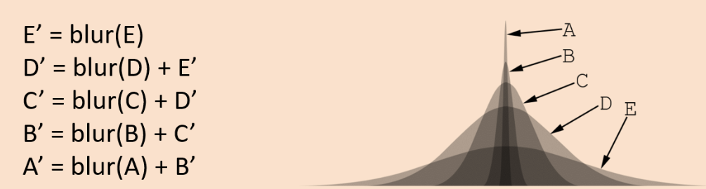

* Chromatic Abberation(色差)

求出与中心点的偏移量，根据偏移量采样不同坐标的r、g、b值

```cpp
	vec2 diffFromCenter = TexCoords - vec2(0.5, 0.5);
	vec2 offset = diffFromCenter * texel_size * intensity;

	// Emulated how Unity handles their "fast" implementation
	float r = texture2D(input_texture, TexCoords - (1 * offset)).r;
	float g = texture2D(input_texture, TexCoords - (2 * offset)).g;
	float b = texture2D(input_texture, TexCoords - (3 * offset)).b;
```

* Vignette(晕影)

 通过距离求出一个权重，越靠近中心权重越大，越靠近边缘权重越小，给一个背景颜色，然后将两者混合。

```cpp
vec2 uv = TexCoords;
uv *= 1.0 - TexCoords.xy;
float vig = uv.x * uv.y * 15.0;
vig = pow(vig, intensity * 5.0);

FragColour = vec4(mix(color, sceneColour, vig), 1.0);
```

* Film Grain(电影颗粒)

  根据时间、纹理位置生成一些随机值，就是颗粒的效果，最终和场景图混合。

```cpp
vec3 colour = texture2D(input_texture, TexCoords).rgb;

float x = (TexCoords.x + 4) * (TexCoords.y + 4) * ((time + 1) * 10.0);
vec4 grain = vec4(mod((mod(x, 13.0) + 1.0) * (mod(x, 123.0) + 1.0), 0.01) - 0.005) * intensity;

FragColour = vec4(colour + grain.xyz, 1.0);
```

### **AO**

#### SSAO

前提：**基于光照来自于无穷远处的假设**

把当前视点下的深度缓存当成场景的一个粗略的近似来计算AO , 因为它们都是基于场景在屏幕空间的一个特定表达 , 而 AO 计算也是在屏幕空间中进行的 。

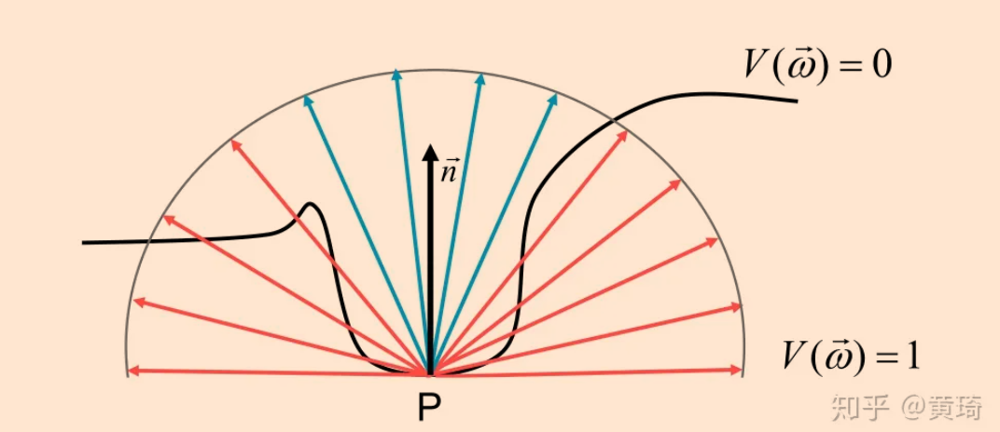

1. 在以 p 点为中心、 R 为半径的球体空间内( 若有法向缓存则为半球体空间内 ) 随机地产生若干三维采样点
2. 估算每个采样点产生的 AO : 计算每个采样点在深度缓存上的投影点 , 用投影点产生的遮蔽近似代替采样点的遮蔽。

#### SSDO

前提：基于光照来自于非常近的地方，考虑到了间接光照

* **思路**

  * 我们不去假设间接光照是固定不变的
  * RSM中我们用shadow map去找到接收直接光照的点当作间接光照为其他的Shading point提供直接光照,也就是说**我们一定程度上是可以已经得到间接光照的信息。**

  

  通过AO和DO的对比我们可以看到,AO能够产生变暗的效果使得物体相对感更强烈,但AO并不能做到Clolor Blending（不同颜色的Diffuse会互相照亮）

  * 在SSDO中，我们使用直接光照的信息，但不是从RSM中获得的，而是从screen space中得到的。

* **做法**


SSDO的做法于path tracing很像,假设在Shading Point的P点，随机的往某一个方向打出一根光线:

1. 如果光线没碰到物体，则认为P点这里接收直接光照
2. 如果碰到了一个点Q,那么算出Q点接受的直接光照打到P点的贡献,从而求出P点的间接光照。


我们可以发现,SSAO和SSDO是完全相反的两个假设:

AO：在AO中我们认为红色的框里能接收间接光照，黄色框里无法接收间接光照，然后求出加权平均的visibility值,也就是**假设间接光照是从比较远的地方来的**；

DO：在DO中,我们认为红色框里接收的是直接光照,而黄色框里才是接收到的间接光照.因为红色框里的光线打不到用来反射的面，因此这些方向上就不会有间接光照，黄色框里的光线能打到物体上，P点接收到的是来自红色框的**直接光照**+黄色框里的**间接光照**,也就是**假设间接光照是从比较近的反射物来的。**

其实这两个假设都不是完全正确的，物理真实的情况是这两种的混合：近处的是DO，远距离是AO，因此AO与DO也并没有矛盾。

回到渲染方程上,将没有遮蔽的与遮蔽的方向上的光照分开考虑，那么对于DO如何解Rendering Equation:

​	1. 当V=1时是直接光照，而DO的计算是计算间接光照的，因此这个我们完全不用去计算与考虑


​	2. 当V=0时也就是间接光照的情况，这个是我们需要关注与计算的。


SSDO的核心是要找哪些patch会被挡住，也就是对点P提供间接光照贡献的是哪些点，做法是与AO完全一样的。

我们同样考虑点P法线部分的半球，判断从P点往A、B、C、D四个方向看会不会被挡住，由于是屏幕空间的算法,因此这里我们同样不考虑在3D场景中A,B,C,D四点会不会与P连成光线,只考虑从camera看去A,B,C,D与P连成的光线会不会被挡住。

这里A/B/D这三个点的深度比从camera看去的最小深度深,也就是说PA,PB,PD方向会被物体挡住,因此会为P点提供间接光照。然后把我们用在RSM中讲的计算间接光照的方法这些点对P的贡献加起来。


SSDO也会出现一些问题,如下图是假设与实际情况不同的情况，因为我们是在屏幕空间处理的,因此在A点虽然会被canmera看不到，但是AP之间是不会挡住的,实际上A点需要提供间接光照给P点,但在SSDO算法中则不提供。


从计算量上来看与SSAO差不多，但是不同之处是，判定会被挡住的时候，会额外计算被挡住的小片的贡献，质量非常接近离线渲染。

* **问题**

P点对于半球上的点可见性是通过Camera对这些点的可见性来近似计算的，存在于屏幕空间中丢失信息的问题，下图是一个很明显的例子，当黄色的面朝向屏幕的时候地面的SSDO信息是正确的，而当旋转过去之后，就看不到SSDO的信息了。


SSDO只能解决一个很小范围内的全局光照，下图是接近正确的情况，而如果使用SSDO来计算，方块右边是追踪不到远处绿色的墙的，方块上也就不会有绿色的反光。


### **抗锯齿**

* **FXAA**

首先找出来边缘，可以根据亮度公式，相差比较大的就认为是边缘信息，对于边缘信息就要确定混合的方向，然后计算出对应的混合因子.

* **MSAA**

发生在光栅阶段，通过判断点是否在三角形内，来计算一个初步的覆盖率，像素着色器只运行一次，最后结果与着色率相乘。

* **SSAA**

超采样，先生成一张高分辨率的图像，再做降采样。


## OpenGL渲染器

### 渲染队列

* 分为Opaque队列和Transparent队列，先渲染Opaque队列，再对透明物体进行渲染。

* 顺序: Opaque队列->天空盒->透明物体排序->Transparent队列

* 队列中存放的是RenderModel，Model中可拥有多个Mesh，每一个Mesh都有一个Material，Material采用PBR MR工作流程

### PBR

PBR渲染，采用的是MR工作流程，在Material中绑定各个材质，名字统一命名为`texture_albedo(normal metallic roughness ao等等)`

```cpp
void Material::BindMaterialInformation(Shader *shader) const{
		// Texture unit 0 is reserved for the shadow map
		// Texture unit 1 is reserved for the irradianceMap used for indirect diffuse IBL
		// Texture unit 2 is reserved for the prefilterMap
		// Texture unit 3 is reserved for the brdfLUT
		int currentTextureUnit = 4;

		shader->setUniform("material.texture_albedo", currentTextureUnit);
		if (m_AlbedoMap) {
			m_AlbedoMap->bind(currentTextureUnit++);
		}
		else {
			TextureLoader::getDefaultAlbedo()->bind(currentTextureUnit++);
		}

		shader->setUniform("material.texture_normal", currentTextureUnit);
		if (m_NormalMap) {
			m_NormalMap->bind(currentTextureUnit++);
		}
		else {
			TextureLoader::getDefaultNormal()->bind(currentTextureUnit++);
		}

		shader->setUniform("material.texture_metallic", currentTextureUnit);
		if (m_MetallicMap) {
			m_MetallicMap->bind(currentTextureUnit++);
		}
		else {
			TextureLoader::getDefaultMetallic()->bind(currentTextureUnit++);
		}

		shader->setUniform("material.texture_roughness", currentTextureUnit);
		if (m_RoughnessMap) {
			m_RoughnessMap->bind(currentTextureUnit++);
		}
		else {
			TextureLoader::getDefaultRoughness()->bind(currentTextureUnit++);
		}

		shader->setUniform("material.texture_ao", currentTextureUnit);
		if (m_AmbientOcclusionMap) {
			m_AmbientOcclusionMap->bind(currentTextureUnit++);
		}
		else {
			TextureLoader::getDefaultAO()->bind(currentTextureUnit++);
		}

		shader->setUniform("material.texture_displacement", currentTextureUnit);
		if (m_DisplacementMap) {
			shader->setUniform("hasDisplacement", true);
			shader->setUniform("minMaxDisplacementSteps", glm::vec2(m_ParallaxMinSteps, m_ParallelMaxSteps));
			shader->setUniform("parallaxStrength", m_ParallaxStrength);
			m_DisplacementMap->bind(currentTextureUnit++);
		}
		else {
			shader->setUniform("hasDisplacement", false);
		}

	}
```

 

### IBL Probe

基于光照探针生成IBL信息。

* 漫反射	

​	具体原理:[漫反射辐照 - LearnOpenGL CN (learnopengl-cn.github.io)](https://learnopengl-cn.github.io/07 PBR/03 IBL/01 Diffuse irradiance/)

​		在探针位置生成一个CubemapCaemra，从该点看向场景生成CubeMap，对CubeMap进行采样卷积，生成irradianceMap，

* 镜面反射

  具体原理:[镜面IBL - LearnOpenGL CN (learnopengl-cn.github.io)](https://learnopengl-cn.github.io/07 PBR/03 IBL/02 Specular IBL/)

  将镜面反射部分拆分成了两部分进行预计算，预滤波环境贴图与BRDF计算。		

  * 预滤波环境卷积

  

  这次卷积引入了粗糙度，由于跟视角关系有关，又做出了大胆的假设

  ```cpp
  vec3 N = normalize(w_o);
  vec3 R = N;
  vec3 V = R;
  ```

  基于蒙特卡洛方法，使用低差异序列生成蒙特卡洛样本向量，完成重要性采样，最终生成预过滤卷积环境贴图，完成了第一项积分的计算。

  * BRDF

​			

将公式转化为F0 * A + B，A、B即为预先计算的BRDF贴图采样的结果，其输入是 n 和 ωo 的夹角，以及粗糙度，并将卷积的结果存储在纹理中。我们将卷积后的结果存储在 2D 查找纹理（Look Up Texture, LUT）中。最终完成应用。


### 前向渲染与延迟渲染

首先init渲染，生成环境Probe即完成IBL对应的预计算

* 前向渲染
  * 阴影深度图pass生成
  * forward PBR Lighting Pass
  * 后处理Pass
* 延迟渲染
  * geometryPass，第一遍渲染保存下来opaque物体的法线、世界位置、材质等信息
  * PreLighting Pass，预计算环境AO贴图，使用SSAO算法实现
  * Deffered PBR Lighting Pass，NDC_Plane Draw完成fragment lighting 的计算
  * forward PBR Lighting Pass渲染透明物体
  * 后处理Pass

###  阴影

* 生成以光源为相机的深度贴图
* 在光照Pass中使用，完成PCF阴影，在深度中多次采样以达到一顶程度上阴影软化的效果。


### 后处理

* **介绍一下后处理渲染管线**
  计算机图形学中的后处理渲染管线是渲染管线的最后一个阶段，用于对渲染输出进行最终的处理和增强。这个阶段通常包括各种效果，如模糊、辉光、色调映射、景深、抗锯齿等，以提高图像的视觉质量或添加特定的艺术效果。以下是后处理渲染管线的一般步骤：

1. **获取渲染输出：** 首先，渲染管线的前面阶段（几何处理、光照、着色等）生成了场景的渲染输出，通常是一帧图像。
2. **帧缓冲对象（Frame Buffer Object，FBO）：** 渲染结果通常存储在帧缓冲对象中。后处理渲染管线将使用这个帧缓冲对象作为输入，对图像进行处理。
3. **后处理效果：** 后处理渲染管线的核心是一系列的后处理效果。这些效果可以是预先设计好的，也可以是基于用户输入或运行时条件动态调整的。常见的后处理效果包括：
   - **模糊效果：** 高斯模糊、运动模糊等。
   - **辉光（Bloom）：** 增强亮度，使亮部产生“泛光”效果。
   - **色调映射（Tone Mapping）：** 将 HDR（高动态范围）图像映射到 LDR（低动态范围）。
   - **景深（Depth of Field）：** 模拟相机焦距，使得某些区域在焦点内，其他区域模糊。
   - **抗锯齿（Anti-aliasing）：** 减少图像边缘的锯齿现象。
   - **动态模糊：** 根据物体运动产生模糊效果。
4. **混合和合成：** 处理后的图像可能需要与原始渲染结果进行混合或合成，以生成最终的图像。这通常涉及到使用混合模式、透明度等技术。
5. **显示：** 最终的图像将被发送到显示设备进行呈现。

后处理渲染管线的目标是通过添加特定的视觉效果，提高图形场景的真实感或艺术效果。这种技术在实时图形应用中广泛应用，如视频游戏、虚拟现实（VR）和电影制作。


#### Bloom(泛光)


是在hdr-》sdr之前进行的，里面的值仍可能>1

* 第一遍pass根据阈值提取出高亮部分
* 第二遍pass运用高斯模糊，模糊处理高亮部分，可以运用水平一次pass、竖直一次pass减少计算量
* 第三遍混合原图和模糊处理后的高亮部分，以达到bloom的效果

#### ChromaticAberration（色差处理）


是在sdr之后处理的，采用了一个快速实现，计算每个点的uv和中心点的uv(0.5, 0.5)的差值以确定偏移值，采样的时候分别通过偏移值采样不同点的r、g、b来实现色差效果

```glsl
vec2 diffFromCenter = TexCoords - vec2(0.5, 0.5);
vec2 offset = diffFromCenter * texel_size * intensity;

// Emulated how Unity handles their "fast" implementation
float r = texture2D(input_texture, TexCoords - (1 * offset)).r;
float g = texture2D(input_texture, TexCoords - (2 * offset)).g;
float b = texture2D(input_texture, TexCoords - (3 * offset)).b;
```

#### Vignette (晕影效果)


设定一默认颜色黑色，根据uv和中心点之间的距离，给不同的mix权重，在中心点mix就比较大，采样结果输入图像对应结果，对于比较远的边缘的点，mix结果比较小，黑色占比比较大，实现了这种晕影效果

```glsl
vec2 uv = TexCoords;
uv *= 1.0 - TexCoords.xy;
float vig = uv.x * uv.y * 15.0;
vig = pow(vig, intensity * 5.0);

FragColour = vec4(mix(color, sceneColour, vig), 1.0);
```

#### FXAA 后处理抗锯齿

* 找到锯齿的位置，通过采样一个范围内的点(四个角落)，判断最小值和最大值的差别，如果太大认为存在锯齿。
* 确定采样的方向,x方向渐变比较大说明锯齿在y方向上，y方向变化比较大说明锯齿在x方向。
* 进行模糊处理

####  SMAA 后处理抗锯齿

####  Film Grain(电影颗粒效果)


根据时间和uv生成一些随机颗粒，叠加到颜色中去，时间一直在更新，因此看起来有颗粒波动的效果。

	vec3 colour = texture2D(input_texture, TexCoords).rgb;
	
	float x = (TexCoords.x + 4) * (TexCoords.y + 4) * ((time + 1) * 10.0);
	vec4 grain = vec4(mod((mod(x, 13.0) + 1.0) * (mod(x, 123.0) + 1.0), 0.01) - 0.005) * intensity;
	
	FragColour = vec4(colour + grain.xyz, 1.0);

#### 景深

将计算好的场景图进行模糊，再生成一张模糊图，现在有两张图一张场景图、一张模糊图；

取一段区域为聚焦区域，中间区域在场景图中采样，两边区域在模糊图中采样，中间过渡区进行插值。

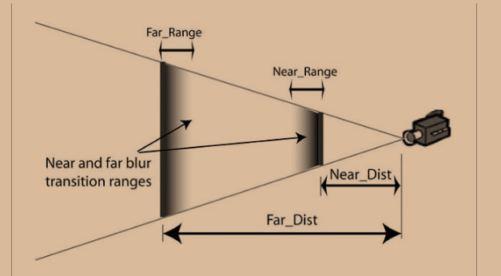

#### 运动模糊(Motion Blur)

[UnityShader_屏幕后处理之运动模糊_unity 关闭运动模糊-CSDN博客](https://blog.csdn.net/weixin_40301728/article/details/107017580#:~:text=思路： 计算获取当前帧的位置以及上一帧的位置，两者做差求出速度 v （方向、大小），利用这个速度我们就可以求得,n 张移动过程中的动画帧，将这些动画帧叠加并取平均，这样就可以得到一个含有 n 个虚影的运动模糊效果。)

1. 叠加图像法。通过采集每一帧的屏幕成像，并将图像累计混合得到模糊运动成像。
2. 第二种方式是通过深度图以及 视角*投影矩阵 变化，得到在当前帧及前一帧的速度变化，直接在当前帧模拟出路径上的模糊残影。
   总体上的感觉来说，第一种更为真实，第二种会感觉到较为明显的抖动，尤其是在_DrawCount数量增加 or _BlurSize变大 or _SpeedTime变小 三者有一个或者多个发生的时候，因为此时残影还没画完但物体实际已经偏离了当前位置。

### 地形绘制

目前是基于高度图去绘制，

绘制步骤：

1. 生成NXN的网格系统，则XY坐标都已经确定
1. 采样高度图，确定高度Y
1. 采样不同texture，最终进行混合属性
1. 完成光照计算


优化思路：

1. **视锥剔除，**没有必NXN，很大一部分是看不到的，可以提前视锥剔除，减少顶点着色器运算量。

2. **利用曲面细分着色器**，先生成比较粗糙的、范围比较大的三角形面片，然后在FOV视野里面的地形，再利用曲面细分着色器进行曲面细分，生成更加精细的图片。

   问题：会出现T-Junction的情况，在相邻三角形的曲线细分层次等级不一样，可能会有缝隙，因此要保证LOD等级一致。

   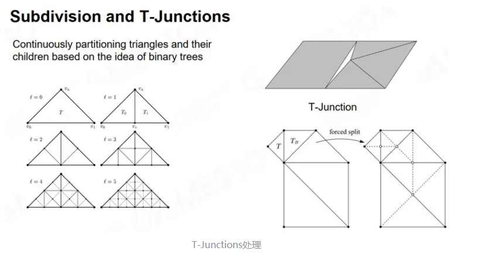

3. **四叉树形式**

切分三角形的方式不符合我们制作地形的直觉，因此上述算法在实际应用中使用不多。基于四叉树的细分方式则更加方便理解和使用。

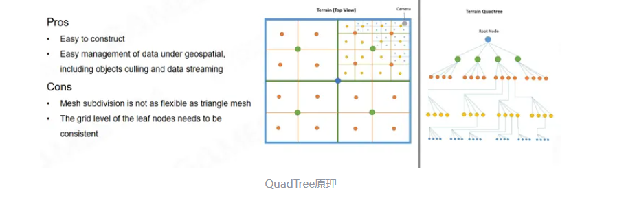

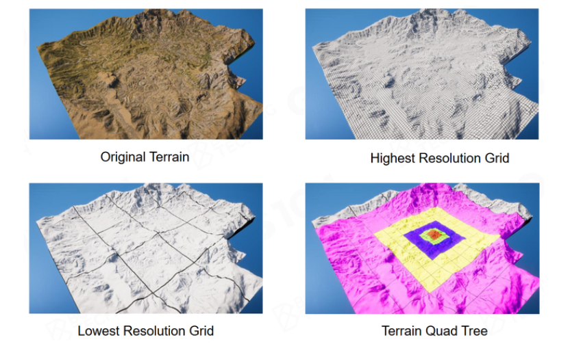

QuadTree不仅在算法层面较为便利，并且资源的制作和管理方式也与算法较为贴合。四叉树同样存在T-Junctions问题，但在处理时十分聪明：存在T-Junctions的问题三角形，将其新增的细分点吸附到临近三角形点。这种处理方式不存在顶点的删减，算法实现层面也较为简单。

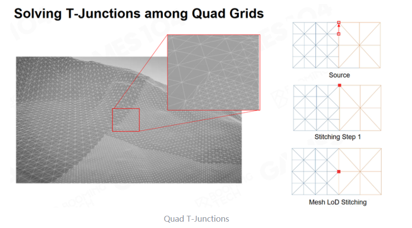

4. **nanite渲染管线**


### OpenGL 模拟水流

可以试想下，相机在水面以上，

反射效果：通过过在水面上方可以看到水面下方，水面以上物体（天空盒）会被水面反射看到；

折射效果：通过过在水面上方可以看到水面下方，可以看到水面下面的网格地面。

实现方式如下：从场景中多个视角渲染多个缓冲区，然后使用帧缓冲区中的结果作为纹理，融合到ADS光照水面。

* **反射效果实现**


反射纹理：反射相机与主相机在y轴的相反位置，同时反射相机向X轴方向倾斜，倾斜角度为主相机相反的倾斜角度。我们从反射相机的角度进行渲染，只渲染水面以上的物体（天空盒），最终渲染结果颜色对应Y坐标需要反转(1.0-tex.y)，不渲染水面底部及顶部纹理。

* **折射效果实现**

折射相机与主相机在相同位置，具有相同角度。使用和主相机相同的视图矩阵，折射纹理便是通过折射相机进行渲染，渲染透过水面可以看到的物体，（比如水底棋盘格）。

* **加一些扰动**

在采样reflect与refract texture的时候，利用dudv纹理加入一些扰动，让结果看起来更加真实

```cpp
// Apply offset to the sampled coords for the refracted & reflected texture
vec2 distortion;


vec2 totalDistortion;
if (clearWater) {
    distortion = vec2(0.0, 0.0);
    totalDistortion = vec2(0.0, 0.0);
}
else {
    distortion = (texture(dudvWaveTexture, vec2(planeTexCoords.x + waveMoveFactor, planeTexCoords.y)).rg * 2.0 - 1.0) * 0.1; // Unpack the dudv map
    distortion = planeTexCoords + vec2(distortion.x, distortion.y + waveMoveFactor);
    totalDistortion = (texture(dudvWaveTexture, distortion).rg * 2.0 - 1.0) * waveStrength * dampeningEffect; // Unpack the dudv map and multiply by strength
}
reflectCoords += totalDistortion;
reflectCoords = clamp(reflectCoords, 0.0, 1.0);
refractCoords += totalDistortion;
refractCoords = clamp(refractCoords, 0.0, 1.0);
vec4 reflectedColour = texture(reflectionTexture, reflectCoords);
vec4 refractedColour = texture(refractionTexture, refractCoords);

```

* **计算高光**

利用normal map，与入射角，计算反射角与太阳光照夹角，计算一个简略的高光

```glsl
vec3 normal;
	if (clearWater) {
		normal = vec3(0.0, 1.0, 0.0);
	}
	else {
		normal = texture(normalMap, distortion).rgb;
		// Assumes the normal of the water plane is always (0, 1, 0) 
		// so the the y component for the normal will never be negative
		normal = normalize(vec3(normal.r * 2.0 - 1.0, normal.g * waterNormalSmoothing, normal.b * 2.0 - 1.0)); 
	}

	vec3 viewVec = normalize(fragToView);
	float fresnel = dot(viewVec, vec3(0.0, 1.0, 0.0)); // TODO: Should use sampled normal

	// Direct Specular light highlights (TODO: Actually make this work for multiple directional lights, right now it requires there to be one directional light and only uses one)
	vec3 reflectedVec = reflect(normalize(dirLights[0].direction), normal);
	float specular = max(dot(reflectedVec, viewVec), 0.0);
	specular = pow(specular, shineDamper);
	vec3 specHighlight = dirLights[0].lightColor * specular * reflectivity * dampeningEffect;
```


* **透明度设置**

根据水面和水底之间的距离来设置透明度，如果离得太远，就设置为1.0

```glsl
float near = nearFarPlaneValues.x;
float far = nearFarPlaneValues.y;
float depth = texture(refractionDepthTexture, refractCoords).r;
float cameraToSurfaceFloorDistance = 2.0 * near * far / (far + near - (2.0 * depth - 1.0) * (far - near));
depth = gl_FragCoord.z;

float cameraToWaterDistance = 2.0 * near * far / (far + near - (2.0 * depth - 1.0) * (far - near));
float waterDepth = cameraToSurfaceFloorDistance - cameraToWaterDistance;
float dampeningEffect = clamp(waterDepth / dampeningEffectStrength, 0.0, 1.0);

//calculate
//....
//...

FragColour.a = dampeningEffect;
```

## Unity

* **Unity SRP原理**

[【Unity】SRP底层渲染流程及原理 - 知乎 (zhihu.com)](https://zhuanlan.zhihu.com/p/378781638)


#### **CBDL**

分簇延时光照是一种流行的光照计算优化策略，允许海量的同屏光照，CBDL将相机视锥体分为了多簇，并为每簇分配若干的有效光源，可以避免大量的无效光照计算，分簇光照分为两步，预处理和着色。

* 预处理阶段
  * 分割相机视锥体，生成若干个Cluster
  * 对于每个Cluster，便利所有光源求焦点，得到影响该cluster的有效光源列表
* 着色阶段
  * 根据像素坐标生成该像素所属的Cluster，遍历该cluster的"有效光源列表"，逐一计算光照，每个光源操作是相同的，知识簇和光源的数据不同，符合SIMD并行思想，使用Compute Shader并行进行分簇和光源分配

准备了四个Buffer，分别存放Cluster信息表(世界坐标八个点的坐标)，光源信息表，光源分配结果表以及光源分配索引表，所有Buffer都是一维的，使用的时候根据compute shader thread id三维坐标转换为一维坐标再读取数据


光源分配索引表（assignTable）中每个元素对应一个 Cluster，每个元素存储了 start 和 count，表示该 Cluster 受到哪些光源的影响。

在光源分配结果表（lightAssignBuffer）的 [start, start+count) 区间存储的是这些光源的 id，即光源在 lightBuffer 中的下标，所以光源分配结果表以 sizeof uint 为 stride

具体的索引过程如下。首先通过 Cluster ID 查 assignTable，然后遍历 lightAssignBuffer 获取灯光 ID，再根据灯光 ID 查 lightBuffer 获取灯光信息：


* 分簇

  每一个簇都可以用粗暴的8个点表示


分割方法如下。这里通过 SV_GroupThreadID 得到 Cluster 的 xy 索引，通过 SV_GroupID 得到 z 方向的索引，组成三维 Cluster ID，用（i，j，k）表示。然后：

1. 通过 i、j 得到 NDC 空间下该 Cluster 的 xy 二维 Rect
2. 分别用 0 和 1 做深度，将 Rect 反投影得到世界空间下近、远截面的梯形台
3. 通过 k 对梯形台进行切分，截取我们要的第 k 级 cluster
4. 将结果保存到 Compute Buffer

步骤比较简单，但我的语言表达能力捉急，于是大概流程图如下：


分簇结果绘制出来大概是这样：


* 传递光源信息

Compute buffer允许用户使用SetDada在CPU端设置数据。在每一帧通过Resources.FindObjectsOfType 获取全部的光源列表，然后更新光源信息到 Buffer，同时向 Shader 传递有效的光源数量。

```cpp
public void UpdateLightBuffer(Light[] lights) {
    PointLight[] plights = new PointLight[maxNumLights];
    int cnt = 0;
    for (int i = 0; i < lights.Length; ++i) {
        if (lights[i].type != LightType.Point) {
            continue;
        }
        PointLight pl;
        pl.color = new Vector3(lights[i].color.r, lights[i].color.g, lights[i].color.b);
        pl.intensity = lights[i].intensity;
        pl.position = lights[i].transform.position;
        pl.radius = lights[i].range;
        plights[cnt++] = pl;
    }
    lightBuffer.SetData(plights);

    //传递光源数量
    lightAssignCS.SetInt("_numLights", cnt);
}
```

也可以使用 Unity SRP API 提供的裁剪方法对视锥体外的光源进行裁剪，传递裁剪过后的光源列表能有效提高后续求交操作的效率。注意这里裁剪之后返回的是 VisuableLight 而不是 Light 对象，要重载多一个方法：

```cpp
public void UpdateLightBuffer(VisibleLight[] lights)
{
    PointLight[] plights = new PointLight[maxNumLights];
    int cnt = 0;
    for (int i = 0; i < lights.Length; ++i)
    {
        var vl = lights[i].light;
        if (vl.type != LightType.Point)
        {
            continue;
        }
        PointLight pl;
        pl.color = new Vector3(vl.color.r, vl.color.g, vl.color.b);
        pl.intensity = vl.intensity;
        pl.position = vl.transform.position;
        pl.radius = vl.range;
        plights[cnt++] = pl;
    }
    lightBuffer.SetData(plights);

    //传递光源数量
    lightAssignCS.SetInt("_numLights", cnt);
}
```

* 光源求交计算

这部分计算也是有Compute Shader承担，求交判断box的八个点在不在球的内部，只要有一个点在，就记录到该Cluster对应的结果存放表中

```cpp
[numthreads(16,16,1)]
void LightAssign(
    uint3 gtid : SV_GROUPTHREADID,
    uint3 gid : SV_GROUPID)
{
    // cluster ID
    uint i = gtid.x, j = gtid.y, k = gid.x;
    uint3 cluster_3D = uint3(i, j, k);
    uint clusterId_1D = Index3DTo1D(cluster_3D);

    ClusterBox box = _clusterBuffer[clusterId_1D];

    //in _lightAssignBuffer's  index
    uint startIndex = clusterId_1D * _maxNumLightsPerCluster;
    uint endIndex = startIndex;

    //search the intersect with the light
    for(int lid = 0; lid < _numLights; ++lid){
        PointLight pl = _lightBuffer[lid];
        if(ClusterLightIntersect(box, pl)){
            _lightAssignBuffer[endIndex++] = uint(lid);
        }
    }

    //write the res
    LightIndex idx;
    idx.count = endIndex - startIndex;
    idx.start = startIndex;
    _assignTable[clusterId_1D] = idx;
}
```

* 光照计算的应用

根据像素位置求出所在的clusterID，根据光照结果计算表求出在该Cluster下，光照的贡献结果，点源衰减计算套取了一个衰减公式：


```cpp
//计算Cluster Based Lighting
uint x = floor(uv.x * _numClusterX);
uint y = floor(uv.y * _numClusterY);
uint z = floor((1 - d_lin) * _numClusterZ); //z是反的 dx

uint3 clusterId_3D = uint3(x, y, z);
uint clusterId_1D = Index3DTo1D(clusterId_3D);
LightIndex lightIndex = _assignTable[clusterId_1D];

int start = lightIndex.start;
int end = lightIndex.start + lightIndex.count;
for(int j = start; j < end; ++j){
    uint lightId = _lightAssignBuffer[j]; //灯光ID
    PointLight lit = _lightBuffer[lightId]; //根据id查找灯光表

    L = normalize(lit.position - worldPos.xyz);
    radiance = lit.color;

    //灯光衰减
    float dis = distance(lit.position, worldPos.xyz);
    float d2 = dis * dis;
    float r2 = lit.radius * lit.radius;
    float dying = saturate(1 - (d2 / r2) * (d2 / r2));
    dying *= dying;

    color += PBR(N, V, L, albedo, radiance, roughness, metallic) * lit.intensity * dying;
}
```

* **CBDL有光源比较小，在Box里面怎么办？**

两种情况，第一种情况

1. 光源在簇的外部，但是仍然影响着该簇，那么可以根据距离来判断，光源和簇的Box八个点最小距离小于影响半径，那么加进去！
2. 光源在簇的内部，直接根据位置来筛选，在里面的话光源的xyz一定位于box的min(xyz)~max(xyz)之间

* **如何加速求交**

**BVH包围盒啊！！**


#### 剔除

*  **视锥剔除**

demo完成对同一个物体的剔除，该物体数量很多

1. 求出世界空间剔除的六个面

2. 向compute shader中传入物体的坐标变换矩阵

3. 完成坐标变换，将物体从局部空间转换到世界空间，通过包围盒和平面的位置判断是否相交。

4. 具体判断过程：

   


如图：判断OA和法向量n的关系，如果夹角小于90°说明该点在平面外，如果包围盒的所有点都在某个面的外部，那么该物体就在平面的外部，不在视锥内，则不需要绘制。

* **遮挡剔除hiz**

Hiz剔除主要是利用mipmap的思想，先用包围盒包裹住一个物体，如果包围盒内的所有物体的深度都比depthTexture上的大，那么说明包围盒所有物体都被遮挡住了，这个时候不需要往shader中传递数据，那么问题就转换为了如何计算一个范围内物体的深度，自然就利用到了mipmap，生成深度图的时候，手动写一下depth shader的代码，将上一层的mipmap传入shader，生成这一层的mipmap

```hlsl
    float4 depth;
    float offset = _MainTex_TexelSize.x / 2;
    depth.x = tex2D(_MainTex, uv);
    depth.y = tex2D(_MainTex, uv + float2(0, offset));
    depth.z = tex2D(_MainTex, uv + float2(offset, 0));
    depth.w = tex2D(_MainTex, uv + float2(offset, offset));
#if defined(UNITY_REVERSED_Z)
	return min(min(depth.x, depth.y), min(depth.z, depth.w));
#else
	return max(max(depth.x, depth.y), max(depth.z, depth.w));
#endif
```

mipmap存储可见的距离摄像机最远的位置的深度值，然后进行Hiz剔除compute shader,在ndc空间重新生成一个包围盒，计算出对应位置的uv坐标，可以计算出左下角右上角，计算出应该读取的mipmap level以及mipmap size大小，将包围盒映射到Mipmap level Texture的四个点,取最小值,即可完成范围查询，并根据深度信息剔除不必要的数据。

* **如果直接用摄像机的深度图怎么办？摄像机的深度图一般不是2的n次方，但是Hiz深度图一般又都是2的n次方，这种情况怎么处理？**

1. UV再映射？深度图映射到2的n次方的纹理坐标空间？
2. ？？？？？？


# 游戏引擎

* **说一说你对游戏引擎的理解**

我认为游戏引擎就是一个软件框架，用于简化和加速游戏开发的过程，每一层都有特定的含义，根据现代游戏引擎开发的基础，一般自顶向下有工具层（各种编辑器的操作）、功能层（渲染、动画、物理、交互、脚本AI、状态机）、资源层（文件和数据）、核心层（复用的底层代码、数学库等等）、平台层（不同平台用户）。

* **游戏引擎分层架构**

  * 工具层(UI)

  对于新手，通过在引擎编辑器中进行简单的GUI操作，即可实现游戏功能（设计关卡、动画等），这一层被称为**工具层**，也是接触引擎时最直观、最直接交互的层级。

  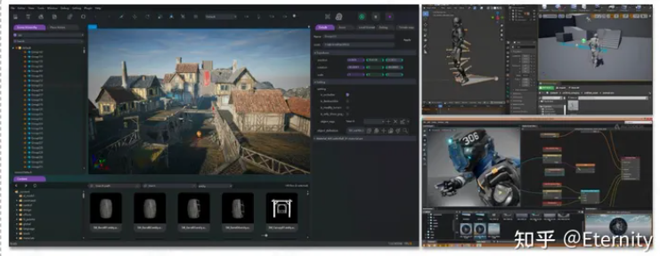

  

  * 功能层

  为了使游戏呈现在屏幕上，需要渲染系统对虚拟世界进行渲染。动画系统将艺术家设计的动作动画在引擎中进行组合、过渡，让游戏人物在游戏动起来。逼真的虚拟世界也离不开物理，物理系统将使用刚体、软体、流体等去表达世界，使得人与人、人与物不会发生碰撞。游戏中的玩法以及NPC人物，也都离不开脚本、事件、AI系统等。为了实现游戏中的人机交互，还需要与输入、输出设备连接。

  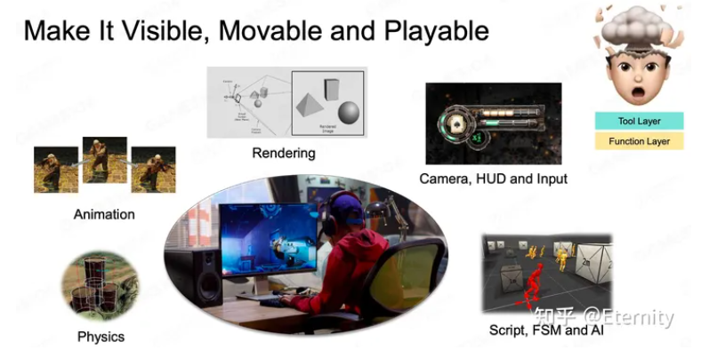

  * 资源层

  游戏引擎中通常包含大量数据和文件，这些文件通常以不同的形式存在，例如Photoshop中的专用格式psd文件或者3ds Max中的max文件，上万、上十万的数据文件由**资源层**进行加载与管理。

  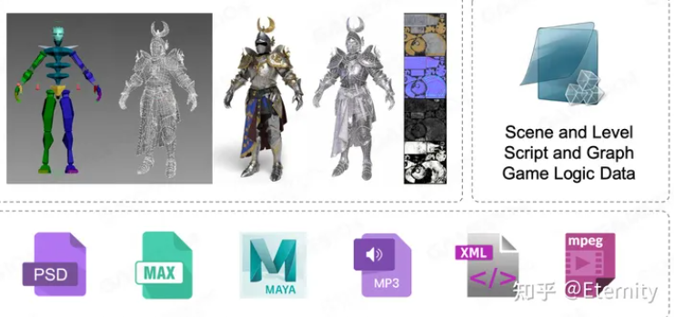

  * 核心层

  工具层、功能层、资源层会频繁调用底层代码，使用容器创建、内存分配、数学库、多线程等底层功能，而**核心层**能够提供上述功能。

  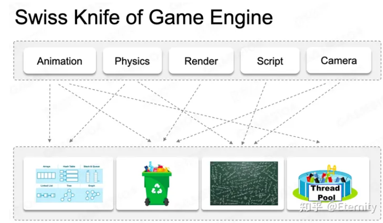

  * 平台层

  在游戏引擎中最容易被忽略的是平台层，引擎或者游戏需要发布在不同平台上，可能需要使用不同的图形API。此外，用户使用的输入设备、硬件设备可能也完全不同，这都需要平台层进行处理。

  


* **ECS引擎架构模式**

[游戏开发中的ECS 架构概述 - 知乎 (zhihu.com)](https://zhuanlan.zhihu.com/p/30538626)


* **ECS设计模式优缺点**

ECS（Entity-Component-System）是一种游戏引擎中常用的模式设计，它将游戏对象分解为实体（Entity）、组件（Component）和系统（System）三个核心概念。下面是ECS模式设计的一些优点和缺点：

优点：
1. 高度可扩展性：ECS模式设计可以轻松地添加、删除或修改组件和系统，使得游戏系统更加灵活和可扩展。开发人员可以根据需要创建自定义组件和系统，以实现特定的功能。

2. 高性能：ECS模式设计可以提供更好的性能。由于组件和系统的分离，可以更好地利用现代硬件的优势，如数据局部性和并行处理。这种高效的数据布局和处理方式可以加速游戏的运行速度，提高性能。

3. 可重用性和组合性：ECS模式设计鼓励组件的重用和组合，使得不同的组件可以在不同的实体上进行组合，形成各种各样的游戏对象。这种可重用性和组合性可以减少代码的冗余，并使开发人员更加专注于游戏的逻辑和功能。

4. 可维护性和测试性：由于ECS模式设计的组件和系统的分离，可以更容易地进行单元测试和功能测试。每个系统都可以被单独测试，而不需要涉及整个游戏对象。同时，ECS模式设计也使代码更容易理解和维护，因为逻辑和功能被分解为独立的部分。

缺点：
1. 学习曲线：ECS模式设计可能对初学者来说比传统的继承式设计更具挑战性。理解如何组织和管理实体、组件和系统的关系需要一定的学习和实践。

2. 灵活性限制：ECS模式设计可能不适用于所有类型的游戏。某些特定类型的游戏，如角色扮演游戏（RPG）可能更适合使用传统的继承式设计。在某些情况下，ECS模式可能需要额外的复杂性来处理特定的需求。

3. 初始开发成本：在开始阶段，ECS模式设计可能需要更多的投入和时间来建立一个完善的框架和基础设施。这可能会对小型项目或时间紧迫的项目产生一定的影响。

总的来说，ECS模式设计在游戏引擎开发中有其独特的优点，尤其在可扩展性、性能和可维护性方面。然而，对于每个具体的项目，开发人员需要权衡ECS模式设计的优缺点，以确定是否适合使用该模式。


* **组合优于继承，这是从什么角度出发的？**

“组合优于继承”是一种软件设计原则，强调在构建软件系统时应优先选择组合（Composition）而不是继承（Inheritance）的方式。

这个原则主要出发于以下几个角度：

1. 灵活性和可维护性：使用继承时，子类会继承父类的实现和行为，这使得类之间产生了紧耦合的关系。当需求变化时，修改继承体系的父类可能会导致整个类结构的变动。而使用组合时，类与类之间的关系通过对象的组合来表达，更加灵活、松散耦合，对于需求变化更加容易扩展和维护。

2. 单一职责原则：继承会导致类的功能和责任的混杂，一个类可能承担了太多的功能，违背了单一职责原则。而通过组合，每个类只需关注自身的职责，减少了耦合和复杂性，使得系统更易理解和维护。

3. 代码重用性和模块化：组合可以更好地促进代码的重用性和模块化。通过将各个对象组合在一起，每个对象都可以独立地进行开发和测试，并且可以在不同的上下文中重复使用。 

需要注意的是，继承和组合都是有效的代码复用和架构设计方式，而选择使用哪种方式应根据具体情况来决定。在某些情况下，继承可能更加合适，特别是当需要共享相同的行为和属性时。但是，如果继承导致了过多的类层次结构和复杂度，或者需要更多的灵活性和可维护性，那么使用组合就更加合适。


* **MVC、MVMM**

  [MVC、MVP、MVVM 解析【理论篇】 - 简书 (jianshu.com)](https://www.jianshu.com/p/ac44eed71193)

  * MVC

  **Model - 数据层**，负责处理数据相关的操作。这部分多数只管能否做，而不考略是否应该做。

  **View - 视图层**，用户的界面。例如：对界面组件的持有、不含业务逻辑的开关等操作。

  **Controller- 控制层**，业务逻辑所在的层级。这部分是判断是否应该做、如何做的地方。

  它们的依赖关系或数据的走向常规有以下3种，而第三种也是使用最频繁的一种（其实项目中多数是使用第三种的变种）

  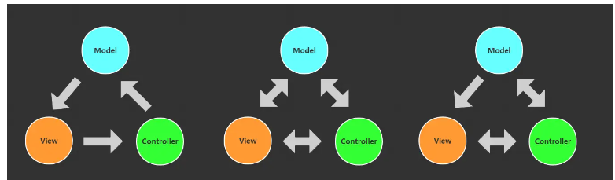

  

  * MVMM

**Model** 定义用户界面所需要被显示的资料模型，一个模型包含着相关的业务逻辑（在实际开发中，数据相关的业务逻辑都会放到服务器）。

**View** 视图为呈现用户界面的终端，用以表现来自 Model 的资料，和用户命令路由再经过 Presenter 对事件处理后的资料。

**ViewModel** 在原有Controller层的基础上，将业务逻辑封和组件进行双向绑定（data-binding），达到同步更新的目的。

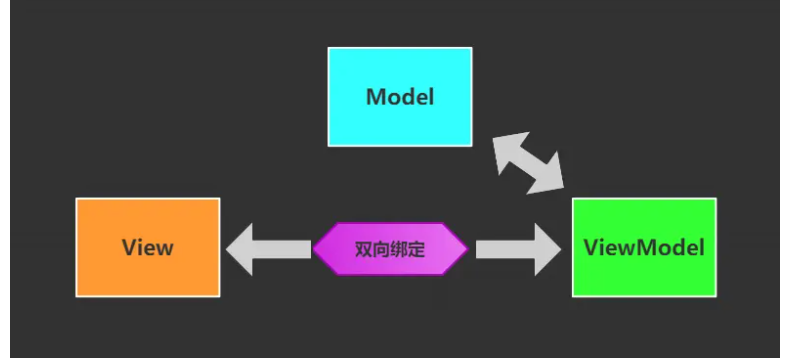


# 逻辑题

* **一个是两种药片，每种有两个，一个人需要早上吃两种药片各一个，现在这四个药片混在一起了这个人什么方法吃。**

把所有的4颗药丸都切开成相等的两半，然后早上和晚上，分别吃掉每颗药丸的一半


* **一共1000瓶酒，其中一瓶有毒。如果一只老鼠喝了有毒的酒，会在一天之后死亡，那么如果给你一天时间，然你判定哪瓶酒有毒，至少需要几只老鼠？**

答案是10只。这个需要使用二进制编码来解决，1000瓶酒至少需要10位二进制数来进行编码。然后取十只杯子分别代表这是个二进制数的十个位，分别将1000瓶酒倒入其编码为1的对应的杯子中。取十个老鼠分别喝十个杯子中的酒，一天之后，就可以根据喝哪些杯子的老鼠死掉来确定出有毒的那瓶酒的编码，从而确定哪瓶酒有毒。其根据就是只有有毒酒的编码对应的毒死老鼠的杯子位置。这个题目就是利用了二进制编码的一些特性。


# 常见算法题

## 链表

* **回文链表**

快慢指针找出中间位置，反转后面的链表，进行比较

```cpp
bool isPalindrome(ListNode* head) {
    if(head->next == nullptr)
        return true;

    ListNode* newHead = new ListNode();

    ListNode* slow = head;
    ListNode* fast = head;

    while(fast && fast->next){
        slow = slow->next;
        fast = fast->next->next;
    }
    while(slow){
        ListNode* temp = slow->next;
        slow->next = newHead->next;
        newHead->next = slow;
        slow = temp;
    }

    newHead = newHead->next;

    while(newHead && head){
        if(newHead->val != head->val){
            return false;
        }
        newHead = newHead->next;
        head = head->next;
    }
    return true;
}
```


## 排序

* **快速排序**

```cpp
class Solution {
public:
    void quickSort(vector<int>& vec, int left, int right) {
        if (left >= right)
            return;
        int l = left;
        int r = right;
        
        int index = rand() % (right - left + 1);
        swap(vec[left + index], vec[left]);
        int privot = vec[left++];

        while (left <= right)
        {
            while (left <= right && vec[right] >= privot) {
                --right;
            }

            while (left <= right && vec[left] <= privot)
            {
                ++left;
            }
            if (left < right) {
                swap(vec[left], vec[right]);
            }
        }
        swap(vec[l], vec[right]);
        
        int leftPivot = right - 1;
        int rightPivot = right + 1;
        // 优化二
        while(leftPivot >= l && vec[leftPivot] == vec[right]) leftPivot--;
        while(rightPivot <= r && vec[rightPivot] == vec[right]) rightPivot++;

        quickSort(vec, l, leftPivot);
        quickSort(vec, rightPivot, r);
    }
    vector<int> sortArray(vector<int>& nums) {
        quickSort(nums, 0, nums.size() - 1);
        return nums;
    }
};
```

* **归并排序**

```cpp
class Solution {
    vector<int> tmp;
    void mergeSort(vector<int>& nums, int l, int r) {
        if (l >= r) return;
        int mid = (l + r) >> 1;
        mergeSort(nums, l, mid);
        mergeSort(nums, mid + 1, r);
        int i = l, j = mid + 1;
        int cnt = 0;
        while (i <= mid && j <= r) {
            if (nums[i] <= nums[j]) {
                tmp[cnt++] = nums[i++];
            }
            else {
                tmp[cnt++] = nums[j++];
            }
        }
        while (i <= mid) {
            tmp[cnt++] = nums[i++];
        }
        while (j <= r) {
            tmp[cnt++] = nums[j++];
        }
        for (int i = 0; i < r - l + 1; ++i) {
            nums[i + l] = tmp[i];
        }
    }
public:
    vector<int> sortArray(vector<int>& nums) {
        tmp.resize((int)nums.size(), 0);
        mergeSort(nums, 0, (int)nums.size() - 1);
        return nums;
    }
};
```

* **堆排序**

```cpp
//调整堆的操作
void adjust(vector<int>& nums, int i, int n){
    int left = 2 * i + 1;
    int right = 2 * i + 2;
    int curIndex = i;
    if(left <= n && nums[curIndex] > nums[left]){
        curIndex = left;
    }
    if(right <= n && nums[curIndex] > nums[right]){
        curIndex = right;
    }
    if(curIndex != i){
        swap(nums[curIndex], nums[i]);
        adjust(nums, curIndex, n);
    }
}

//建堆的操作
void buildHeadp(vector<int>& nums, int n){
    for(int i = (n - 1) / 2; i >= 0; --i){
        adjust(nums, i, n);
    }
}
```

* **给定一个数组a[n]，要求求出接近m的k个数。分析思路，时间复杂度。 **

1. 构建一个大小为 `k` 的最大堆，初始时堆中没有元素。
2. 遍历数组，对于每个元素计算与目标值的差异的绝对值，并将该差异的绝对值与堆顶元素进行比较。
3. 如果当前元素的差异较小，则将其加入堆，并移除堆顶元素。
4. 遍历完成后，堆中的元素即为接近目标值 `m` 的前 `k` 个数。


## 二分查找

* **基础版查找**

```cpp
// 二分查找函数
int binarySearch(const std::vector<int>& arr, int target) {
    int left = 0;
    int right = arr.size() - 1;

    while (left <= right) {
        int mid = left + (right - left) / 2;
        // 如果找到目标值，返回索引
        if (arr[mid] == target) {
            return mid;
        }
        // 如果目标值在左半部分，缩小右边界
        if (arr[mid] > target) {
            right = mid - 1;
        }
        // 如果目标值在右半部分，缩小左边界
        else {
            left = mid + 1;
        }
    }
    // 如果未找到目标值，返回 -1
    return -1;
}
```

* **找到第一个或最后一个大于等于目标值的下标**

```cpp
// 二分查找函数，找到第一个大于等于目标值的数字的索引
int binarySearchFirstGreaterOrEqual(const std::vector<int>& arr, int target) {
    int left = 0;
    int right = arr.size() - 1;
    int result = -1;

    while (left <= right) {
        int mid = left + (right - left) / 2;

        if (arr[mid] >= target) {
            // 更新结果并继续在左半部分查找
            result = mid;
            right = mid - 1;  // 修改这一行
        } else {
            // 在右半部分查找
            left = mid + 1;
        }
    }

    return result;
}

// 二分查找函数，找到最后一个大于等于目标值的数字的索引
int binarySearchLastGreaterOrEqual(const std::vector<int>& arr, int target) {
    int left = 0;
    int right = arr.size() - 1;
    int result = -1;

    while (left <= right) {
        int mid = left + (right - left) / 2;

        if (arr[mid] >= target) {
            // 更新结果并继续在右半部分查找
            result = mid;
            left = mid + 1;  // 修改这一行
        } else {
            // 在左半部分查找
            right = mid - 1;
        }
    }

    return result;
}
```

## 二叉树遍历

* **栈的非递归遍历**

  * 前序遍历

  ```cpp
  void preOrder(TreeNode *T){
      TreeNode *stack[15];
      int top = -1;
      TreeNode *p = T;
      while(p!=NULL||top!=-1){
          if(p!=NULL){
              stack[++ top] = p;
              printf("%d\t",p->data); //入栈时，访问输出
              p = p->lChild;
          }else{
              p = stack[top --];
              p = p->rChild;
          }
      }
  }
  ```

  

  * 中序遍历

  ```cpp
  void inOrder(TreeNode *T){
      TreeNode *stack[15];
      int top = -1;
      TreeNode *p = T;
      while(p!=NULL||top!=-1){
          if(p!=NULL){
              stack[++ top] = p;
              p = p->lChild;
          }else{
              p = stack[top --];
              printf("%d\t",p->data);  //出栈时，访问输出
              p = p->rChild;
          }
      }
  }
  ```

  


## 随机算法

* **洗牌算法**

  给定一个无序数组，要求打乱它们的顺序，使得每个元素在每个位置的概率相等

  * 证明
    Fisher-Yates算法的正确性可以通过数学归纳法来证明。首先，让我们考虑数组中只有两个元素的情况。

  假设数组中有两个元素A和B，初始时A在位置0，B在位置1。在第一次迭代中，我们有50%的概率将B与A交换，从而使得B出现在位置0的概率为1/2。在第二次迭代中，A被交换到位置1的概率为1/2，而B则在位置0的概率为1/2。因此，对于两个元素的情况，它们在每个位置的概率相等。

  现在假设对于包含k个元素的数组，算法能够保证每个元素在每个位置的概率相等。我们来证明对于k+1个元素的数组也成立。

  考虑包含k+1个元素的数组，初始时第k个元素在位置k。在第一次迭代中，最后一个元素（第k+1个元素）被交换到位置k的概率为1/(k+1)。此时，问题转化为在前k个元素中每个元素在每个位置的概率相等，而这是归纳假设所保证的。

  通过数学归纳法，我们可以得出结论：Fisher-Yates算法确保了对于任意大小的数组，每个元素在每个位置的概率都是相等的。这是因为每个元素都有机会在任意位置进行交换，而交换的概率是相等的。

```cpp
#include <iostream>
#include <cstdlib>
#include <ctime>
#include <vector>

void shuffleArray(std::vector<int>& nums) {
    // 使用当前时间作为随机数种子
    std::srand(std::time(0));
    
    int n = nums.size();
    for (int i = n - 1; i > 0; --i) {
        // 生成一个随机索引 j，其中 0 <= j <= i
        int j = std::rand() % (i + 1);
        
        // 将当前位置的元素与随机位置的元素交换
        std::swap(nums[i], nums[j]);
    }
}
```

## 位操作

* **一个整数数组，只有两个数字只出现一次，其他数字出现两次，找出这两个数字**

1. 对整数数组中的所有数字进行一次完整的异或运算，得到的结果是两个只出现一次的数字的异或结果。
2. 在这个异或结果中找到为1的任意一位，可以通过按位与运算和移位操作来实现。这一位表示两个只出现一次的数字在该位上不同。
3. 根据这一位，将原数组中的所有数字分成两组，一组中该位为1，另一组中该位为0。
4. 分别对这两组数字进行异或运算，得到的结果即为只出现一次的两个数字。

```cpp
#include <iostream>
#include <vector>

std::vector<int> findSingleNumbers(std::vector<int>&nums) {
	int xorResult = 0;

	// 计算所有数字的异或结果
	for (int num : nums) {
		xorResult ^= num;
	}

	// 找到异或结果中为1的最低位
	int bit = 1;
	while ((xorResult & bit) == 0) {
		bit = bit << 1;
	}

	int result1 = 0, result2 = 0;

	// 分成两组进行异或运算
	for (int num : nums) {
		if ((num & bit) == 0) {
			result1 ^= num;
		}
		else {
			result2 ^= num;
		}
	}

	return { result1, result2 };
}

int main() {
	std::vector<int> nums = { 1, 2, 1, 3, 2, 5 };
	std::vector<int> singleNumbers = findSingleNumbers(nums);

	std::cout << "The two single numbers are: " << singleNumbers[0] << " and " << singleNumbers[1] << std::endl;

	return 0;
}

```

* **一个整数数组，只有一个数字只出现一次，其他数字出现三次，找出这一个数字**

```cpp
int singleNumber(vector<int>& nums) {
    int ans = 0;
    for (int i = 0; i < 32; ++i) {
        int total = 0;
        for (int num: nums) {
            total += ((num >> i) & 1);
        }
        if (total % 3) {
            ans |= (1 << i);
        }
    }
    return ans;
}

```

## 二叉树

* **从树的前序中序遍历建立二叉树**

```cpp
std::unordered_map<int, int> hash;
TreeNode* build(vector<int>& preorder, vector<int>& inorder, int l1, int r1, int l2, int r2){
    if(l1 > r1 || l2 > r2){
        return nullptr;
    }
    int pos = hash[preorder[l1]];
    int leftNum = pos - l2;
    TreeNode* node = new TreeNode(preorder[l1]);
    node->left = build(preorder, inorder, l1 + 1, l1 + leftNum, l2, pos - 1);
    node->right = build(preorder, inorder, l1 + leftNum + 1, r1, pos + 1, r2);
    return node;
}
TreeNode* buildTree(vector<int>& preorder, vector<int>& inorder) {
    int size = preorder.size();
    for(int i = 0; i < size; ++i){
        hash[inorder[i]] = i; 
    }
    return build(preorder, inorder, 0, size - 1, 0, size - 1);

}
```


# 开放题

* **镜子如何渲染？**

应该是相机位置关于镜子做对称然后渲染一张图，可以利用glDistance做一个裁剪，只让在镜子上半部分的完成显示，类似于水流的模拟。


* **现在给定一个模型，这个模型是由几十万个三角片元组成的，现在要实现一个三角形拾取的功能，鼠标点这个模型上的某个三角面，然后要高亮它，怎么做？**

1. **将屏幕坐标转换为射线：** 首先，将鼠标点击的屏幕坐标转换为视图坐标或世界坐标。通常，你需要使用逆投影矩阵来完成这个过程。
2. **射线与模型相交：** 使用转换后的射线与模型中的每个三角形进行相交测试。一种常见的方法是使用射线与三角形相交的快速算法，例如Möller–Trumbore算法。
3. **确定相交的三角形：** 找到与射线相交的三角形，可以根据相交测试的结果得知。在相交测试后，可以获得相交的三角形的索引或其他标识。
4. **高亮选中的三角形：** 一旦确定了相交的三角形，就可以在图形渲染中标记或高亮这个三角形。这通常涉及到在渲染过程中使用不同的材质或颜色来区分选中的三角形。


* **C++优化**

1. **对象池(享元)**
2. **预编译头**


# Unity

* **生命周期函数**

在Unity中，在游戏对象（GameObject）上可以使用一系列的生命周期函数（Lifecycle Functions）来控制和管理对象的行为和状态。以下是常见的Unity生命周期函数：

1. Awake()：
   - 在对象被创建后立即调用。
   - 可以进行初始化工作，例如变量的赋值和引用的获取。
2. Start()：
   - 在Awake()之后调用。
   - 在所有对象的Awake()都执行完之后，在第一帧Update()之前调用。
   - 通常用于准备开始游戏的工作。
3. Update()：
   - 在每一帧都会被调用。
   - 用于更新对象的状态、处理输入和游戏逻辑等。
4. FixedUpdate()：
   - 在每一固定时间间隔调用，与帧率无关。
   - 用于处理物理模拟和其他固定频率的更新。
5. LateUpdate()：
   - 在所有对象的Update()函数执行完之后调用。
   - 通常用于对象的跟随或相机的跟随等需要在Update()之后处理的行为。
6. OnEnable() 和 OnDisable()：
   - 在对象被启用或禁用时调用。
   - 可以在启用或禁用对象


* **Update和FixUpdate区别**

1. **FixedUpdate:**
   - **调用时机：** `FixedUpdate` 在固定的时间间隔内被调用，通常是每帧固定的时间。默认情况下，Unity 设置为每秒调用 `FixedUpdate` 50 次（可以通过编辑器设置进行调整）。
   - **用途：** 主要用于处理涉及到物理、运动、刚体等需要在固定时间间隔内执行的逻辑。由于 `FixedUpdate` 的调用频率是固定的，它对于实现一些需要时间一致性的物理模拟或运动逻辑非常有用。
2. **Update:**
   - **调用时机：** `Update` 在每一帧都会被调用。它的调用频率不是固定的，而是取决于每秒的帧率。默认情况下，Unity 的目标帧率是每秒 60 帧。
   - **用途：** 用于处理一般的游戏逻辑、输入处理、用户交互等。由于 `Update` 的调用频率不是固定的，它更适合处理与时间无关或不需要精确时间控制的逻辑。

使用场景示例：

- 如果你需要更新与物理相关的逻辑，例如移动刚体、施加力、检测碰撞等，那么你应该使用 `FixedUpdate`。
- 如果你需要处理一般的游戏逻辑，例如用户输入、游戏状态切换等，那么你应该使用 `Update`。


* **Unity优化：批处理**

[Unity渲染优化的4种批处理：静态批处理，动态批处理，SRP Batcher 与 GPU Instancing - 知乎 (zhihu.com)](https://zhuanlan.zhihu.com/p/432223843)


* **Unity 静态合批和动态合批的区别是什么？**


Unity中的静态合批（Static Batching）和动态合批（Dynamic Batching）是两种不同的批次合并技术，分别适用于静态物体和动态物体。以下是它们的主要区别：

1. **适用对象类型：**
   - **静态合批：** 主要用于合并静态或不变的物体，这些物体在运行时不会发生位置、旋转或缩放的变化。这种合批发生在场景构建时，通过编辑器的静态合批操作或者使用静态批处理工具。
   - **动态合批：** 用于合并在运行时可能发生位置、旋转或缩放变化的动态物体。这种合批发生在游戏运行时。
2. **合并时机：**
   - **静态合批：** 在场景构建时或编辑器中进行，因为静态物体在运行时不发生变化，可以在构建阶段预先计算好合批数据。
   - **动态合批：** 在游戏运行时进行，因为动态物体在运行时的状态可能会发生变化，需要在每一帧或根据条件进行动态计算合批。
3. **GPU Instancing：**
   - **静态合批：** 静态合批通常可以利用 GPU Instancing 技术，允许多个实例使用相同的着色器和材质进行渲染，而不需要在 CPU 上进行多次渲染调用。
   - **动态合批：** 在动态合批中，GPU Instancing 的使用相对有限，因为动态物体的状态可能会变化，不同物体可能需要不同的渲染状态。
4. **对性能的影响：**
   - **静态合批：** 静态合批的性能影响主要发生在场景构建时，对于运行时性能影响较小，因为静态物体的状态在运行时不变。
   - **动态合批：** 动态合批会在运行时对性能产生一定的影响，因为需要在每一帧或根据条件动态计算合批。同时，要考虑物体之间的状态变化和合批的计算成本。
5. **计算区别**

计算静态合批和动态合批的具体做法略有不同，下面分别介绍它们的计算过程：

静态合批（Static Batching）:

1. **合并网格：** 针对具有相似网格的静态物体，可以将它们的网格合并为一个共享的网格。这可以通过编辑器的静态合批工具或脚本自动化完成。
2. **共享材质：** 如果多个静态物体使用相同的材质，可以将这些物体指定为使用同一个材质实例，以减少渲染状态的变化。这也有助于提高合批效果。
3. **GPU Instancing：** 静态合批可以充分利用 GPU Instancing 技术。启用 GPU Instancing 后，Unity可以使用相同的渲染数据来渲染多个实例，而不需要为每个实例发出单独的渲染调用。

动态合批（Dynamic Batching）:

1. **相似性检查：** 在运行时，通过遍历场景中的动态物体，检查它们的渲染属性是否相似。这可能涉及到检查材质、着色器、光照属性等。
2. **合并计算：** 对于具有相似渲染属性的动态物体，将它们合并为一个批次。合并计算可能涉及到创建合并后的顶点数据和索引数据，以及更新合并后的渲染状态。
3. **GPU Instancing（有限使用）：** 对于合并为一个批次的动态物体，可能在一些情况下使用 GPU Instancing。但由于动态物体的状态可能会变化，有时难以充分利用 GPU Instancing。

总体而言，静态合批在构建场景时通过编辑器工具或脚本预先计算合批数据，而动态合批需要在运行时动态检查并计算合批数据。无论是静态合批还是动态合批，都是为了减少渲染调用的数量，提高图形渲染性能。


* **为什么合批影响帧率**

动态合批在某些情况下可能会对帧率产生影响，这主要与合批的计算成本、GPU工作负载以及状态变化等因素有关。以下是一些可能导致动态合批影响帧率的原因：

1. **计算成本：** 动态合批需要在运行时动态计算合并物体的数据，这包括检查物体的渲染属性、创建合并后的顶点数据和索引数据等。这些计算可能会占用一定的 CPU 时间，尤其是在物体数量较多的情况下。
2. **状态变化：** 合并物体为一个批次时，要求这些物体具有相似的渲染状态，如相同的材质、着色器等。然而，物体之间的状态变化可能会导致需要频繁的状态切换，增加了 CPU 和 GPU 的工作负担。
3. **GPU Instancing 限制：** GPU Instancing 在动态合批中的使用相对有限，因为动态物体的状态可能会变化。GPU Instancing 的有效使用需要物体之间的状态尽可能相似，而动态物体的状态可能会变化，因此无法充分利用 GPU Instancing 的优势。
4. **合批过程的频繁触发：** 如果合批的检查和计算过程过于频繁，例如每一帧都进行动态合批的检查，可能导致过多的 CPU 计算和带宽消耗，影响帧率。
5. **合批后的物体复杂度：** 合并后的物体可能会变得更加复杂，增加 GPU 的工作负担。这可能是因为在合批后，每个合并后的物体仍然保留着各自的复杂性，增加了片元数和渲染计算。

为了优化动态合批的性能，可以考虑以下措施：

- **减小物体的复杂度：** 优化物体的三角面数，简化模型，以减小每个物体的渲染成本。
- **减少状态变化：** 尽可能使合并的物体状态相似，减少状态变化的频率，以降低 CPU 和 GPU 的开销。
- **限制合批触发频率：** 根据场景需求，可以调整合批的触发频率，不必在每一帧都进行动态合批。
- **合理使用 GPU Instancing：** 在满足条件的情况下，合理使用 GPU Instancing 技术，以提高 GPU 的渲染效率。

综上所述，动态合批的性能影响是一个综合考虑多个因素的问题，需要根据具体场景进行调优。


* **OverDraw相关**

Overdraw（超绘）是指在图形渲染中重复绘制相同像素的现象。当多个物体或多个图元重叠在屏幕上时，由于透明度或混合等原因，可能会导致某些像素被绘制多次。这种多余的绘制操作会浪费计算资源，并可能影响图形渲染的性能。

Overdraw问题通常出现在由于物体的顺序或透明度不正确而导致的重叠绘制。在典型的渲染管线中，深度测试（Depth Testing）和模板测试（Stencil Testing）等技术被用来解决Overdraw问题。通过使用这些技术，可以进行像素级别的可见性测试，避免不可见的像素的重复绘制。

解决Overdraw问题的一种常用方法是使用深度缓冲（Depth Buffer）。深度缓冲是一种用于存储每个像素深度值的缓冲区，用于判断像素是否在场景中的其他物体之后绘制。在绘制每个像素之前，深度缓冲会与新像素的深度值进行比较，只有当新像素的深度值更小（即更接近相机）时，才会进行绘制。这样可以确保只绘制最前面的可见像素，避免重复绘制。

除了使用深度缓冲外，还可以使用其他技术来解决Overdraw问题，例如预排序（Pre-sorting）物体或图元、使用遮挡剔除（Occlusion Culling）等。

通过减少Overdraw，可以提高图形渲染的效率，并减少不必要的计算开销，特别是在复杂的场景和大规模的渲染中。


# 操作系统

* **线程和进程之间的区别**

1、进程是资源分配的最小单位，线程是程序执行的最小单位（资源调度的最小单位）
2、进程有自己的独立地址空间，每启动一个进程，系统就会为它分配地址空间，建立数据表来维护代码段、堆栈段和数据段，这种操作非常昂贵。
而线程是共享进程中的数据的，使用相同的地址空间，因此CPU切换一个线程的花费远比进程要小很多，同时创建一个线程的开销也比进程要小很多。
3、线程之间的通信更方便，同一进程下的线程共享全局变量、静态变量等数据，而进程之间的通信需要以通信的方式（IPC)进行。不过如何处理好同步与互斥是编写多线程程序的难点。
4、但是多进程程序更健壮，多线程程序只要有一个线程死掉，整个进程也死掉了，而一个进程死掉并不会对另外一个进程造成影响，因为进程有自己独立的地址空间。


* **线程间通信的方式**

1. 共享内存：线程之间共享程序的公共状态，线程之间通过读-写内存中的公共状态来隐式通信。
2. 消息传递：线程之间没有公共的状态，线程之间必须通过明确的发送信息来显示的进行通信(notify)。
3. 管道流：管道输入/输出流的形式


* **进程间通信的方式**

1. **管道（Pipe）：**
   - 管道是一种半双工通信机制，用于在父进程和子进程之间进行通信。它在内存中创建一个临时文件描述符，一个进程写入数据，而另一个进程则读取这些数据。管道适用于具有父子关系的进程间通信。
2. **命名管道（Named Pipe）：**
   - 类似于普通管道，但具有一个命名的文件路径。命名管道允许不具有亲缘关系的进程之间进行通信。
3. **消息队列（Message Queue）：**
   - 消息队列是一种进程间通信方式，通过消息传递实现。一个进程将消息发送到队列，而另一个进程则从队列中接收消息。消息队列可以用于不同进程之间的通信，且不限于父子进程。
4. **共享内存（Shared Memory）：**
   - 共享内存允许多个进程共享同一块内存区域，进程可以直接读写这块内存，实现高效的数据交换。通常需要使用信号量等同步机制来防止数据竞争。
5. **信号量（Semaphore）：**
   - 信号量是一种用于控制多个进程对共享资源访问的同步机制。通过对信号量的操作，可以实现对资源的互斥访问和同步。
6. **共享文件映射（Shared Memory Mapping）：**
   - 共享文件映射允许多个进程将同一文件映射到它们的地址空间中，实现共享内存的效果。这种方式可以在不同的计算机进程间进行通信。
7. **套接字（Socket）：**
   - 套接字是一种网络编程中常见的通信方式，但也可以用于本地进程间通信。通过套接字，不同的进程可以在同一台计算机或不同计算机上进行通信。
8. **信号（Signal）：**
   - 信号是一种异步的通信方式，用于在进程之间传递简单的通知信息。例如，一个进程可以通过发送信号给另一个进程来通知它某个事件的发生。


# 计算机组成原理

* **底层表示**

二进制的补码计算非常简单，各种教材中也经常使用二进制来说明源码、反码与补码三者的关系。

1. 原码

最高位为符号位，0表示正数，1表示负数。

```text
例如：
X = 0b11 (3)，四比特表示原码 = 0011(3) ；
X = - 0b11(-3) ，四比特表示原码 = 1011(11) ；
```

2. 反码

最高位为符号位，0表示正数，1表示负数。

正数的反码等于本身，负数的反码除符号位外，各位取反：

```text
例如：
X = 0b11 (3)，四比特表示原码 = 0011(3)，对应反码为 = 0011(3) ；
X = - 0b11(-3) ，四比特表示原码 = 1011(11)，对应反码为 = 1100(12)  ；
```

3. 补码

最高位为符号位，0表示正数，1表示负数。

正数的补码等于本身，负数的补码等于反码+1：

```text
例如：
X = 0b11 (3)，四比特表示原码 = 0011(3)，对应反码为 = 0011(3) ，补码为 = 0011(3)；
X = - 0b11(-3) ，四比特表示原码 = 1011(11)，对应反码为 = 1100(12)，补码为1101(13)  ；
```

计算机内采用补码表示数据，**负数的补码，是能够和其相反数相加通过溢出从而使计算机内计算结果变为0的二进制码**。这是补码设计的初衷，具体目标就是让1+（-1）=0，这利用原码是无法得到的：

**正十进制数补码等于其本身，n位寄存器下$-X$的补码等于**$2^n-X$对应的二进制编码。

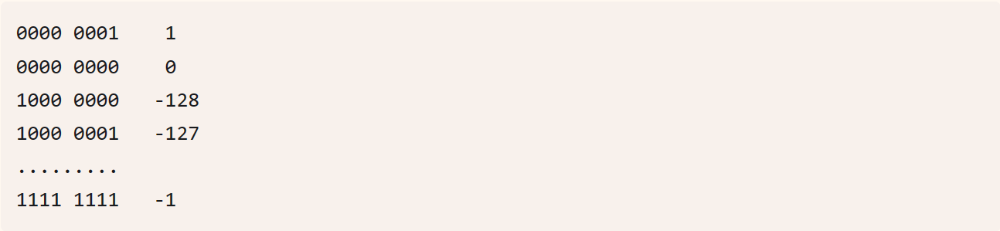


# 实验室面经

## 21

### 阿里-3D渲染引擎开发一面

40min 电话面试
(自我介绍)
(图形学)

* **渲染管线介绍下**


* **几何阶段的输入输出都是什么**

**几何阶段**把输入的3D模型局部空间坐标数据转换成2D屏幕空间数据。包括顶点着色器、图元装置、裁剪和屏幕映射几个过程。

**顶点着色器**主要进行顶点坐标变换。将输入的**模型空间**顶点坐标变换到**裁剪空间**顶点坐标**。**

**图元装配**将**顶点**装配成指定**图元**的形状。可以**细分**为外壳着色器、镶嵌器和域着色器。

**几何着色器**通过产生新顶点构造出新的图元来生成其他形状。

**图元组装**将输入的顶点组装成指定的图元。

**图元组装后**会进行屏幕映射的操作，包括**透视除法**（投影、裁剪转成2维）和**视口变换**（映射，适配到屏幕），将图元从三维空间映射到二维平面上，这是由**硬件**完成的。


* **知道z-fighting吗**

场景中渲染多个三维物体的时候，几个三维物体的摆放位置有点接近，导致在深度缓冲测试的时候，会产生精度的误差，然后会导致几个物体之间的片段值有的时候a通过，有的时候b通过，导致交替显示这几个物体的颜色值，然后就会产生闪烁的现象。

解决办法：

1. 不要把物体放的太近。
2. 调整近平面的距离，一定程度上远离摄像机的位置。
3. 使用更加惊喜的深度缓冲。


* **在放缩的过程中有遇到过边缘变黑的情况吗? 分析下原因可能是什么? **

(非等比缩放，法线没有正确变换，应该乘以模型变换矩阵的逆转矩阵)


* **知道欧拉角万向锁吗?出现的原因是什么? 如果插值的话会出现什么问题? UE里面是怎么解决万向锁的? **

(让物体的坐标系不随着旋转而旋转，只用一个世界坐标系，四元数解决)


* **动画里面用四元数还是欧拉角表示旋转?**


* **说一下蒙皮动画的原理?如果有一把武，怎么和人物放一起? 是一起动吗?怎么进行变换?**

* **知道后处理吗?**

* **光照有哪些?**

  (天空盒，太阳光等)

* **光追开销大，如何用光栅化的方法实时计算全局光照?**

  (实时阴影、实时全局光照算法)

  
  
  

* **场景中有多个平行光源，如何考虑阴影？**

* **地形绘制除了高度图，还有什么方法？**


* **C++内存管理的方法**


# 自己的面经

## FunPlus游戏引擎

### 一面(日常实习)

* **图形**

1. **阴影的原理**
2. **PCSS**
3. **常见抗锯齿方案原理(SSAA、MSAA、FXAA)**
4. **CSM划分的特点，Unity怎么划分？包围盒怎么计算的？**
5. **Shader dudv原理了解吗**

​	这两条指令用于对指定的寄存器，求其值在临近像素上的变化率，因为纹理坐标的梯度可以用来确定纹理当前被缩放的程度，可用该值来计算Mip层，另外它也可以用来计算Texel的跨越Size，由此求得正确的过滤宽度，从而纠正通常的线性过滤在远处由于过滤宽度错误而产生的失真。

6. **Shader渲染实际是一块一块的，有了解吗？**

**偏导计算**
在三角形光栅化是，GPU 都是 block 片段来计算光栅化的。偏导计算于是由这block之间的片段的值来计算的；dFdx 计算并返回的是右边的片段减去左边的片段的值，而 dFdy 是有上减去下的值。查看下图的格式显示的就 block 中对应的 (x, y) 屏幕坐标上的片段。


8. **SSAO算法原理？前向渲染实现SSAO？**
8. **根据深度图如何还原出法线图？**

[【知识补充】深度信息还原位置和法线 - 知乎 (zhihu.com)](https://zhuanlan.zhihu.com/p/367257314)

对计算好的AO图进行模糊，消除里面的噪点

10. **TBN矩阵坐标轴的含义？怎么推导的？**

11. **Hiz遮挡剔除怎么实现mipmap层级确定？降采样怎么实现的？**

将AABB包围盒投影到NDC空间，求出来对应的距离范围，再和原始图像相乘，求出来覆盖的区域，取log2求出来mipmap等级。

```cpp
// 计算中心和 bounding box 的宽高
float4 center = float4(0,0,0,1);
float xmax=-1, ymax=-1, xmin=1, ymin=1, zmax=-1, zmin=1;
for(int i=0; i<8; i++)
{
    // to ndc space
    float4 ndcBounds = mul(_vpMatrix, _bounds[i]);
    ndcBounds.xyz /= ndcBounds.w;
    center.xyz += ndcBounds.xyz;

    xmax = max(xmax, ndcBounds.x);
    ymax = max(ymax, ndcBounds.y);
    xmin = min(xmin, ndcBounds.x);
    ymin = min(ymin, ndcBounds.y);
    zmax = max(zmax, ndcBounds.z);
    zmin = min(zmin, ndcBounds.z);
}
center.xyz /= 8;
float2 uv = center.xy * 0.5 + 0.5;

// 计算 mip 等级
float boxSize = clamp(max(xmax - xmin, ymax - ymin) * 0.5, 0, 1);
int lod = clamp(floor(log2(boxSize * _size)), 0, 15);

uv *= _size / pow(2, lod);
float d = _hizBuffer.mips[lod][int2(uv)].r;
```


* C++

1. **内存分区**

堆区、栈区、全局区\静态区、代码区

2. **堆区和栈区谁的分配速度更快？为什么？**

栈区更快。

栈：只要栈的剩余空间大于所申请空间，系统将为程序提供内存，否则将报异常提示栈溢出。
堆：首先应该知道操作系统有一个记录空闲内存地址的链表，当系统收到程序的申请时，会遍历该链表，寻找第一个空间大于所申请空间的堆结点，然后将该结点从空闲结点链表中删除，并将该结点的空间分配给程序。
对于大多数系统，会在这块内存空间中的首地址处记录本次分配的大小，这样，代码中的 delete 语句才能正确的释放本内存空间。

3. **内存碎片(内部碎片、外部碎片)**

### 二面

* **图形**

1. **介绍一下光栅化渲染管线**

2. **cook-torrance模型**

3. **BRDF漫反射项的常数项怎么确定的？($f_d$)**

   

4. **F0的确定，非金属为什么是是0.04？**

   ```cpp
   // calculate reflectance at normal incidence; if dia-electric (like plastic) use F0 
   // of 0.04 and if it's a metal, use the albedo color as F0 (metallic workflow)    
   vec3 F0 = vec3(0.04); 
   F0 = mix(F0, albedo, metallic);
   ```

5. **BRDF镜面项，FDG各项的含义**

   * D：表示的是微表面结构中法线分布函数，它描述了光线以多大的概率在不同方向上的散射。业界常用的法线分布函数是GGX，具有更好的高光长尾

   

   * F：菲涅尔项，表示的是光线在材质表面与介质之间的反射和折射的行为，掠视金属时反射较多的光而俯视时反射光较少

   

   * G：表示的是几何遮蔽的情况，返回一个未被遮蔽的表面的百分比，常用GGX模型，通过史密斯法叠加入射和出射两个方向。

6. **IBL原理**

7. **IBL高光项，mipmap和roughness对应关系**

   ```cpp
   //learnopengl
   mip = linearRoughness * maxMip;
   //unity
   mip = linearRoughness * (1.7f - 0.7f * linearRoughness) * maxMip
   ```

   线性分布不合理，可以让前面的mipmap更加精细一点，后面的mipmap更加粗糙一点。

   绿色的opengl线性分布，蓝色的是unity中的分布，unity中的更加合理。

   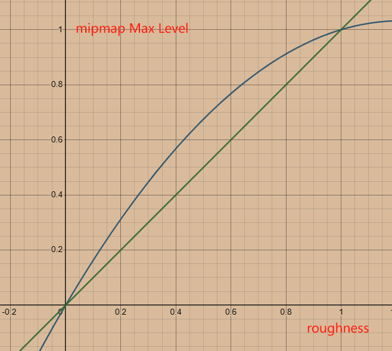

8. **CSM原理**

   

* **C++**

1. **C++为什么引入智能指针？**

   贯彻RAII思想，帮助我们程序员做好内存管理工作，防止内存泄漏。

2. **unique_ptr怎么保证唯一性？**

   禁止拷贝构造和赋值构造

3. **unique_ptr和裸指针的性能上有什么差异？**

   * **内存管理开销：** `std::unique_ptr` 通常包含一个指向堆上对象的指针和一个额外的控制块，用于管理资源的所有权。这可能导致 `std::unique_ptr` 对象相较于裸指针占用更多的内存。然而，现代编译器通常会进行优化，使得这种开销相对较小。

   * **构造和销毁开销：** 创建和销毁 `std::unique_ptr` 对象可能涉及更多的工作，因为它需要在构造和析构时管理资源。相较之下，裸指针的构造和销毁开销较小。但这种差异通常在实际应用中不是性能瓶颈。

   * **函数调用开销：** 将 `std::unique_ptr` 传递给函数可能会涉及更多的指针复制，因为 `std::unique_ptr` 是非拷贝可传递（move-only）的。这意味着在函数调用中可能会执行资源所有权的转移。对比之下，裸指针的传递只涉及指针值的复制。

   * **异常处理开销：** `std::unique_ptr` 提供了异常安全性，当异常发生时，会自动释放其管理的资源。这可能导致与裸指针相比更多的开销。但这种开销通常是可以接受的，尤其是考虑到异常安全性的好处。

4. **move函数的作用？**

   `std::move` 并不实际执行任何移动操作，而是将一个左值强制转换为右值引用，从而允许使用移动语义。

5. **什么情况下需要用到forward转发？**

   `std::forward` 主要用于在泛型编程中进行完美转发（perfect forwarding），以保留原始参数的值类别（是左值还是右值）并正确传递给其他函数。下面是一些需要使用 `std::forward` 的常见情况：

6. **move和forward有性能上的损失吗？**

   应该没有吧，static_cast用的是，编译器进行的，运行时应该没有损失。

7. **static_cast有性能损失嘛？**

   `static_cast` 是 C++ 中的一种类型转换操作符，它通常在编译时进行，并且没有运行时开销。在理论上，`static_cast` 本身不应该引入性能损失，因为它只是进行了静态类型转换。

8. **shared_ptr的实现除了引用计数，还有什么东西？**

   `std::shared_ptr` 的实现还包含以下主要元素：

   **控制块（Control Block）：** 在堆上分配的动态对象通常由一个控制块来管理。控制块包含了引用计数以及额外的信息，用于协调多个 `std::shared_ptr` 共享同一块动态内存。控制块一般包含以下信息：

   - 引用计数：用于记录有多少个 `std::shared_ptr` 共享同一块内存。
   - 原始对象的指针：指向实际的动态分配的对象。
   - 删除器（Deleter）：负责在引用计数减为零时释放资源的函数或函数对象。

9. **shared_ptr性能问题可能出现在哪？**

   * **多线程竞争：** `std::shared_ptr` 的引用计数是原子操作，但在极端的多线程环境中，可能存在竞争条件。频繁地创建和销毁大量的 `std::shared_ptr` 实例，特别是在多线程环境下，可能导致引用计数的频繁增减，从而影响性能。
   * **析构函数：**当给shared_ptr指针指向另一个地方，原来的内存可能被析构，比较耗时。
   * **循环引用：** 如果存在循环引用（两个或多个 `std::shared_ptr` 彼此引用），可能导致对象永远无法被释放，从而导致内存泄漏。虽然 `std::shared_ptr` 引入了 `std::weak_ptr` 来处理循环引用问题，但仍需要小心使用，以避免潜在的性能和内存泄漏问题。

10. **C++开发中你遇到的最有趣的东西是什么？**

    * bool没写返回值，返回的值是不确定的，可能与预想不太一样。
    * volitile防止编译器优化，cuda调试


## 阿里-灵犀互娱游戏引擎(日常实习)

### 一面

* **C++**

1. **讲讲STL**
2. **说一说string的内存布局**

小字符串优化（Small String Optimization，SSO）是一种优化技术，用于在`std::string`中避免对堆内存的频繁分配。这个优化的思想是，在某些情况下，将短字符串直接存储在`std::string`对象本身的内部缓冲区中，而不是分配额外的堆内存。这可以提高性能，减少内存分配和释放的开销。

一般而言，`std::string` 包含以下几个部分：

**内部缓冲区：** 用于存储短字符串的字符内容。这个缓冲区是`std::string`对象的一部分，它通常具有一个固定的大小，足够存储小字符串。

**字符串长度：** 记录当前字符串的长度。

**容量：** 记录内部缓冲区的大小，即为小字符串优化分配的空间大小。

**指向堆内存的指针（可选）：** 当字符串较长时，可能需要在堆上分配额外的内存来存储字符串内容。这个指针将指向分配的堆内存。


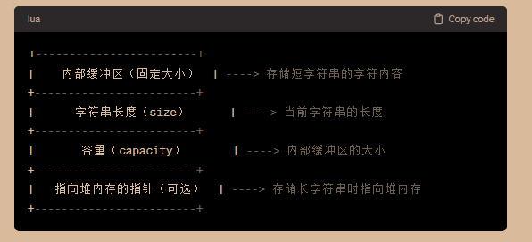

* **图形**

1. **讲讲PBR**

2. **说一说不同类型光源的计算过程**

   定向光：与位置无关，直接使用颜色与方向进行光照计算

   点源：以位置中心画一个一定半径的球，在球体内是被影响的区域，需要考虑衰减

   聚光源：位置就是摄像机的位置，方向也是摄像机的朝向，也要考虑衰减，同时还会有两个角度，一个内角、一个外角，中间区域为过度区域。

3. **后处理渲染管线了解吗？**


# 其他

## 图形

* **BVH包围盒原理**


* **光追系统下为什么不用八叉树、KD-Tree去管理场景呢？**

判断包围盒与三角面的是否相交较难，因此划分的过程不是那么想象的简单，其次同一个三角面可能被不同的包围盒同时占有，这两个不同包围盒内的叶节点会同时存储这一个三角形面。

* **什么情况下适合八叉树？**

1. 碰撞检测：当需要在三维空间中进行碰撞检测时，八叉树可以将空间划分成八个等分的子空间，并在每个子空间中存储游戏对象。这样可以减少碰撞检测的计算量，只需要检测与当前游戏对象所在的子空间相交的对象。
2. 可见性剔除：在渲染大型场景时，八叉树可以用于快速剔除不可见的对象。通过将场景划分成八个等分的子空间，并通过视锥体进行可见性测试，可以确定哪些子空间包含了可见的对象，从而避免对不可见的对象进行渲染计算。
3. 粒子系统：八叉树可以用于管理和更新粒子系统。通过将空间划分成八个等分的子空间，可以根据粒子的位置将其放入相应的子空间中。这样可以更高效地管理粒子系统，并加速与其他游戏对象之间的交互。
4. 场景渲染：在实时渲染中，八叉树可以用于加速光照计算、阴影计算等操作。通过将空间划分成八个等分的子空间，可以更高效地计算光照的影响范围，并减少不必要的计算量。

* **实时情况下为什么不用BVH？**

在实时情况下，为什么不使用边界体层次结构（Bounding Volume Hierarchy，BVH）的主要原因是其构建和更新的开销较大。

BVH是一种用于加速碰撞检测和可见性剔除的空间划分数据结构。它将场景中的物体划分成一系列边界体（Bounding Volume），如包围盒或球体，然后组织成树状结构。这种结构可以通过递归地划分和合并来有效地减少需要检测的物体数量。

然而，在实时应用中，BVH的构建和更新需要耗费大量的计算资源和时间。构建BVH需要遍历场景中的所有物体，并进行划分和合并操作，这对于复杂的场景来说非常耗时。除此之外，BVH需要在物体发生运动时进行更新，而且更新过程也比较昂贵。

相比而言，一些其他的空间划分数据结构，如八叉树（Octree）或四叉树（Quadtree），在实时应用中更具优势。它们的构建和更新通常比BVH更便捷，并且在某些情况下能够提供相近的性能。这些数据结构在游戏引擎中更常用，因为它们能够更好地满足实时应用的需求。

* **阴影算法**

* **光源相机裁剪视锥体参数怎么确定，什么样的才是最优解？**

平行光怎么看确定呢？

以摄像机视线的正前方为中心？正交投影建立裁剪平面？

* **CSM原理**

* **SSAO、SSDO**

* **深度图还原出世界位置？(禁止反投影)**

挖草！根据三角形关系直接求了，没有必要反投影！

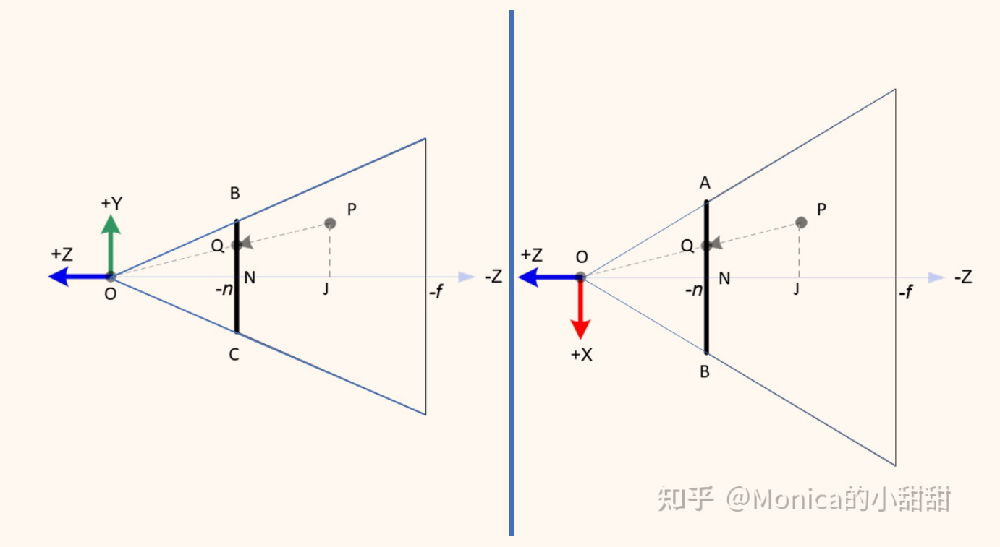

其中P点就要求的点，Q点就是映射到近平面的点。现在已知的信息是P点的深度，读取深度缓存的UV坐标，FOV角，近平面(n)和远平面(f)的值，以及屏幕宽高。接下来就用上面的值进行推导。

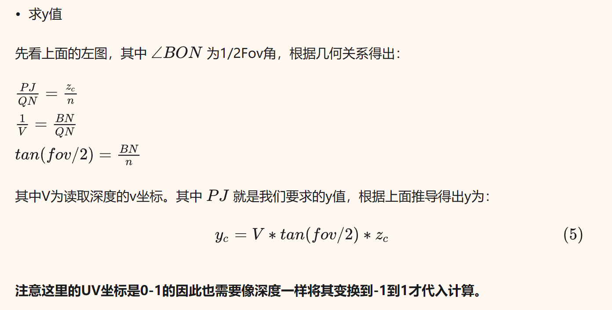

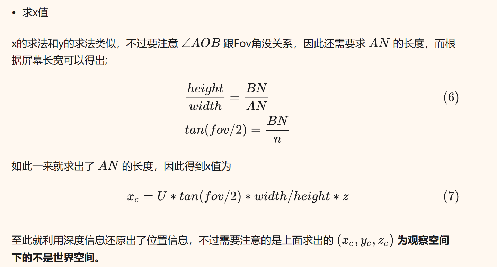

* **后处理-举例子**

* **剔除、遮挡剔除怎么实现？**

* **延迟渲染和前向渲染的区别**
* **延迟渲染的优缺点**
* **G-Buffer压缩**


## C++


